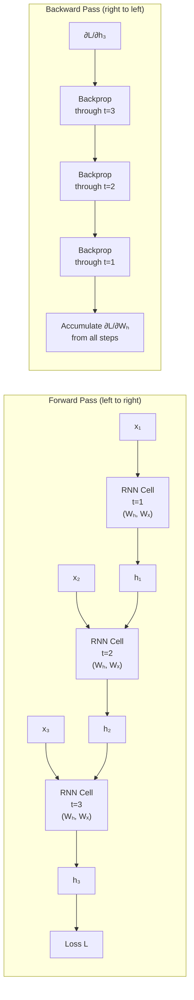
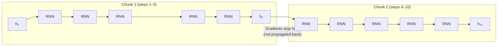

# Lesson 1.2 — Training RNNs: Backpropagation Through Time (BPTT)

---

## The Problem: How Do You Train a Network That Loops?

Training a feedforward network is straightforward: compute the loss, backpropagate through the layers once, update weights. But an RNN uses the same weight matrices `Wₕ` and `Wₓ` at every time step. If you make a mistake at step 50, the gradient of that mistake needs to travel all the way back through all 50 applications of the same weight matrix to update it correctly.

You cannot use standard backpropagation directly because the computation graph is a loop, not a straight path. You need **Backpropagation Through Time (BPTT)** — the technique that "unrolls" the loop into a very deep computational graph and then backpropagates through it.

---

## How BPTT Works

**Step 1: Unroll the RNN across time.**

Take a sequence of length T. The RNN that runs for T steps is equivalent to a T-layer deep feedforward network where every layer uses the same weights. Each "layer" is one time step.

**Step 2: Run the forward pass.**

Process x₁, x₂, ..., xₜ one at a time, storing every hidden state h₁, h₂, ..., hₜ. You must store *all* hidden states because backpropagation needs them.

**Step 3: Compute the loss.**

Depending on the task:
- Many-to-one: Loss = L(yₜ, ŷ) at the final step only
- Many-to-many: Loss = Σ L(yₜ, ŷₜ) summed across all steps

**Step 4: Backpropagate through the unrolled graph.**

Starting from the loss at the final step, compute gradients and propagate them backward through every time step — from step T all the way back to step 1. At each step, the gradient flows through the tanh and through `Wₕ`.

**Step 5: Accumulate gradients for the shared weights.**

Because `Wₕ` is the same matrix at every step, its gradient is the **sum** of gradients from every time step:

```
∂L/∂Wₕ = Σₜ (∂Lₜ/∂Wₕ)
```

Update `Wₕ` once with this accumulated gradient.

---

## BPTT Diagram



*Forward pass stores all hidden states. Backward pass walks backward through every stored state, accumulating gradients for the shared weight matrix.*

---

## The Memory Cost of BPTT

To backpropagate through T time steps, you must store all T hidden states in memory during the forward pass. For a sequence of length 1,000 with a hidden size of 512, that is 1,000 × 512 floats — just for the hidden states alone, not counting activations or gradients.

This makes BPTT **memory-proportional to sequence length** — a significant practical constraint.

---

## Truncated BPTT: The Practical Fix

Full BPTT over very long sequences (e.g., a 10,000-token document) is both memory-prohibitive and computationally expensive. **Truncated BPTT** solves this by processing the sequence in chunks:

1. Process k₁ steps in the forward pass.
2. Backpropagate through only k₂ ≤ k₁ steps.
3. Slide the window forward and repeat.

The hidden state from the end of one chunk is passed as the starting state of the next chunk — so information continues to flow forward. But gradients are only backpropagated through k₂ steps, not through the entire history.



*Hidden states carry forward across chunks (forward pass). Gradients are cut off at chunk boundaries (backward pass). This limits memory and compute at the cost of missing very long-range gradient signals.*

**The trade-off:** Truncated BPTT is faster and uses less memory, but the network can only learn dependencies within a window of k₂ steps. Dependencies longer than that produce no gradient signal at all.

---

## Concrete Example: Language Modeling

Suppose you are training an RNN language model on a book (100,000 tokens). Full BPTT is not feasible. You use truncated BPTT with k₁=50 (process 50 tokens at a time) and k₂=50 (backpropagate through all 50).

- Chunk 1: tokens 1–50 → forward pass → loss → backprop through 50 steps → update weights → save h₅₀
- Chunk 2: tokens 51–100, starting from h₅₀ → forward pass → loss → backprop through 50 steps only → update weights → save h₁₀₀
- And so on.

The model learns short-to-medium dependencies (up to ~50 tokens) well. Dependencies like "the character introduced in chapter 1 reappears in chapter 5" — 5,000 tokens apart — produce no gradient signal. The model effectively cannot learn them.

---

> **Interview note:** *"What is the difference between full BPTT and truncated BPTT? When would you use each?"*  
> Full BPTT: Gradients flow back through the entire sequence. Theoretically correct but memory grows with sequence length (O(T) memory). Only practical for short sequences.  
> Truncated BPTT: Gradients are cut off after k steps. Memory is O(k), independent of sequence length. Loses ability to learn dependencies longer than k.  
> The strong answer adds: "In practice, almost all RNN training uses truncated BPTT. The chunk size k is a hyperparameter — too small and you miss medium-range dependencies; too large and you run out of memory. Typical values are 20–200 depending on the task."

> **Interview note:** *"Why does BPTT require storing all hidden states?"*  
> During backpropagation, the gradient at time step t depends on the hidden state hₜ from the forward pass (because the tanh derivative uses hₜ). If you haven't stored it, you'd have to recompute it, which doubles the cost. This is called gradient checkpointing — a technique that trades compute for memory by discarding intermediate states and recomputing them during the backward pass.

---

## Summary

- BPTT unrolls the RNN across T time steps into a T-deep computational graph, then applies standard backpropagation through the entire unrolled graph.
- Because the weight matrices `Wₕ` and `Wₓ` are shared across all time steps, their gradient is the **sum** of contributions from every time step.
- Full BPTT requires storing all T hidden states in memory — making it O(T) in memory and impractical for long sequences.
- Truncated BPTT processes sequences in fixed-size chunks, cutting off gradient flow at chunk boundaries. It is the standard in practice. The trade-off: no gradient signal for dependencies longer than the chunk size.
- The gradient flowing backward through each time step passes through `Wₕ` and the tanh derivative. Multiply these across T steps and you get the root cause of the vanishing gradient problem — covered in Lesson 1.3.
