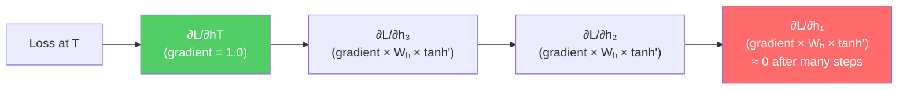

# Lesson 1.3 — The Vanishing & Exploding Gradient Problem

---

## The Core Failure of Vanilla RNNs

Lesson 1.2 showed that BPTT propagates gradients backward through every time step. Here is the critical question: what happens to those gradients after they travel through 50, 100, or 200 time steps?

The answer is the central failure mode of vanilla RNNs: **the gradients either shrink toward zero (vanishing) or grow toward infinity (exploding)**. Both make training impossible over long sequences. This is not a bug you can tune away — it is a mathematical consequence of the architecture. Understanding it completely is what separates a strong interview answer from a weak one.

---

## The Math: Where Gradients Come From

To update `Wₕ`, you need the gradient of the loss with respect to `Wₕ`. During BPTT, the gradient at step t must travel backward through steps t-1, t-2, ..., 1. At each step, it passes through two things:

1. The weight matrix `Wₕ` (via chain rule)
2. The derivative of tanh

The gradient of the loss at the final step T with respect to the hidden state at step k (k < T) is:

```
∂hₜ/∂hₖ = Π (from i=k+1 to T) of [Wₕᵀ · diag(tanh'(hᵢ))]
```

In plain English: **multiply the weight matrix by the tanh derivative at every step between k and T.** That product has (T − k) terms.

The tanh derivative (tanh'(x) = 1 − tanh²(x)) has a maximum value of 1 and quickly shrinks toward 0 for large inputs. In practice, values are typically in the range [0.1, 0.5].

Now consider what happens when you multiply 100 of these together:

```
If each factor ≈ 0.5:    0.5¹⁰⁰ ≈ 10⁻³⁰   →  gradient effectively = 0
If each factor ≈ 1.5:    1.5¹⁰⁰ ≈ 10⁶      →  gradient explodes
```

---

## The Two Problems

---

When you multiply a matrix W by a special vector v, something interesting happens — the vector doesn't rotate, it only stretches or shrinks:
W⋅v=λvW \cdot v = \lambda vW⋅v=λv
That λ is the eigenvalue. It tells you how much the matrix scales that vector.

λ = 2 → vector doubles in magnitude
λ = 0.5 → vector halves in magnitude
λ = 1 → vector unchanged
λ = -0.5 → vector flips direction and halves

---

### Vanishing Gradients

When the eigenvalues of `Wₕ` are less than 1 (and tanh derivatives are small), the gradient product shrinks exponentially with sequence length. After 20–30 steps, the gradient reaching the early time steps is so small it might as well be zero.

**What this means in practice:** The weight `Wₕ` receives essentially no gradient signal from events more than ~20 steps ago. The model cannot learn that the word at position 1 affects the output at position 50. Long-range dependencies are invisible to the optimizer.

This is why vanilla RNNs fail at tasks like:
- Machine translation (subject of a sentence must match verb far away)
- Long document classification (a key phrase in paragraph 1 determines the category)
- Any task where the "relevant signal" is far from the "prediction step"

### Exploding Gradients

When the eigenvalues of `Wₕ` are greater than 1, the gradient product grows exponentially. After ~20–30 steps, the gradient is astronomically large. The weight update becomes enormous and the model diverges — loss spikes to NaN or infinity.

**What this means in practice:** Training becomes numerically unstable. The model weights jump wildly from one step to the next.

---

"In an RNN the same weight matrix Wh is applied at every timestep. During backpropagation, the gradient has to travel back through every single timestep — and at each step it gets multiplied by Wh and the activation derivative. If those values are less than 1, the gradient shrinks exponentially with sequence length — after 20-30 steps it's basically zero, so early timesteps get no learning signal. This is vanishing gradient. If those values are greater than 1, the gradient explodes exponentially — weights get catastrophically large updates and training collapses."

---

## Diagram: Gradient Flow Over Time



*Each backward step multiplies the gradient by Wₕ and the tanh derivative. After many steps, the gradient at early time steps approaches zero (red = dead gradient).*

---

## The Two Fixes (and Why One Is a Band-Aid)

### Fix for Exploding: Gradient Clipping

The standard fix for exploding gradients is **gradient clipping**: if the norm of the gradient vector exceeds a threshold, scale it down so its norm equals the threshold.

```python
# PyTorch gradient clipping
torch.nn.utils.clip_grad_norm_(model.parameters(), max_norm=1.0)
```

This prevents the update from being catastrophically large. It works reliably and is used in almost all RNN training pipelines.

**But gradient clipping is not a cure — it is a band-aid.** It prevents the gradient from being too large, but it cannot prevent the gradient from being too small. The vanishing gradient problem remains completely unsolved by clipping.

### Fix for Vanishing: There Is No Simple Fix for Vanilla RNNs

You cannot clip a small gradient back to its original size — information is genuinely lost. The only real solutions require architectural changes:
- **LSTM** — introduces gating and a cell state that creates an additive gradient path (Lesson 2.3)
- **GRU** — a simpler gated architecture with similar properties (Part 3)
- **Residual connections** — used in deep networks generally, less standard for RNNs
- **Transformers** — bypasses the problem entirely by not being recurrent (Part 5)

---

## Concrete Example: Sentiment Shifts Over Distance

Consider training an RNN on restaurant reviews. A review reads:

> *"The ambiance was lovely, the staff were incredibly friendly, the appetizers were decent, and the dessert was acceptable, but the main course — which every review says is the centerpiece — was absolutely inedible."*

The word "but" and the negative conclusion are ~40 tokens from the start of the sentence. The RNN needs to attribute the overall negative sentiment to the structure of the full sentence.

With vanishing gradients, the gradient signal from "inedible" at the end cannot meaningfully reach "was lovely" at the beginning. The early tokens receive ~0 gradient. The model learns to classify based on whatever is close to the end of the sequence — in this case, "inedible" — and essentially ignores all earlier context. It gets the right answer for the wrong reason, and fails on examples where the structure is different.

---

> **Interview note:** *"Explain the vanishing gradient problem without using the word 'gradient.'"*  
> "The RNN learns by sending an error signal backward through time. At each step backward, the signal gets multiplied by a small number — roughly 0.5 or less. After 30 steps backward, you've multiplied by 0.5 thirty times: 0.5³⁰ ≈ 10⁻⁹. The signal is virtually zero. Early words in a sequence stop affecting how the model updates, so the model can't learn that what happened 30 steps ago matters. That's why vanilla RNNs work well for short-range patterns and fail completely on long-range ones."

> **Interview note:** *"How do you fix the exploding gradient problem? Is the fix perfect?"*  
> Gradient clipping fixes exploding gradients. Set a threshold (commonly 1.0 or 5.0) and scale the gradient norm down to that threshold if it exceeds it. The fix is simple and reliable. It is not perfect — you're discarding some gradient information — but in practice it is sufficient and widely used.  
> The strong answer adds: "Gradient clipping only fixes exploding. It does nothing for vanishing. The vanishing gradient problem is why LSTM was invented — the architectural fix, not a training trick."

> **Interview note:** *"At what sequence length does the vanishing gradient problem become critical?"*  
> There is no universal threshold. It depends on the magnitude of `Wₕ` eigenvalues and the tanh derivative values at each step. A rule of thumb: vanilla RNNs typically struggle to learn dependencies longer than 10–20 steps. LSTM empirically handles 100–300 steps. For thousands of steps, even LSTM struggles, which is one motivation for Transformers.

---

## Summary

- During BPTT, gradients travel backward through time by multiplying a product of weight matrices and tanh derivatives at every step. This product has T terms for a sequence of length T.
- If each term is < 1 (typical for tanh), the product shrinks exponentially: **vanishing gradients**. Early time steps receive essentially zero gradient, making long-range dependency learning impossible.
- If each term is > 1, the product grows exponentially: **exploding gradients**. Training becomes numerically unstable.
- **Gradient clipping** fixes exploding gradients — if the gradient norm exceeds a threshold, scale it down. This is a reliable practical fix.
- Vanishing gradients have no simple fix within the vanilla RNN architecture. The solution is to change the architecture — which is exactly what LSTM does by creating an additive gradient path (Lesson 2.3).
- Vanilla RNNs practically cannot learn dependencies longer than ~10–20 steps. This is not a hyperparameter tuning issue — it is a fundamental structural limitation.
