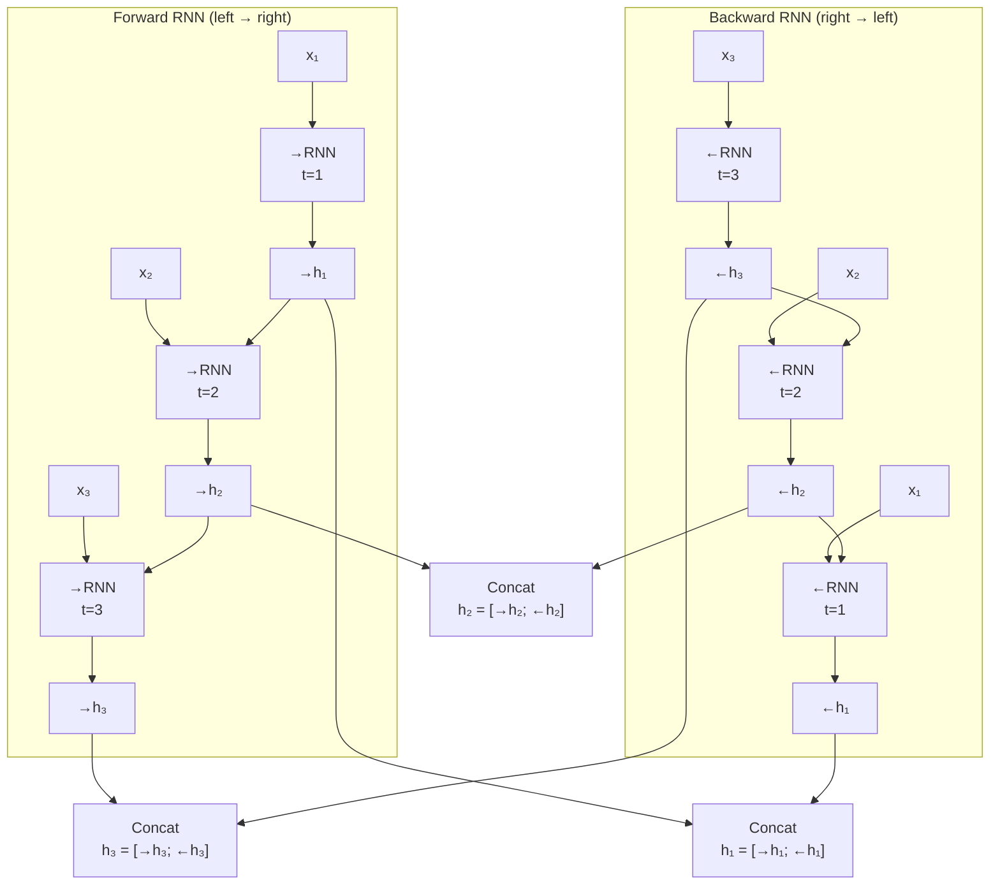
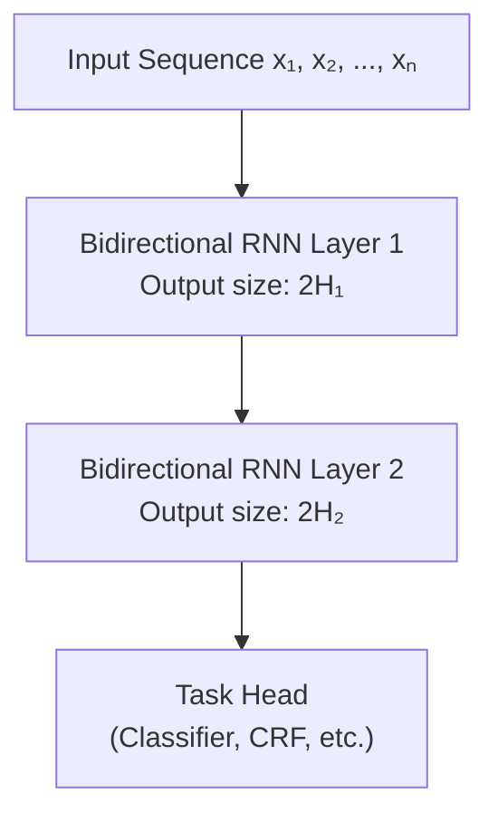

# Lesson 1.4 — Bidirectional RNN (Bi-RNN)

---

## The Problem: Sequences Have Context in Both Directions

A standard RNN reads left to right. At time step t, it knows about positions 1 through t. It knows nothing about positions t+1 through T. This makes sense for generation — you genuinely do not know future tokens when generating — but it is a real limitation for tasks where the full sequence is available at inference time.

Consider Named Entity Recognition (NER). Given the sentence:

> *"I visited **Paris** last summer."*

Knowing "I visited" tells you that something is coming. But knowing that "last summer" follows "Paris" confirms it is a location, not a person's name. The RNN at position "Paris" only sees the left context. The right context — which is sometimes the clearest signal — is invisible.

**Bidirectional RNNs** solve this by running two RNNs in parallel: one left-to-right and one right-to-left. Their outputs are concatenated at each position, giving the model access to both past and future context simultaneously.

---

## Architecture: Two Passes, One Output

A Bi-RNN runs two separate RNN cells with separate weight matrices:

1. **Forward RNN**: processes x₁ → x₂ → ... → xₜ producing `→hₜ` at each step
2. **Backward RNN**: processes xₜ → xₜ₋₁ → ... → x₁ producing `←hₜ` at each step

At each position t, the combined hidden state is:

```
hₜ = [→hₜ ; ←hₜ]   (concatenation)
```

The output at position t now has access to all tokens to the left *and* all tokens to the right.



*The forward RNN accumulates left context. The backward RNN accumulates right context. Both are concatenated at each position to give full bidirectional context.*

---

## What Bi-RNN Costs You

Bidirectionality is not free:

| Property | Unidirectional RNN | Bidirectional RNN |
|---|---|---|
| **Parameters** | `Wₕ`, `Wₓ` | Two sets: `→Wₕ`, `→Wₓ`, `←Wₕ`, `←Wₓ` (~2x) |
| **Hidden state size** | H | 2H (concatenated) |
| **Computation** | Single forward pass | Two passes (forward + backward) |
| **Latency at inference** | Low — can stream | High — must see full sequence first |
| **Use for generation?** | Yes | No |

The last row is the critical constraint: **you cannot use a Bi-RNN for autoregressive generation.** When generating token t+1, you do not yet know tokens t+2 through T — so the backward pass cannot run. Bi-RNNs are strictly for tasks where the full sequence is available (classification, NER, question answering encoders, etc.).

---

## Concrete Example: Part-of-Speech Tagging

Consider tagging the sentence: *"They can fish."*

The word "fish" is ambiguous — it can be a noun (they can [preserve] fish) or a verb (they are able to fish). A unidirectional RNN, having processed "they" and "can", assigns the tag based only on left context. It might default to "noun" since "can" often precedes nouns.

A Bi-RNN processes the full sentence. The backward pass gives the model the signal that "fish" appears at the end with a period, suggesting it is the main verb. The combined representation captures both the "can" (aux verb signal) and the end-of-sentence position. The model makes the correct prediction that "fish" is a verb here.

This kind of disambiguation by future context is precisely what Bi-RNN was designed for.

---

## Stacking Bidirectional Layers

You can stack multiple Bi-RNN layers. The output of one Bi-RNN layer (of size 2H) becomes the input to the next:



*Stacked Bi-RNNs build hierarchical representations — lower layers capture local syntax, upper layers capture higher-level semantics.*

Stacked Bi-LSTMs were the dominant architecture for NLP sequence labeling tasks (NER, POS, parsing) from roughly 2015–2018, before Transformers took over.

---

> **Interview note:** *"When would you use a Bidirectional RNN over a unidirectional one?"*  
> Use bidirectional whenever (1) the full sequence is available at inference time and (2) the task benefits from future context. Standard cases: NER, POS tagging, sentiment analysis, reading comprehension encoders. Never use it for autoregressive generation (language modeling, machine translation decoder) because the future is unknown at generation time. The strong answer also mentions that Bi-LSTM (not vanilla Bi-RNN) was the standard in practice — the bidirectionality and LSTM gating combine to give both future context and the ability to learn long-range dependencies.

> **Interview note:** *"BERT uses bidirectionality — is BERT a Bi-RNN?"*  
> No. BERT achieves bidirectionality through self-attention in Transformers, not through two separate RNN passes. Every token in BERT attends to every other token in a single forward pass — there is no separate backward RNN. The key difference: BERT's bidirectionality is done in O(1) path length (direct attention to any token), while Bi-RNN requires O(n) steps in each direction. Since you know BERT's architecture, this question tests whether you conflate "bidirectional" the concept with the specific RNN mechanism.

---

## Summary

- A unidirectional RNN at position t can only see tokens 1 through t. Many NLP tasks (NER, POS tagging, classification) benefit from future context — what comes *after* a position.
- Bidirectional RNNs solve this by running two RNNs: one left-to-right (forward) and one right-to-left (backward). Their hidden states are concatenated at each position.
- The trade-off: approximately 2x parameter count, 2x computation, and — critically — **requires the full sequence at inference time**, making it incompatible with autoregressive generation.
- In practice, Bi-LSTM (Bidirectional LSTM) was the standard, not vanilla Bi-RNN — combining gating with bidirectional context.
- Stacked Bi-LSTMs were state-of-the-art for NLP sequence labeling from ~2015–2018.
