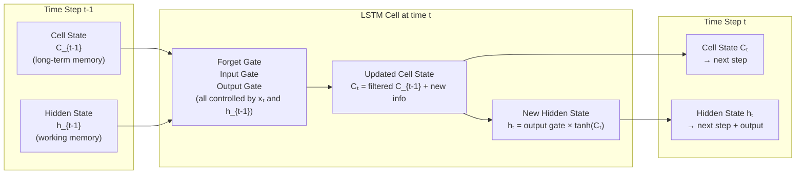

# Lesson 2.1 — The LSTM Insight: Why a Separate Cell State?

---

## The Failure Mode That LSTM Was Designed to Fix

Vanilla RNNs have one type of memory: the hidden state `hₜ`. Everything the network knows — about the current input, about what it saw 5 steps ago, about patterns it has learned — must coexist in a single vector. At every step, that vector gets completely overwritten:

```
hₜ = tanh(Wₕ · hₜ₋₁ + Wₓ · xₜ + b)
```

The word "overwritten" is doing a lot of work here. The previous hidden state `hₜ₋₁` is not gently updated — it is run through a weight matrix and a tanh, and the result completely replaces it. There is no mechanism to say "keep this part of the old memory and only update that part." The network either incorporates the new input fully or it does not, but the decision is not selective — it applies to the entire hidden state vector simultaneously.

This creates a fundamental problem: **new inputs tend to overwrite old information.** Over many steps, the influence of early inputs decays and disappears — not because the network chose to forget them, but because the mechanics of the update leave no room to preserve them selectively.

LSTM was introduced by Hochreiter and Schmidhuber in 1997 precisely to fix this. The insight was not to make a bigger hidden state or a better weight matrix. It was to **separate memory from computation** by introducing a second, explicitly protected memory channel: the cell state.

---

## The Central Insight: Two Separate Memory Channels

An LSTM cell has two vectors running through time, not one:

1. **Cell state `Cₜ`** — long-term memory. This is the "conveyor belt" that runs through the entire sequence. Information can be read from it, written to it, or erased from it — but only through deliberate gating operations. By design, the cell state is *not* passed through a nonlinear activation on every step, which is what makes it resistant to vanishing gradients.

2. **Hidden state `hₜ`** — short-term, working memory. This is what gets exposed to the outside world (used for predictions, passed to the next layer). It is derived from the cell state at each step.



*The cell state Cₜ flows through time with minimal interference — gates control what gets added or removed. The hidden state hₜ is a filtered view of the cell state, used as the output.*

---

## The Highway Analogy

Think of the cell state as a highway running alongside the time axis. Information can travel long distances on this highway without being transformed. The gates act as on-ramps and off-ramps:

- The **forget gate** decides how much of the existing highway traffic to let continue (exit ramp: erase some of what was flowing).
- The **input gate** decides what new information to add to the highway (on-ramp: write new information).
- The **output gate** decides what to read off the highway as the current step's output (reading sign: use some of what's stored).

The highway can carry information from step 1 to step 100 largely intact, as long as no gate decides to erase it. In a vanilla RNN, every step is a complete detour off and back onto the highway — nothing survives the journey without transformation.

---

## Why This Solves Vanishing Gradients (Preview)

Lesson 2.3 covers this in full mathematical detail. The preview: in a vanilla RNN, the gradient at step 1 must travel through T applications of `tanh` and `Wₕ`. Each application multiplies the gradient by a small number. After T steps, the product approaches zero.

In an LSTM, the cell state gradient path is **additive**, not multiplicative. At each step, the cell state update is:

```
Cₜ = fₜ ⊙ Cₜ₋₁ + iₜ ⊙ C̃ₜ
```

The gradient of the loss with respect to `Cₜ₋₁` goes through `fₜ` (the forget gate value, between 0 and 1) — but it does not go through `tanh` at every step. When the forget gate is close to 1 (meaning "keep this information"), the gradient passes through nearly unchanged. This is the constant error carousel — information and gradients can flow unchanged across many steps.

---

## Concrete Example: Document Classification with Rare Keywords

You are classifying scientific papers as "physics" or "chemistry" based on abstract text (200 tokens). The key discriminating word — "photon" or "covalent" — appears at position 15. The rest of the abstract is filler.

A vanilla RNN processes all 200 tokens. By token 200, the hidden state has been overwritten 185 times since "photon" was read. The signal is gone.

An LSTM, at token 15, opens its input gate for "photon" and writes a strong signal into the cell state. That signal stays in the cell state for the remaining 185 steps — the forget gate keeps it at ~1.0 (no reason to erase a discriminative keyword) and the input gate stays at ~0 (filler words do not change the key memory). At token 200, the output gate reads the cell state to produce a hidden state that still strongly reflects "photon" from position 15.

This is not an approximation — it is literally what a well-trained LSTM learns to do.

---

> **Interview note:** *"What is the difference between the cell state and the hidden state in LSTM? Why does having two matter?"*  
> Cell state (`Cₜ`): long-term memory, flows with minimal transformation, protected by gates. Hidden state (`hₜ`): short-term working memory, fully recomputed at each step from the cell state, exposed as the output.  
> Why two matters: the cell state provides a gradient highway that bypasses the multiplicative vanishing gradient problem. The hidden state provides the expressive, step-specific output. If you only had one (as in a vanilla RNN), you cannot maintain long-term memory without overwriting short-term computation. Separating them lets each serve its purpose without compromising the other.  
> The weak answer: "cell state is long-term memory and hidden state is short-term." The strong answer explains why the separation is architecturally necessary for gradient flow.

---

## Summary

- Vanilla RNNs use a single hidden state that gets completely overwritten at every step. There is no selective preservation — new inputs always transform the full state.
- LSTM introduces **two** memory channels: the cell state `Cₜ` (long-term, protected) and the hidden state `hₜ` (short-term, exposed as output).
- The cell state acts as a "conveyor belt" or highway — information travels along it across many time steps, with gates controlling what gets added, erased, or read.
- The key gradient insight: the cell state update is additive (`fₜ ⊙ Cₜ₋₁ + iₜ ⊙ C̃ₜ`), not a full matrix-multiply-and-tanh like the RNN hidden state update. This creates a gradient path that does not decay multiplicatively across steps.
- The gate mechanics (forget, input, output) are detailed in Lesson 2.2.
