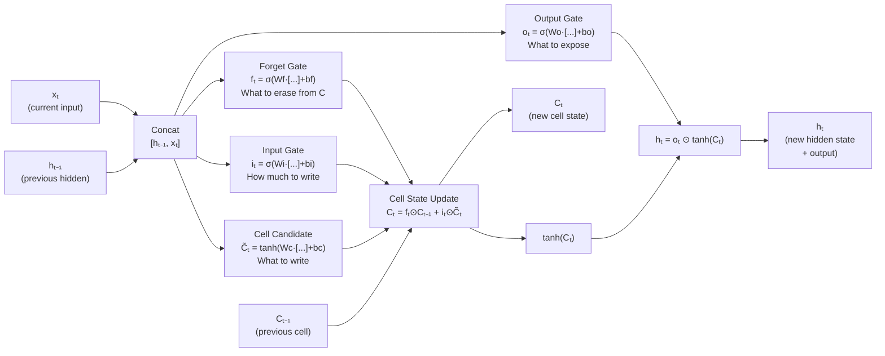

# Lesson 2.2 — LSTM Gates in Full Detail

---

## Why Gates? The Need for Selective Memory

Lesson 2.1 established that LSTM maintains two memory channels — the cell state (long-term) and the hidden state (short-term). The question is: how does the network decide what to keep, what to erase, and what to output at each step?

The answer is **gates** — learnable sigmoid functions that produce values between 0 and 1, acting as soft on/off switches. A gate output of 0 means "block completely", 1 means "pass through completely", and values in between mean partial filtering.

An LSTM cell at each time step takes:
- `xₜ` — the current input
- `hₜ₋₁` — the previous hidden state

And produces:
- `Cₜ` — the updated cell state
- `hₜ` — the new hidden state

It does this through exactly **four** computations (three gates + one candidate). Let's go through each one.

---

## Gate 1: The Forget Gate — What to Erase

The forget gate answers: *"Of what we're currently storing in the cell state, what should we discard?"*

```
fₜ = σ(Wf · [hₜ₋₁, xₜ] + bf)
```

Where:
- `σ` — sigmoid function, outputs values in (0, 1)
- `Wf` — weight matrix for the forget gate
- `[hₜ₋₁, xₜ]` — concatenation of the previous hidden state and current input
- `bf` — bias

**In plain English:** Look at what we just saw (`xₜ`) and what we currently remember (`hₜ₋₁`). Produce a number between 0 and 1 for each position in the cell state. Multiply the cell state by these numbers.

If `fₜ[i] = 1`: keep everything at position i in the cell state.  
If `fₜ[i] = 0`: completely erase position i in the cell state.

**Concrete example:** In language modeling, if the network has been tracking that the current subject is "The students" (stored in the cell state), and it reads a period (end of sentence), the forget gate should fire high for "erase subject tracking." The new sentence will have a new subject.

---

## Gate 2: The Input Gate — What to Write

The input gate answers: *"Of the new information available right now, what should we add to the cell state?"*

This is actually two computations:

**2a. Input gate — how much to write:**
```
iₜ = σ(Wi · [hₜ₋₁, xₜ] + bi)
```

**2b. Candidate cell state — what to write:**
```
C̃ₜ = tanh(Wc · [hₜ₋₁, xₜ] + bc)
```

Where:
- `iₜ` — the gate valve: how much of the candidate to actually write (0–1)
- `C̃ₜ` — the candidate values: what we *would* write if the gate was fully open (-1 to 1 due to tanh)
- `Wc`, `Wi` — separate weight matrices for the candidate and gate

**In plain English:** Compute what new information we want to store (`C̃ₜ` using tanh for bounded values). Compute how much of that we should actually write (`iₜ` using sigmoid). The actual addition is `iₜ ⊙ C̃ₜ`.

The separation of `iₜ` and `C̃ₜ` is deliberate. tanh produces the values to write (and can be negative, allowing subtraction). sigmoid controls how much of those values actually get written.

---

## Cell State Update — The Core Memory Operation

With the forget and input gates computed, the cell state update is:

```
Cₜ = fₜ ⊙ Cₜ₋₁  +  iₜ ⊙ C̃ₜ
```

Where `⊙` is element-wise multiplication.

Breaking this down:
- `fₜ ⊙ Cₜ₋₁`: the old cell state, selectively erased by the forget gate
- `iₜ ⊙ C̃ₜ`: the new candidate values, selectively written by the input gate
- The sum: old information (partially) + new information (partially) = updated long-term memory

This is the **additive update** that makes LSTM resistant to vanishing gradients. The cell state is not multiplied by a full weight matrix and passed through tanh — it is *modified* by adding and subtracting partial amounts. Gradients can flow back through this addition with minimal decay.

---

## Gate 3: The Output Gate — What to Expose

The output gate answers: *"Of what is currently stored in the cell state, what should we expose as the hidden state (output) right now?"*

```
oₜ = σ(Wo · [hₜ₋₁, xₜ] + bo)
```

```
hₜ = oₜ ⊙ tanh(Cₜ)
```

Where:
- `oₜ` — how much of the cell state to expose (0–1 per position)
- `tanh(Cₜ)` — the full cell state squashed into (-1, 1)
- `hₜ` — the new hidden state (what gets passed to the next step and to the output layer)

**In plain English:** The cell state may be tracking many things simultaneously. The output gate decides which of those tracked things are relevant *right now* for producing the current output. You might be tracking the current verb tense and the current subject — the output gate decides which to emphasize based on the current input context.

---

## Complete LSTM Architecture Diagram



*Four computations per step. Cell state Cₜ flows through with additive update. Hidden state hₜ is a gated view of the cell state.*

---

## Concrete Example: Tracking Subject-Verb Agreement

In the sentence: *"The students, who studied very hard, **pass**."*

| Position | Input | LSTM Internal Action |
|---|---|---|
| "The" | Article | Input gate writes "article seen" |
| "students" | Plural noun | Input gate writes "subject = plural" into cell state |
| "," | Punctuation | Forget gate partially clears short-term context |
| "who studied very hard" | Relative clause | Input gate writes clause info; "subject = plural" persists in cell state (forget gate stays open) |
| "," | Punctuation | Forget gate clears relative clause; "subject = plural" still intact |
| "pass" | Verb | Output gate reads "subject = plural" from cell state → predicts plural verb form "pass" not "passes" |

The subject ("students") is 5 tokens before the verb. Vanilla RNN loses this. LSTM keeps it in the cell state, protected by a low forget gate on that memory slot.

---

> **Interview note:** *"Walk me through the LSTM gates. Why does the cell update use element-wise multiplication and not matrix multiplication?"*  
> Element-wise multiplication with the gate (a vector of values in [0,1]) acts as a selective mask — each position in the cell state is independently controlled. A full matrix multiplication would mix all positions together, destroying the ability to selectively retain or erase specific memory slots. The element-wise structure is what gives each memory slot its own "lifecycle" — some information can persist for hundreds of steps while other information is erased immediately.

> **Interview note:** *"Why does the forget gate use sigmoid instead of tanh? Why does the candidate cell use tanh?"*  
> Sigmoid (output: 0–1) is used for gates because gates are binary decisions — pass or block, on or off. A value between 0 and 1 is a natural soft switch.  
> tanh (output: -1 to 1) is used for the candidate cell values because you want to be able to *decrease* existing cell state values (write a negative number) or *increase* them (write a positive number). Using sigmoid would mean you can only add positive values to the cell state, which would make it monotonically increasing — clearly wrong.

> **Interview note:** *"How many weight matrices does an LSTM have?"*  
> Four: `Wf` (forget gate), `Wi` (input gate), `Wc` (cell candidate), `Wo` (output gate). Each matrix combines `hₜ₋₁` and `xₜ`, so each has size `(H + input_size) × H`. Total parameter count ≈ 4 × (H + input_size) × H, compared to vanilla RNN's single matrix of size `(H + input_size) × H`. LSTM has roughly 4x more parameters per cell.

---

## Summary

- An LSTM has four computations per step: forget gate (erase), input gate + candidate (write), output gate (expose).
- **Forget gate** `fₜ = σ(...)`: Produces 0–1 per position. Multiplied element-wise with old cell state — values near 0 erase, values near 1 preserve.
- **Input gate** `iₜ = σ(...)` + **Candidate** `C̃ₜ = tanh(...)`: Input gate controls how much of the candidate gets written. Candidate provides the actual values (positive or negative).
- **Cell state update** `Cₜ = fₜ ⊙ Cₜ₋₁ + iₜ ⊙ C̃ₜ`: Additive update — old memory selectively kept plus new memory selectively added. No full matrix-multiply-then-tanh. This is the key to gradient stability.
- **Output gate** `oₜ = σ(...)` → `hₜ = oₜ ⊙ tanh(Cₜ)`: Selectively reads from the cell state to produce the current hidden state.
- LSTM has ~4x the parameters of a vanilla RNN cell due to four separate gate weight matrices.
