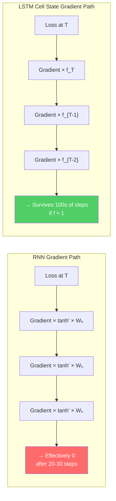

# Lesson 2.3 — How LSTM Solves the Vanishing Gradient Problem

---

## Recap: Why RNN Gradients Die

Lesson 1.3 showed the root cause: during BPTT, the gradient at early time steps is the product of T multiplications. Each multiplication involves `Wₕ` and the tanh derivative. The tanh derivative is ≤ 1 almost everywhere, and in practice much smaller. After 30–50 multiplications, the product shrinks toward zero and the gradient is effectively dead.

LSTM does not patch this problem. It redesigns the gradient pathway so the problematic multiplicative chain does not exist for the cell state. This lesson explains exactly how — with the math.

---

## The Gradient Path Through the Cell State

In a vanilla RNN, the gradient of the loss at step T with respect to the hidden state at step k travels through:

```
∂hₜ/∂hₖ = Π (from i=k+1 to T) of [Wₕᵀ · diag(tanh'(hᵢ))]
```

This is a product of T-k matrices, each involving `Wₕᵀ` and the tanh derivative. The product decays exponentially.

In an LSTM, the cell state update is:

```
Cₜ = fₜ ⊙ Cₜ₋₁ + iₜ ⊙ C̃ₜ
```

The gradient of `Cₜ` with respect to `Cₜ₋₁` is:

```
∂Cₜ/∂Cₜ₋₁ = fₜ
```

That's it. Just `fₜ` — the forget gate value. No weight matrix multiplication. No tanh derivative. Just element-wise multiplication by the forget gate.

The gradient of the loss at step T with respect to the cell state at step k is:

```
∂L/∂Cₖ = ∂L/∂Cₜ · Π (from i=k+1 to T) of fᵢ
```

This is a product of T-k **forget gate values**, not a product of T-k full matrix-tanh operations. The difference is enormous.

---

## Why This Prevents Vanishing

The forget gate values `fᵢ` are between 0 and 1, so they can still cause vanishing if consistently small. But:

1. **The network learns to control these values.** If long-term information is important, the network learns `fᵢ ≈ 1` for those steps (meaning "keep this"). The forget gate becomes a trained, input-dependent control signal — not a fixed architectural limitation.

2. **No weight matrix multiplication.** In the RNN, the gradient must pass through `Wₕᵀ` at every step. If any eigenvalue of `Wₕᵀ` is < 1, the gradient shrinks — and you cannot prevent this without changing the matrix. In LSTM, there is no matrix in the gradient path through the cell state.

3. **No tanh derivative.** The tanh derivative saturates toward zero for large inputs, which is the main cause of vanishing in RNN. The cell state gradient path does not have a tanh in it.

This is what Hochreiter and Schmidhuber called the **Constant Error Carousel (CEC)**: when `fₜ = 1`, the gradient flows back with exactly no decay — like a conveyor belt running at constant speed with no friction.

---

## Visualization: Two Gradient Paths



*RNN gradient path: each step multiplies by `Wₕ` and tanh derivative — shrinks exponentially. LSTM cell gradient path: each step multiplies only by the forget gate value — can be set near 1 by the network, allowing gradients to survive.*

---

## The Hidden State Still Vanishes — That's Intentional

It is important to be precise here: **the hidden state `hₜ`'s gradient path does still involve tanh and weight matrices.** The hidden state is computed as:

```
hₜ = oₜ ⊙ tanh(Cₜ)
```

The gradient through the hidden state path does decay. But the LSTM is designed so that the primary long-range gradient path goes through the **cell state**, not the hidden state. The cell state is the protected highway. The hidden state is the expressive, step-specific output.

This is not a flaw — it is intentional. The hidden state should be sensitive to immediate context (that is its job). The cell state should preserve long-term signals (that is its job). The two gradient paths serve different roles.

---

## Concrete Example: Learning a Long-Range Pattern

Task: Predict whether a legal contract clause favors the buyer or seller, based on a 300-token paragraph. The key phrase "indemnification waived" appears at token 20. Everything else is boilerplate.

**Vanilla RNN training:**
At the end of the paragraph (token 300), BPTT sends a gradient signal backward. By the time it reaches token 20, it has been multiplied by 280 weight-matrix-tanh operations. The gradient at token 20 is approximately `0.5^280 ≈ 10^{-84}`. The weight matrix at token 20 receives essentially zero gradient. The model never learns that "indemnification waived" matters.

**LSTM training:**
At token 20, the input gate writes a strong signal into the cell state. The forget gate for the next 280 steps is learned to be near 1.0 (the legal boilerplate does not erase key contract terms). The gradient at the final step travels back through 280 forget gate multiplications: `0.99^280 ≈ 0.06` — small but non-zero and meaningful. The model learns to write "indemnification waived" to the cell state and preserve it.

The difference between ~10^{-84} and 0.06 is the difference between "completely untrainable" and "learns correctly."

---

> **Interview note:** *"How does LSTM solve the vanishing gradient problem?"*  
> Weak answer: "LSTM has gates that help it remember long-term information."  
> Strong answer: "LSTM solves it by creating an **additive gradient path** through the cell state. The cell state update is `Cₜ = fₜ ⊙ Cₜ₋₁ + iₜ ⊙ C̃ₜ`. The gradient of the cell state at step T with respect to step k is the product of forget gate values from k to T — no weight matrix multiplication, no tanh derivative. If the network learns forget gate values near 1 for a particular memory slot, the gradient flows back with minimal decay. In a vanilla RNN, this same gradient product involves `Wₕ` and tanh derivatives at every step, which shrink it exponentially."

> **Interview note:** *"Does LSTM completely eliminate the vanishing gradient problem?"*  
> No. There are two caveats:  
> 1. If the forget gate is consistently near 0 (the network learned to forget everything quickly), the cell state gradient still decays — but this is a learned behavior, not an architectural inevitability.  
> 2. The hidden state gradient path (through `hₜ = oₜ ⊙ tanh(Cₜ)`) does still vanish. The protection is on the cell state path.  
> In practice, LSTM reliably handles 100–300 step dependencies. For thousands of steps, even LSTM struggles. That is one reason Transformers were developed.

---

## Summary

- In a vanilla RNN, the gradient from step T to step k is the product of T-k matrices and tanh derivatives — it shrinks exponentially (vanishes).
- In an LSTM, the gradient through the **cell state** path from step T to step k is the product of T-k forget gate values: `∂L/∂Cₖ = ∂L/∂Cₜ · Π fᵢ`. No weight matrix, no tanh derivative.
- When the network learns forget gate values near 1 for long-term memory slots, the gradient flows backward nearly unchanged across many steps — the **Constant Error Carousel**.
- The network has agency: it can learn to open or close forget gates based on input, selectively protecting important memory. RNN vanishing is an unavoidable architectural fact; LSTM vanishing (via forget gate) is a controllable design choice.
- The hidden state `hₜ` still has a vanishing gradient path — protection is specifically on the cell state path.
- LSTM empirically handles 100–300 step dependencies. Beyond ~1000 steps, attention mechanisms (Part 4) and Transformers (Part 5) become necessary.
