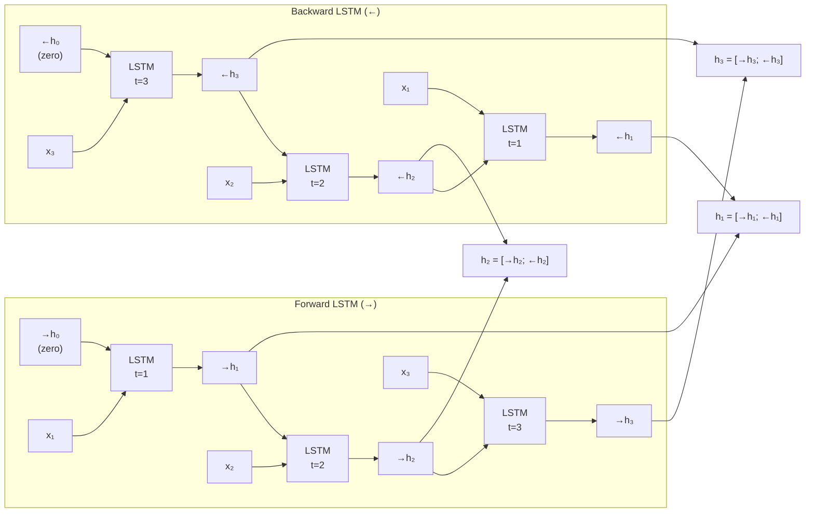
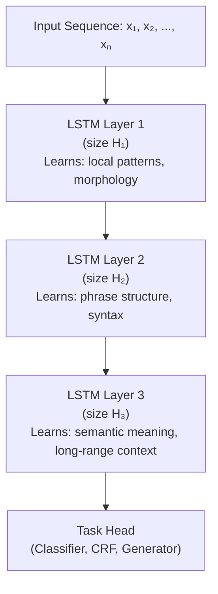

# Lesson 2.4 — Bidirectional LSTM & Stacked LSTM

---

## Bidirectional LSTM: The Best of Both Worlds

Lesson 1.4 introduced Bidirectional RNNs — running two RNNs in opposite directions and concatenating their outputs. Bidirectional LSTM (Bi-LSTM) applies exactly the same idea to LSTM cells, and this combination was genuinely powerful.

The motivation is unchanged: at position t in a sequence, a unidirectional LSTM only knows what came before position t. For tasks like NER, POS tagging, or sequence labeling, the tokens after position t often carry critical context. Bi-LSTM gives every position access to both past and future context — with the gradient stability and long-range memory of LSTM.

### Architecture

A Bi-LSTM has two LSTM cells:
- **Forward LSTM**: processes x₁ → x₂ → ... → xₙ, producing `→hₜ` and `→Cₜ` at each step
- **Backward LSTM**: processes xₙ → xₙ₋₁ → ... → x₁, producing `←hₜ` and `←Cₜ` at each step

The final representation at position t:

```
hₜ = [→hₜ ; ←hₜ]
```

Both LSTMs are trained jointly. The parameters of the forward and backward cells are **not** shared — they are separate weight matrices. This roughly doubles the parameter count and computation compared to a unidirectional LSTM.



*Forward LSTM and Backward LSTM run independently, then concatenate at each position.*

### Concrete Example: Clinical NER

Suppose you are extracting drug names from medical notes. The text reads:

> *"Patient was administered **metformin** 500mg twice daily."*

At the token "metformin", the forward LSTM knows "Patient was administered" — typical pre-medication phrasing, but "metformin" could still be a procedure or device. The backward LSTM knows "500mg twice daily" — a classic dosage pattern that strongly signals this is a drug. Combined, the Bi-LSTM at "metformin" confidently predicts DRUG entity.

---

## Stacked LSTM: Hierarchical Representations

Stacking multiple LSTM layers gives the model the ability to build **hierarchical representations**: lower layers capture local syntax patterns, middle layers capture phrase-level structure, upper layers capture semantic meaning.

Each LSTM layer takes the sequence of hidden states from the layer below as its input:



*Each LSTM layer processes the output sequence of the layer below. Depth adds representational power at the cost of training difficulty.*

**Practical rules for stacking:**
- 2–3 layers is the sweet spot for most tasks. Deeper than 3 rarely helps and makes training unstable.
- Apply dropout *between* layers (not within the LSTM cell) to regularize.
- Use residual connections between layers for very deep stacks (4+) to stabilize gradients.

```python
import torch.nn as nn

# Stacked Bi-LSTM: 2 layers, hidden size 256, bidirectional
# Output hidden size = 256 * 2 = 512 (bidirectional concatenation)
bilstm = nn.LSTM(
    input_size=300,      # e.g., word embedding dimension
    hidden_size=256,
    num_layers=2,        # stacked 2 layers
    bidirectional=True,
    dropout=0.3,         # dropout between layers (applied when num_layers > 1)
    batch_first=True
)
```

---

## Trade-offs: Stacked vs Single-Layer Bi-LSTM

| Configuration | Parameters | Captures | Training time | Risk |
|---|---|---|---|---|
| **1-layer Uni-LSTM** | Baseline | Local dependencies | Fastest | Cannot use future context |
| **1-layer Bi-LSTM** | ~2x | Local + bidirectional | 2x | Cannot use at generation time |
| **2-layer Bi-LSTM** | ~4x | Hierarchical + bidirectional | 4x | Overfitting on small data |
| **3-layer Bi-LSTM** | ~6x | Deep hierarchical | 6x | Training instability |

The dominant architecture for NLP sequence labeling (2015–2018) was **2-layer Bi-LSTM + CRF** (Conditional Random Field on top for structured prediction). BERT replaced this for most tasks by 2019.

---

> **Interview note:** *"Why use a stacked LSTM rather than a wider single-layer LSTM?"*  
> Width (more hidden units) and depth (more layers) add capacity differently. A wider single-layer LSTM has more parameters per step but only one level of abstraction. A stacked LSTM builds hierarchical representations where each layer operates at a different level of abstraction. For NLP tasks, hierarchy matters — word-level features at layer 1, phrase-level at layer 2, sentence-level at layer 3. This mirrors the compositional structure of language. In practice, 2–3 stacked layers outperform a single wide layer for sequence labeling tasks with sufficient data.

> **Interview note:** *"Can you use a Bi-LSTM as a language model (to predict the next word)?"*  
> No. A language model predicts token t+1 given tokens 1 through t. The backward LSTM requires tokens t+1 through T to run — but those are exactly what you are trying to predict. You cannot use future tokens to predict future tokens. Bi-LSTM is only valid for tasks where the full sequence is available at inference time (classification, NER, encoding). For language modeling and generation, you must use unidirectional architectures.

---

## Summary

- **Bi-LSTM** runs two independent LSTMs — forward and backward — and concatenates their hidden states at each position. It gives every position access to both past and future context with LSTM's gradient stability.
- Bi-LSTM approximately doubles parameters and computation compared to unidirectional LSTM. It cannot be used for autoregressive generation — the full sequence must be available at inference time.
- **Stacked LSTM** layers build hierarchical representations: lower layers capture local patterns, higher layers capture abstract meaning. 2–3 layers is the practical optimum.
- The dominant NLP sequence labeling architecture from 2015–2018 was 2-layer Bi-LSTM + CRF. BERT displaced this by 2019 for most tasks.
- PyTorch's `nn.LSTM` supports both `num_layers` (stacking) and `bidirectional=True` in a single module.
