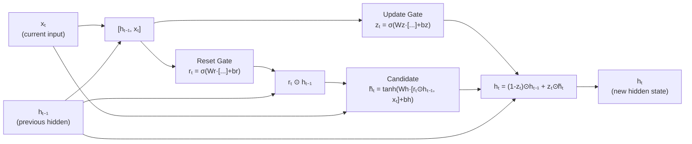

# Lesson 3.1 — GRU Architecture: A Streamlined LSTM

---

## The Question GRU Asks

LSTM was a major improvement over vanilla RNNs. But it raised an immediate engineering question: do you actually need four gate computations per step? Is the cell state / hidden state separation necessary, or is it architectural overhead?

In 2014, Cho et al. proposed the **Gated Recurrent Unit (GRU)** as an answer to this question. GRU merges the LSTM's forget gate and input gate into a single **update gate**, and eliminates the separate cell state entirely. The result: fewer parameters, faster computation per step, and — critically — comparable performance to LSTM on many tasks.

GRU is not a simplified LSTM. It is a redesign that makes different architectural trade-offs. Understanding why it makes those choices, and what it gives up, is what makes the difference in an interview.

---

## What GRU Removes from LSTM

LSTM has:
- Cell state `Cₜ` (long-term memory)
- Hidden state `hₜ` (short-term / output)
- Three gates: forget, input, output
- One candidate: C̃ₜ

Total weight matrices: **4** (Wf, Wi, Wc, Wo)

GRU has:
- Only one state: hidden state `hₜ` (no separate cell state)
- Two gates: reset gate `rₜ`, update gate `zₜ`
- One candidate: `h̃ₜ`

Total weight matrices: **3** (Wr, Wz, Wh)

The key design decision: **GRU eliminates the cell state by folding its function into the hidden state.** A single vector serves as both long-term memory and the per-step output. The gates control how much of the old state is preserved versus how much new information is written.

---

## The Two GRU Gates

### Gate 1: The Reset Gate — How Much to Forget

```
rₜ = σ(Wr · [hₜ₋₁, xₜ] + br)
```

Where:
- `rₜ` — values between 0 and 1 for each position
- `σ` — sigmoid

**In plain English:** The reset gate controls how much of the previous hidden state is visible when computing the candidate new state. If `rₜ ≈ 0`, the candidate is computed almost entirely from the current input (ignore the past). If `rₜ ≈ 1`, the candidate is computed using the full previous hidden state.

Think of the reset gate as: *"How relevant is my past memory for understanding the current input?"* When you start a new topic or sentence, `rₜ` should be low — the old context is no longer useful.

### Gate 2: The Update Gate — How Much to Keep vs Replace

```
zₜ = σ(Wz · [hₜ₋₁, xₜ] + bz)
```

**In plain English:** The update gate controls the interpolation between the old hidden state and the new candidate state. It simultaneously plays the role of LSTM's forget gate (how much to keep) and input gate (how much to write) — but as complementary values: what is kept is (1 - zₜ) and what is written is zₜ.

When `zₜ ≈ 0`: keep almost all of the old hidden state (very little new information written).  
When `zₜ ≈ 1`: replace almost all of the old hidden state with the new candidate.

This is where GRU simplifies LSTM: instead of two independent gates (forget and input) that could both be partially open or closed independently, GRU uses one gate with complementary values. This is a stronger inductive bias — "if you write more, you keep less" — which reduces parameters but limits expressivity slightly.

---

## The GRU Update Equations

**Step 1 — Candidate hidden state:**
```
h̃ₜ = tanh(Wh · [rₜ ⊙ hₜ₋₁, xₜ] + bh)
```

The reset gate is applied to `hₜ₋₁` before computing the candidate. This allows the candidate to be based on a "reset" version of the past.

**Step 2 — Final hidden state update:**
```
hₜ = (1 - zₜ) ⊙ hₜ₋₁  +  zₜ ⊙ h̃ₜ
```

Where:
- `(1 - zₜ) ⊙ hₜ₋₁`: how much of the old state to carry forward
- `zₜ ⊙ h̃ₜ`: how much of the new candidate to write

Notice: this is the same additive update structure as LSTM's cell state. The gradient path through `hₜ₋₁` goes through `(1 - zₜ)`, not through a full weight matrix and tanh. This is GRU's mechanism for resisting vanishing gradients.

---

## GRU Architecture Diagram



*GRU has three weight matrices (Wr, Wz, Wh) and two gates. No separate cell state — one vector serves as both memory and output.*

---

## Concrete Example: Short Story Tracking

A GRU processes a short news article: *"Apple reported record profits. The tech giant attributed this to iPhone sales."*

| Step | Input | Reset Gate | Update Gate | Hidden State Effect |
|---|---|---|---|---|
| "Apple" | Company name | high (keep past) | high (write new) | "subject = Apple" written |
| "reported" | Verb | medium | medium | Verb context added |
| "record profits" | NP | medium | medium | Profit context added |
| "." | End sentence | low → resets context | low → keep memory | Resets syntactic context |
| "The tech giant" | Referring phrase | high | medium | Maintains "subject = Apple" (coreference) |
| "attributed" | Verb | medium | medium | Action verb context |
| "iPhone sales" | Key noun | high | high | Updates with causal factor |

The update gate near "." stays low (keeping long-term memory of "Apple" being the subject) while the reset gate drops (clearing within-sentence syntactic context). This is GRU correctly maintaining entity tracking across sentence boundaries — a legitimate long-range dependency.

---

> **Interview note:** *"What is the key architectural difference between GRU and LSTM?"*  
> Two differences: (1) GRU has no separate cell state — a single hidden state serves as both long-term memory and per-step output. (2) GRU uses two gates (reset, update) instead of three (forget, input, output). The update gate plays the combined role of LSTM's forget and input gates but with a complementary constraint (keep = 1 − write), which reduces parameters but reduces independent control.  
> The honest follow-up: LSTM's separate cell state gives it more representational flexibility — the output gate can read a fraction of long-term memory for each step independently of what was written. GRU cannot do this independently. Whether this extra flexibility matters depends on the task.

> **Interview note:** *"Does GRU solve vanishing gradients the same way as LSTM?"*  
> The mechanism is similar but not identical. In GRU, the gradient path through `hₜ₋₁` goes through `(1 - zₜ)` — an additive update, similar to LSTM's cell state gradient path through `fₜ`. When the update gate is near 0 (keep old state), the gradient flows back through the hidden state with minimal decay. In LSTM, the protected path is specifically the cell state, and the hidden state has its own vanishing gradient path. In GRU, there is only one path. The practical result: both handle long-range dependencies comparably, though some empirical studies show LSTM has a slight edge on tasks with very complex long-range structure.

---

## Summary

- GRU eliminates LSTM's separate cell state and reduces from three gates to two: the **reset gate** (controls how much past is used in the candidate) and the **update gate** (controls how much of the old state to keep vs replace).
- The update gate is a unified replacement for LSTM's forget + input gates, using complementary values: `keep = (1 − z)` and `write = z`.
- The hidden state update `hₜ = (1-zₜ) ⊙ hₜ₋₁ + zₜ ⊙ h̃ₜ` is additive, providing a gradient highway similar to LSTM's cell state path.
- GRU has ~3x the parameters of a vanilla RNN (vs LSTM's 4x), making it faster and lighter with comparable performance on many tasks.
- The full GRU vs LSTM trade-off analysis — the key interview question — is in Lesson 3.3.
