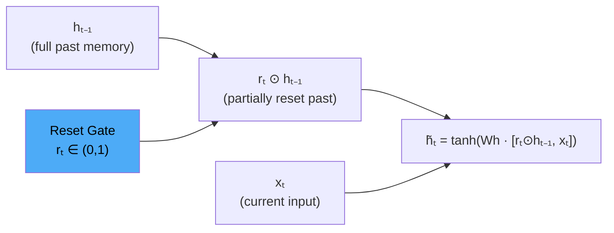
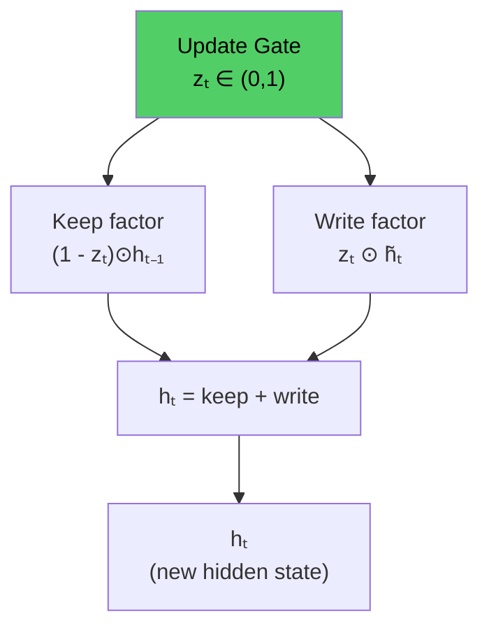

# Lesson 3.2 — GRU Gates: Reset & Update in Depth

---

## Why Two Gates Are Enough

LSTM uses three gates: forget (erase cell state), input (write to cell state), and output (read from cell state). GRU argues that three independent gates is more than necessary. The key simplification:

- LSTM's **forget gate** and **input gate** operate independently. You can simultaneously keep a lot of old information *and* write a lot of new information — the gates are uncoupled.
- GRU's **update gate** forces a trade-off: the more new information you write, the less old information you keep. `keep = (1 − z)`, `write = z`. The two decisions are complementary, not independent.

Additionally, LSTM's **output gate** controls what fraction of the cell state to expose. GRU eliminates the separate cell state, so there is nothing to selectively expose — the entire hidden state is the output. The reset gate partially compensates by controlling what old state is visible during candidate computation.

This is a deliberate architectural simplification with a real cost: less independent control over memory operations. The empirical result is that this cost is often small enough to be acceptable in exchange for fewer parameters.

---

## The Reset Gate: Controlling What Past Matters Now

```
rₜ = σ(Wr · [hₜ₋₁, xₜ] + br)
```

The reset gate modulates how much of `hₜ₋₁` participates in computing the new candidate `h̃ₜ`:

```
h̃ₜ = tanh(Wh · [rₜ ⊙ hₜ₋₁, xₜ] + bh)
```

**Extreme cases:**

- `rₜ = 0` (full reset): `rₜ ⊙ hₜ₋₁ = 0`. The candidate is computed entirely from `xₜ`. The past hidden state is completely ignored. The model behaves as if it is reading this token for the first time, from scratch.

- `rₜ = 1` (no reset): `rₜ ⊙ hₜ₋₁ = hₜ₋₁`. The candidate is computed using the full previous hidden state and current input. Standard integration of past and present.

**What the network learns to do with the reset gate:**

For tokens that mark topic boundaries (sentence endings, section headers, "however", "on the other hand"), the model learns to set `rₜ` close to 0 — essentially saying "start fresh." For tokens that are deeply dependent on recent context (pronouns like "it", "they", "this"), the model learns to set `rₜ` close to 1 — essential to compute the correct representation of the current token using all recent memory.



*The reset gate scales how much of the past hidden state is visible when computing the candidate. Zero means ignore the past; one means use it fully.*

---

## The Update Gate: The Unified Memory Controller

```
zₜ = σ(Wz · [hₜ₋₁, xₜ] + bz)
```

The update gate controls the final interpolation:

```
hₜ = (1 - zₜ) ⊙ hₜ₋₁  +  zₜ ⊙ h̃ₜ
```

**Extreme cases:**

- `zₜ = 0` (full copy of past): `hₜ = hₜ₋₁`. The hidden state is unchanged. The model "passes through" without updating its memory. This is useful for irrelevant tokens — punctuation, stop words in some contexts — where the model should not update its memory.

- `zₜ = 1` (full replace): `hₜ = h̃ₜ`. The old hidden state is completely overwritten with the new candidate. The model decides this token is important enough to completely replace the current memory.

**The gradient insight:** The gradient of `hₜ` with respect to `hₜ₋₁` is `(1 − zₜ)`. When the update gate is small (the model is "passing through"), this gradient is close to 1 — meaning the loss signal flows backward to early steps almost unchanged. This is GRU's mechanism for avoiding vanishing gradients. The network learns to keep `zₜ` low for memory slots it wants to preserve, which simultaneously preserves the memory content AND preserves the gradient path.



*The update gate controls a soft interpolation. More writing = less keeping. Gradient flows back through the (1-z) term.*

---

## Side-by-Side: Reset vs Update Gate Roles

| Gate | Question It Answers | Affects | LSTM Equivalent |
|---|---|---|---|
| **Reset Gate** `rₜ` | How much of past state to use in computing the *candidate*? | Candidate `h̃ₜ` computation | Partial equivalent of forget + output gate logic |
| **Update Gate** `zₜ` | How much of *old state vs new candidate* to use as the new state? | Final `hₜ` update | Combined forget + input gate |

The reset gate operates on the *computation* of what to write. The update gate operates on the *decision* of how much to write. They work at different stages.

---

## Concrete Example: Sentiment Shift Detection

Input: *"The product was good, but the service was terrible."*

| Token | Reset Gate | Update Gate | Effect |
|---|---|---|---|
| "The product was good" | High (keep context) | Medium | Positive sentiment stored in hₜ |
| "," | Medium | Low | Minor pause; hidden state mostly unchanged |
| "but" | Low (reset positive framing) | High | Reset gate clears old sentiment framing; update gate writes "contrast marker" |
| "the service was terrible" | High (use "contrast" context) | High | Negative sentiment written, overriding earlier positive |
| Final hₜ | — | — | Overall: negative (last sentiment dominates) |

The reset gate at "but" is the key: it tells the candidate computation to mostly ignore the previously stored positive sentiment, so the new candidate is computed from a neutral base plus the word "but." The update gate then writes this contrast context strongly. By the end of "terrible," the final hidden state reflects negative sentiment — correctly capturing the sentiment shift.

---

> **Interview note:** *"What does the reset gate do, and how is it different from the update gate?"*  
> Reset gate: controls how much of the previous hidden state is used when computing the *candidate* new state. It acts inside the tanh computation. Think of it as: "should I factor in my past when deciding what to write?"  
> Update gate: controls how much of the final hidden state comes from the old state versus the new candidate. It acts outside the tanh. Think of it as: "should I actually write this, or keep what I had?"  
> The weak answer treats them as interchangeable memory controls. The strong answer identifies that they operate at different stages: reset controls the *computation of what to write*, update controls the *decision of whether to write it*.

> **Interview note:** *"Explain the GRU update rule. Why is it `(1 - zₜ)` for keeping and `zₜ` for writing?"*  
> This is an **interpolation**: `hₜ = (1-z)·old + z·new`. When z=0, new state = old state (no write). When z=1, new state = new candidate (full overwrite). Values between 0 and 1 blend proportionally. The complementary structure means the gate learns a single number that simultaneously controls forgetting and writing. This reduces parameters (one gate instead of two) but removes the ability to simultaneously remember a lot of old information AND write a lot of new information — which LSTM's independent gates allow.

---

## Summary

- The **reset gate** `rₜ` scales how much of `hₜ₋₁` is visible during candidate computation: `h̃ₜ = tanh(Wh · [rₜ ⊙ hₜ₋₁, xₜ])`. Near-zero means start fresh; near-one means fully use the past.
- The **update gate** `zₜ` controls the final interpolation: `hₜ = (1-zₜ)·hₜ₋₁ + zₜ·h̃ₜ`. Near-zero means keep old state; near-one means replace with candidate.
- The gradient of `hₜ` with respect to `hₜ₋₁` is `(1-zₜ)`. When `zₜ ≈ 0` (keep mode), gradients flow backward with minimal decay — GRU's resistance to vanishing gradients.
- The two gates operate at different stages: reset affects how the candidate is computed; update affects whether the candidate replaces the old state.
- GRU's update gate forces a complementary trade-off (write more = keep less), unlike LSTM's independent forget and input gates. This is simpler but slightly less expressive.
