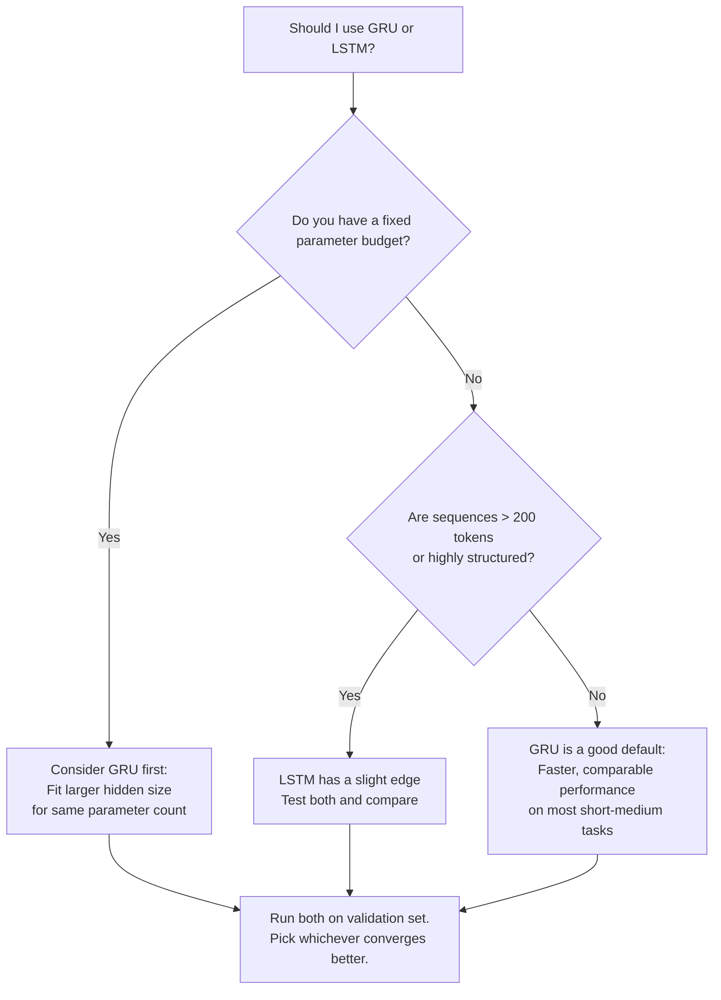

# Lesson 3.3 — GRU vs LSTM: The Real Trade-off

---

## The Core Interview Question

"GRU vs LSTM" is one of the most commonly asked questions in ML interviews, and it is almost always answered poorly. The weak version: "GRU is faster but LSTM remembers better." That answer reveals surface-level pattern matching, not understanding.

The strong answer requires knowing exactly *why* GRU is faster, *why* LSTM might remember better, *when* that memory difference actually matters, and what the empirical research says. This lesson builds that complete picture.

---

## Architectural Differences: Precise Summary

| Component | LSTM | GRU |
|---|---|---|
| **Memory channels** | Cell state `Cₜ` + Hidden state `hₜ` | Hidden state `hₜ` only |
| **Gates** | 3: forget, input, output | 2: reset, update |
| **Weight matrices** | 4: Wf, Wi, Wc, Wo | 3: Wr, Wz, Wh |
| **Parameters per cell** | `4 × (H + I) × H` | `3 × (H + I) × H` |
| **Gate independence** | Forget ⊥ Input (independent) | `keep = (1-z), write = z` (coupled) |
| **Gradient path** | Through cell state: `Π fᵢ` | Through hidden state: `Π (1-zᵢ)` |
| **Output** | `hₜ = oₜ ⊙ tanh(Cₜ)` | `hₜ` directly |

The parameter count difference: for a typical NLP model with hidden size H=256, input size I=300:
- LSTM: `4 × (256 + 300) × 256 = 569,344` parameters per cell
- GRU: `3 × (256 + 300) × 256 = 427,008` parameters per cell
- **Ratio: GRU uses ~75% of LSTM's parameters** — about 25% fewer

---

## What the Research Actually Says

The empirical comparison between LSTM and GRU has been studied extensively. The honest summary:

**On most tasks, the performance difference is small — often within noise.** Neither architecture consistently dominates the other. The choice between them should be driven by your specific constraints, not by a belief that one is fundamentally superior.

**Where GRU tends to do better:**
- Smaller datasets (fewer parameters = less overfitting)
- Shorter sequences (< 100 tokens) where neither architecture's long-range capability is stressed
- Tasks requiring fast inference (lower per-step cost)
- When training time / compute budget is tight

**Where LSTM tends to do better:**
- Very long sequences (> 200 tokens) where the separate cell state provides more stable gradient flow
- Tasks requiring complex, structured long-term memory (subject-verb agreement across long relative clauses)
- When you need the output gate's independent control over what to expose (LSTM can "read" from the cell state selectively; GRU exposes its full hidden state)

**The honest answer:** Run both on your specific task and compare on validation loss. The winning architecture will be task-dependent.

---

## Full Comparison Table

| Dimension | GRU | LSTM | Winner |
|---|---|---|---|
| **Parameter count** | ~75% of LSTM | Baseline | GRU |
| **Training speed (same H)** | Faster (~25%) | Slower | GRU |
| **Inference latency per step** | Lower | Higher | GRU |
| **Memory at training** | Less | More | GRU |
| **Short-range tasks** | Comparable | Comparable | Tie |
| **Long-range dependencies** | Slightly worse | Slightly better | LSTM |
| **Very structured memory** | Less expressive | More expressive | LSTM |
| **Interpretability** | Simpler | More modular | GRU |
| **Empirical NLP benchmarks** | Competitive | Competitive | Tie |

---

## The Key Difference That Matters Most in Practice

The practical difference that shows up most often is the **parameter efficiency vs expressivity trade-off:**

- If you have a **fixed parameter budget** (e.g., you need the model to fit in 50MB), you can fit a larger hidden size with GRU than with LSTM for the same total parameters. A GRU with H=400 might outperform an LSTM with H=300 on the same budget — because a wider GRU sometimes beats a narrower LSTM even on long-range tasks.

- If you have a **fixed computation budget**, GRU runs more steps in the same time, which means it can process more data in the same training time.

This is the nuanced version of "GRU is faster" — it is faster in ways that have cascading effects on what model you can train.

*Decision tree for GRU vs LSTM selection. Neither is universally superior — task constraints determine the choice.*

---

## Concrete Example: Sequence Labeling on Medical Notes

You are building a NER system for short clinical notes (average 80 tokens). You have 10,000 training examples and a GPU with 16GB memory.

With LSTM (H=512): ~1.2M parameters per cell. Training takes 4 hours. Validation F1: 91.2%.  
With GRU (H=512): ~900K parameters per cell. Training takes 3 hours. Validation F1: 91.0%.  
With GRU (H=640, same param budget as LSTM H=512): Same parameters. Training takes 3.5 hours. Validation F1: 91.5%.

The GRU at equivalent parameter count *slightly outperforms* the LSTM because the wider hidden size compensates for the simpler gating. In practice, this outcome is common for short-to-medium sequence NLP tasks.

---

> **Interview note:** *"Why would you choose GRU over LSTM?"*  
> Three concrete reasons, in order of importance:  
> 1. **Parameter efficiency**: For the same parameter budget, GRU allows a wider hidden size, which sometimes compensates for the simpler gating.  
> 2. **Training speed**: ~25% fewer parameters = ~25% faster training per epoch. With a tight compute budget or many experiments to run, this compounds.  
> 3. **Comparable empirical performance**: On most standard NLP benchmarks, GRU matches LSTM within noise. There is rarely a statistically significant reason to pay LSTM's overhead unless the task specifically requires complex long-term structured memory.  
> The wrong answer: "because GRU is simpler." Simplicity is not the goal. Efficiency and performance are.

> **Interview note:** *"What can LSTM do that GRU cannot?"*  
> Two things:  
> 1. **Independent forget and input gate control**: LSTM can simultaneously decide to keep most of its old cell state AND write a lot of new information. GRU's update gate forces a trade-off: write more means keep less. For tasks where you need to accumulate information from multiple sources simultaneously without overwriting old information, LSTM has an expressive advantage.  
> 2. **Separate output gate**: LSTM's output gate selectively reads a fraction of the cell state for each step. GRU exposes its full hidden state. If a task requires maintaining multiple independent memory "tracks" and only exposing the relevant one at each step, LSTM is more expressive. Classic example: tracking both the subject and verb tense of a sentence independently.

> **Interview note:** *"If I told you GRU and LSTM perform the same on a benchmark, which would you deploy in production?"*  
> GRU. If performance is identical, fewer parameters means smaller model file, faster inference, lower memory at deployment, and lower serving cost. The LSTM complexity overhead is only worth paying if it provides a performance advantage. If it doesn't, it is strictly worse from an engineering standpoint.

---

## Summary

- GRU uses 3 weight matrices vs LSTM's 4 — roughly 25% fewer parameters for the same hidden size. For the same parameter budget, you can run a wider GRU.
- GRU's update gate couples forgetting and writing (`keep = 1-z`, `write = z`); LSTM's forget and input gates are independent. This makes GRU slightly less expressive but simpler.
- Empirically, GRU and LSTM perform comparably on most tasks. LSTM has a slight, consistent edge on tasks with very long sequences (>200 tokens) or requiring structured independent memory tracks.
- If performance is equal, always choose GRU for production: smaller, faster, cheaper to serve.
- The honest practical advice: try both, compare on your validation set. Task-specific evaluation beats any general rule.
