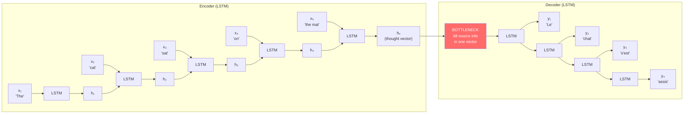

# Lesson 4.1 — The Fixed-Size Bottleneck: What LSTM Cannot Do

---

## The Problem That Survived LSTM

LSTM solved the vanishing gradient problem. Encoders could now read a sentence of 200 tokens and carry meaningful signal all the way to the end. That was a real breakthrough.

But by 2014, a new problem had become clear — particularly in machine translation. When you use an LSTM as a **seq2seq encoder-decoder**, the entire source sentence must be compressed into a single fixed-size vector: the encoder's final hidden state. The decoder reads this vector and generates the translation.

This is the **fixed-size bottleneck**: no matter how long or complex the source sentence, all of its meaning must fit into one vector of, say, 512 or 1024 numbers. For short sentences, this is fine. For long sentences, it is lossy. And as the source sentence gets longer, the translation quality degrades — measurably and predictably.

This lesson explains exactly why the bottleneck exists, what it costs, and why it could not be fixed within the standard seq2seq LSTM architecture.

---

## The Seq2Seq Architecture and Its Bottleneck

A standard LSTM seq2seq model has two parts:

1. **Encoder**: An LSTM that reads the source sequence x₁, x₂, ..., xₙ left to right. The final hidden state `hₙ` (the "thought vector") is the encoder's summary of the entire source sentence.

2. **Decoder**: An LSTM that generates the target sequence y₁, y₂, ..., yₘ one token at a time, starting from the thought vector.

*The encoder summarizes the entire source into a single vector. The decoder must generate the entire translation from that one vector. Information loss is unavoidable for long sequences.*

---

## Why the Bottleneck Hurts: The Specific Failures

### Failure 1: Long Sentence Degradation

Empirically, BLEU scores (translation quality metric) for LSTM seq2seq models drop as sentence length increases beyond ~30–40 words. The thought vector cannot hold enough information about the beginning of a long sentence to still be useful by the time the encoder reaches the end.

### Failure 2: Alignment Loss

In translation, there is a natural word-level alignment: "the cat" maps to "le chat," "sat on" maps to "s'est assis sur." When the decoder generates "chat," it needs to attend to "cat" in the source — not the entire source sentence equally. But in a standard seq2seq model, the decoder has access only to the one thought vector. It cannot "look back" at any specific source word. All source words are equally (and uniformly) compressed.

### Failure 3: Irreversible Information Loss

LSTM's cell state provides a highway for gradients and information, but information still gets overwritten over many steps. A source word from position 3 in a 50-word sentence has been processed by 47 subsequent LSTM steps before reaching the encoder's final hidden state. Some of the signal from position 3 survives, but with non-trivial distortion.

The fundamental issue is structural: **a fixed-size vector cannot represent unbounded information.** H numbers cannot faithfully represent a sentence of arbitrary length. This is not a failure of LSTM's gating — it is a failure of the architecture's output contract.

---

## Quantifying the Problem

In 2014, Cho et al. (who proposed GRU in the same paper) showed that standard LSTM encoder-decoder performance on English-French translation degraded significantly for sentences longer than 30 words. Bahdanau et al. (2015) reproduced this and showed the degradation clearly in a plot:

| Source Sentence Length | LSTM Seq2Seq BLEU | LSTM + Attention BLEU |
|---|---|---|
| < 10 words | 29.0 | 31.0 |
| 10–20 words | 27.5 | 30.5 |
| 20–30 words | 25.0 | 30.0 |
| 30–40 words | 21.0 | 29.5 |
| > 40 words | 17.0 | 28.5 |

The gap widens with length. Attention nearly flat-lines where LSTM seq2seq collapses.

---

## Why Can't You Just Use a Bigger Hidden State?

This is the obvious engineering response: if H=512 is too small to hold a long sentence, use H=2048. The problem is that a bigger hidden state:

1. **Grows parameters quadratically**: doubling H doubles the input to each LSTM gate and doubles the hidden state size, which multiplies the weight matrices by 4x. A 4x parameter increase for modest gains.
2. **Does not fundamentally change the compression**: even H=2048 is a fixed number. A 200-word sentence has semantics that span dozens of dimensions of meaning. At some length, any fixed H is insufficient.
3. **Makes the training harder**: larger hidden states are harder to train and more prone to overfitting without large datasets.

The right solution is not to make the bottle bigger — it is to **eliminate the bottleneck entirely** by letting the decoder access all encoder hidden states directly, not just the final one. That is exactly what attention does, which is the subject of Lesson 4.2.

---

> **Interview note:** *"Why does LSTM seq2seq translation quality degrade for long sentences?"*  
> The encoder compresses the entire source sequence into a single fixed-size vector — the final hidden state. For short sentences, this vector can hold all relevant information. For long sentences, the vector becomes a lossy summary: information from early positions gets overwritten or diluted by 30–50 subsequent LSTM steps. The decoder only has access to this one compressed vector, so it cannot directly access what was said at position 3 when generating a word that corresponds to position 3 in the source. Attention solves this by giving the decoder direct access to all encoder hidden states, weighted by relevance.

> **Interview note:** *"The LSTM cell state is designed to preserve long-range information. Why doesn't it prevent the bottleneck?"*  
> The cell state solves the gradient problem — it allows information to survive many steps with minimal decay. But the bottleneck is not about gradient flow; it is about information capacity. The cell state is still a fixed-size vector (H numbers). No matter how well the LSTM preserves information across steps, it must still compress the meaning of the entire source sentence into H numbers at the end. A single vector cannot represent unbounded information. The cell state solves "information dying during the forward pass." It does not solve "information being compressed into a fixed-size summary at the end."

---

## Summary

- Standard seq2seq LSTM forces all source information into the encoder's final hidden state — a fixed-size vector called the "thought vector."
- This fixed-size bottleneck causes measurable translation quality degradation as source sentence length increases beyond ~30–40 words, because H numbers cannot faithfully encode arbitrarily complex semantics.
- The decoder cannot "look back" at individual source positions — it only has access to the compressed thought vector.
- Increasing the hidden state size does not fundamentally solve the problem — it only raises the threshold at which compression becomes lossy.
- The structural solution is to let the decoder access *all* encoder hidden states at each decoding step, weighted by relevance. This is attention — covered in Lesson 4.2.
