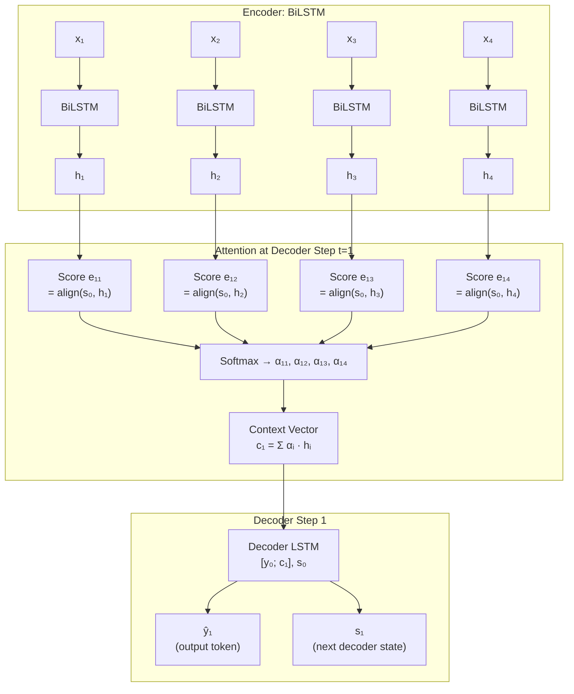
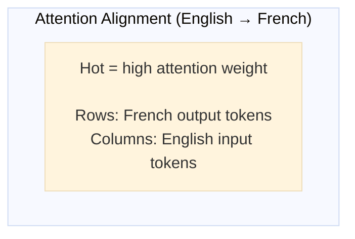

# Lesson 4.2 — Bahdanau Attention: How Attention Fixes the Bottleneck

---

## The Core Idea: Let the Decoder Look Back

Lesson 4.1 established the problem: the decoder has access to only one compressed vector representing the entire source sequence. Important source information gets lost in the compression.

Bahdanau et al. (2015) proposed a direct structural fix: **don't compress the source into one vector at all.** Instead, keep all the encoder hidden states and let the decoder, at each decoding step, compute a weighted sum over all encoder states. The decoder "looks back" at the source and decides which source positions are most relevant for the current output step.

This is attention. The decoder's query ("what am I trying to generate right now?") is matched against each encoder state ("what was at source position i?") to produce a relevance score. The scores are normalized into a probability distribution (attention weights). The weighted sum of encoder states is the "context vector" that the decoder uses at this step.

---

## How Bahdanau Attention Works: Step by Step

The Bahdanau mechanism is also called **additive attention** because it uses a small neural network (an additive combination) to compute alignment scores. Here is the full mechanism:

### Step 1: Encode the source

Run the source through a (typically bidirectional) LSTM encoder:

```
h₁, h₂, ..., hₙ = BiLSTM(x₁, x₂, ..., xₙ)
```

Keep all encoder hidden states — not just the final one. This is the key departure from standard seq2seq.

### Step 2: At each decoder step t, compute alignment scores

For each source position i, compute how well the current decoder state `sₜ₋₁` aligns with encoder hidden state `hᵢ`:

```
eₜᵢ = vᵀ · tanh(Wₛ · sₜ₋₁ + Wₕ · hᵢ)
```

Where:
- `sₜ₋₁` — the decoder's previous hidden state (what the decoder "knows" so far)
- `hᵢ` — the encoder hidden state at source position i
- `Wₛ`, `Wₕ` — learned weight matrices projecting both to the same space
- `vᵀ` — learned weight vector that produces a scalar score
- `eₜᵢ` — the raw alignment score: how relevant source position i is for generating output token t

The tanh + linear layer combination is why this is called **additive attention** — it adds the projected decoder state and encoder state, then passes through a nonlinearity.

### Step 3: Normalize into attention weights

Apply softmax over all source positions to get a probability distribution:

```
αₜᵢ = softmax(eₜᵢ) = exp(eₜᵢ) / Σⱼ exp(eₜⱼ)
```

`αₜᵢ` is the attention weight: how much decoder step t should "attend to" source position i.  
All αₜᵢ sum to 1: `Σᵢ αₜᵢ = 1`.

### Step 4: Compute the context vector

Take a weighted sum of all encoder hidden states, weighted by attention:

```
cₜ = Σᵢ αₜᵢ · hᵢ
```

`cₜ` is the context vector — a dynamic, query-dependent summary of the source. It is different at every decoder step because the attention weights change.

### Step 5: Use context vector in the decoder

Concatenate `cₜ` with the decoder input and feed to the decoder LSTM:

```
sₜ = LSTM([yₜ₋₁; cₜ], sₜ₋₁)
```

The decoder now has direct access to the relevant source information at each step, not just the compressed thought vector.

---

## Full Diagram: Bahdanau Attention in Seq2Seq



*Encoder produces all hidden states. At each decoder step, attention computes alignment scores against all encoder states, normalizes, and takes a weighted sum. The context vector gives the decoder direct access to relevant source content.*

---

## What Attention Weights Reveal

A key byproduct of attention is **interpretability**. The attention weight matrix αₜᵢ (decoder steps × source positions) can be visualized as a heatmap showing what source word each output word attended to:



For a good translation model, you expect near-diagonal alignment for monotonic language pairs. For non-monotonic pairs (e.g., German word order), you see the actual word reordering reflected in the attention matrix. This is directly interpretable — you can see *why* the model generated each word.

---

## Concrete Example: Translating a Long Sentence

Source: *"The scientists who published the groundbreaking study on RNA vaccines received the Nobel Prize."*

Without attention, the decoder trying to generate "prix Nobel" (Nobel Prize) has access only to the encoded thought vector, where "Nobel Prize" — occurring at the end of a 15-word sentence — may have survived well, but the relationship to "scientists" (subject at the beginning) is compressed and partially lost.

With attention, when the decoder generates "prix" (Prize):
- The attention mechanism computes scores across all 15 source positions
- "Nobel" and "Prize" at positions 13–14 get high attention weights (αₜ,₁₃ ≈ 0.6, αₜ,₁₄ ≈ 0.3)
- The context vector directly encodes "Nobel Prize" information
- The decoder generates "prix" correctly, using the targeted source signal

When the decoder generates "Nobel":
- Similar high weights on "Nobel" and "Prize"
- No ambiguity about what the next word should be

The model does not need to rely on the compressed thought vector having preserved this structure. It goes directly to the source.

---

> **Interview note:** *"What is Bahdanau attention, and why was it needed?"*  
> Bahdanau attention was introduced to fix the fixed-size bottleneck in seq2seq LSTMs. Instead of compressing the source into one vector, it keeps all encoder hidden states and lets the decoder compute a weighted sum over them at each decoding step. The weights (attention weights) are computed by a small alignment network that scores how relevant each source position is to the current decoder state. This gives the decoder direct, position-specific access to the source — eliminating information loss from compression.

> **Interview note:** *"What is the difference between Bahdanau attention (additive) and Luong attention (multiplicative)?"*  
> Bahdanau (additive): `eₜᵢ = vᵀ · tanh(Wₛ·sₜ + Wₕ·hᵢ)`. Computes scores by projecting both states to a common space and adding, then applying a linear layer. Slower but more expressive for dissimilar state sizes.  
> Luong (multiplicative/dot-product): `eₜᵢ = sₜᵀ · hᵢ`. Just the dot product of decoder state and encoder state (or a linear transformation). Faster because no extra projection network. Requires states to be the same size (or projected to the same size).  
> In practice, both work similarly. Luong attention is closer to the attention mechanism inside Transformers (which use scaled dot-product attention). Bahdanau is historically earlier.

> **Interview note:** *"Does attention solve the sequential computation problem in RNNs?"*  
> No. Attention with RNNs is added on top of an existing LSTM encoder and decoder. The LSTM still runs sequentially — step by step, step t waits for step t-1. Attention adds a parallel lookup operation *between* the encoder and decoder, but it does not eliminate the sequential bottleneck inside the encoder or decoder. The Transformer's self-attention mechanism replaces the RNN entirely — that is what enables full parallelization.

---

## Summary

- Bahdanau attention fixes the bottleneck by keeping **all** encoder hidden states instead of compressing to one vector.
- At each decoder step, it computes alignment scores between the decoder's current state and each encoder hidden state, normalizes to get attention weights (summing to 1), and takes a weighted sum to produce a step-specific context vector.
- The context vector gives the decoder direct, targeted access to the most relevant source positions — eliminating the fixed-size compression loss.
- A byproduct: the attention weight matrix is interpretable as a soft alignment between source and target tokens.
- Attention with RNNs does not fix the sequential computation problem — the LSTM encoder and decoder still run step by step. Full parallelization required replacing the RNN entirely with self-attention (Transformers).
