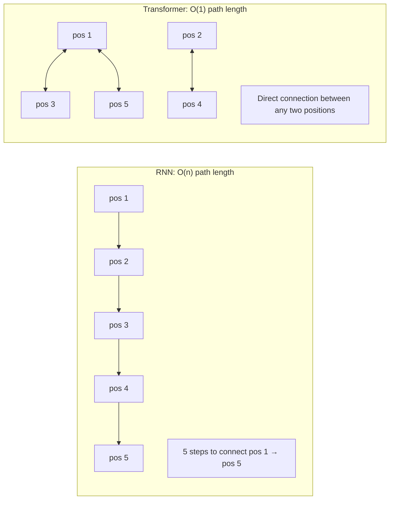
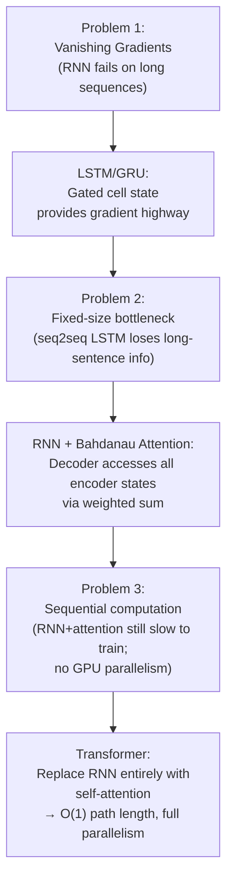

# Lesson 4.3 — From RNN+Attention to Transformers: The Natural Progression

---

> *If you have not read Lesson 4.2 on Bahdanau Attention, do that first — this lesson builds directly on it.*

---

## Attention Worked. So Why Replace the RNN?

By 2016, RNN+attention was state-of-the-art for machine translation. It was better than vanilla seq2seq LSTM, interpretable, and practical. The obvious question: why not stop here?

The answer requires being precise about what attention with RNNs actually solved and what it did not.

**What RNN+attention fixed:**
- The fixed-size information bottleneck (decoder can directly access any source position)
- Translation quality degradation on long sentences

**What RNN+attention did not fix:**
- Sequential computation inside the encoder (still step-by-step, cannot parallelize)
- Sequential computation inside the decoder (still step-by-step)
- Training time proportional to sequence length on GPUs

The RNN was still there, running sequentially, using only a fraction of the GPU's available compute. Attention was an add-on that improved quality but did not unlock hardware efficiency.

---

## The Question That Led to Transformers

The natural follow-up question in 2017 was:

*"We added attention to the RNN because attention was the useful part. What if we removed the RNN entirely and only kept the attention?"*

This is exactly what the "Attention Is All You Need" paper (Vaswani et al., 2017) did. The Transformer architecture replaces RNN encoders and decoders with **stacked self-attention layers** — attention mechanisms that let each position in a sequence attend to every other position, directly, in parallel.

Since you know Transformer architecture, this lesson focuses only on the logical bridge — why this replacement was natural, and what specific properties change.

---

## The Three Key Differences

### Difference 1: Path Length Between Positions

In an RNN, to connect position 1 and position n, information must travel through n-1 sequential RNN steps. Each step can corrupt or dilute the signal.

In a Transformer, any two positions are connected directly via attention — the path length is O(1). Position 1 can attend to position n in a single operation.

*RNN: information about position 1 must travel through every intermediate step to reach position 5. Transformer: any two positions connect directly via self-attention.*

### Difference 2: Parallelism

RNN: the hidden state at step t requires the hidden state at step t-1. This is a sequential data dependency. The entire forward pass runs step-by-step. On a GPU with 5,000+ cores, most cores sit idle.

Transformer: self-attention computes all pairwise interactions simultaneously. The entire sequence is processed in parallel. GPU utilization is dramatically higher.

**Practical consequence:** A Transformer can be trained on 10x–100x more data in the same wall-clock time as an LSTM. More data means better models. This is the dominant reason for the Transformer's success — not just architecture, but hardware-aligned efficiency.

### Difference 3: Attention Is Now Self-Attention

In RNN+attention, attention is a *cross-attention* mechanism: the decoder attends to encoder states. The attention operation is between two different sequences (source and target).

In Transformers, the encoder uses **self-attention**: each position attends to all other positions in the *same* sequence. This lets the encoder directly model relationships between any two words in the input, regardless of distance — and do it in one parallel pass.

---

## The Bridge Summary

*The evolution of sequence models is a chain of problem-solution pairs. Each solution revealed the next problem.*

---

## What Transformers Give Up

This lesson would be incomplete without noting what Transformers cost:

| Property | RNN/LSTM | Transformer |
|---|---|---|
| **Attention complexity** | O(n) per step | O(n²) in self-attention |
| **Memory for long sequences** | O(H) — constant | O(n²) — quadratic |
| **Streaming inference** | Natural (one step at a time) | Requires KV cache (grows with n) |
| **Very long sequences** | Feasible (O(n) memory) | Expensive (O(n²) memory) |

The O(n²) attention cost is Transformer's main limitation. For sequences of 100,000 tokens, standard Transformer attention is impractical. This is an active research area (Flash Attention, Sparse Attention, Mamba/SSM architectures), but for most NLP tasks with sequences ≤ 4,096 tokens, O(n²) is manageable on modern hardware.

---

> **Interview note:** *"Why did Transformers replace RNN+attention instead of just improving RNN+attention?"*  
> RNN+attention improved translation quality but left the fundamental training bottleneck intact: the RNN encoder and decoder were still sequential, still under-utilizing GPU parallelism. The attention mechanism itself suggested a different architecture — if cross-attention (decoder→encoder) was valuable, self-attention (each position→all positions in the same sequence) was the natural extension. Self-attention is fully parallelizable and gives O(1) path length between any two positions, completely replacing what the RNN was doing — but without the sequential dependency. The RNN was the bottleneck, not the attention. Removing the bottleneck was the right engineering decision.

> **Interview note:** *"What does RNN+attention still share with Transformers, and what did Transformers replace?"*  
> Shared: the attention mechanism itself — computing alignment scores, softmax normalization, weighted sum to produce a context vector. This is essentially the same operation in both architectures.  
> Replaced: the RNN backbone. In RNN+attention, attention is an add-on layer. The sequence is still encoded and decoded by a recurrent network. In Transformers, self-attention is the *entire* encoding mechanism. The RNN is gone. There is no recurrence, no hidden state, no sequential dependency.

---

## Summary

- RNN+attention solved the bottleneck (decoder can access all encoder states) but did not solve sequential computation — the LSTM still ran step by step, GPU-inefficiently.
- The Transformer replaced the RNN entirely with self-attention, achieving O(1) connection path length between any two positions and full training parallelism.
- The evolution is a chain: RNN → LSTM (fixes vanishing gradients) → RNN+attention (fixes bottleneck) → Transformer (fixes sequential computation).
- Transformers trade O(n) memory (RNN) for O(n²) memory (attention). This makes very long sequences expensive, which is Transformer's main remaining limitation.
- The mechanism that makes Transformers powerful is self-attention — which is conceptually derived from cross-attention in RNN+attention, extended to let each position attend to all other positions in the same sequence.
