# Lesson 5.1 — The Sequential Computation Problem

---

## The Problem That Neither LSTM Nor GRU Could Fix

LSTM fixed vanishing gradients. GRU made LSTM more efficient. RNN+attention fixed the information bottleneck. By 2017, the NLP community had a highly capable architecture in Bi-LSTM + attention. It worked well. It shipped to production. It was the state of the art.

And yet, training it was agonizingly slow — and getting slower as models grew and datasets scaled.

The reason was a problem that no amount of gating or attention could fix: **every recurrent architecture is fundamentally sequential.** You cannot compute step t until step t-1 is done. This creates a hard bottleneck on GPU utilization that makes training at scale extremely inefficient.

This lesson explains exactly why this bottleneck exists, what it costs in practice, and why it was the decisive reason Transformers replaced LSTM in production.

---

## Why RNNs Are Inherently Sequential

The recurrence relation:

```
hₜ = f(hₜ₋₁, xₜ)
```

There is a data dependency: `hₜ` depends on `hₜ₋₁`. You cannot compute `h₅` until you have `h₄`. You cannot compute `h₄` until you have `h₃`. And so on. For a sequence of length n, you have n steps that must execute one after another.

This is a **sequential data dependency** — a chain where each operation must wait for the previous one to complete before starting. It is the same reason a waterfall cannot run in parallel: each step of the waterfall depends on the step above it.

LSTM does not remove this dependency. It adds more computation per step (four gate operations instead of one), which makes each sequential step *heavier*, not faster.

---

## GPU Utilization: The Real Cost

A modern GPU (e.g., NVIDIA A100) has 6,912 CUDA cores. All of these cores can run operations simultaneously, delivering massive throughput for parallelizable computations.

For a matrix multiplication (the core operation in neural networks), the GPU can split the work across thousands of cores and complete it in a fraction of the time a CPU would take.

For an LSTM processing a sequence of length 512:

1. Compute h₁ (using all GPU cores for the matrix multiply — fast, good utilization)
2. **Wait** for h₁ to complete
3. Compute h₂ (all GPU cores for matrix multiply — fast, but only 1/512 of time spent computing)
4. **Wait** for h₂ to complete
5. ... repeat 512 times

The GPU's 6,912 cores are doing the matrix multiply for roughly 1/512 of the total training time for any given sequence step. The rest of the time, they are waiting.

This is catastrophically inefficient for long sequences on modern hardware.

```mermaid
gantt
    title Training a Sequence of Length 8
    dateFormat X
    axisFormat %s

    section RNN/LSTM (Sequential)
    Step 1 : 0, 1
    Wait   : 1, 2
    Step 2 : 2, 3
    Wait   : 3, 4
    Step 3 : 4, 5
    Wait   : 5, 6
    Step 4 : 6, 7
    Wait   : 7, 8

    section Transformer (Parallel)
    All 8 positions simultaneously : 0, 2
```



*RNN processes steps one at a time, each waiting for the previous. Transformer processes all positions at once. For length 512, the efficiency gap is enormous.*

---

## What This Means at Training Scale

Consider the difference in practice. In 2017, Google trained the original Transformer on WMT English-French translation:

- LSTM best model at the time: trained for ~7 days on 8 P100 GPUs
- Transformer base model: trained in ~12 hours on 8 P100 GPUs

Same hardware, same dataset, comparable quality — the Transformer trained ~14x faster. Not because the Transformer does less computation, but because it uses the available compute more efficiently by processing all positions in parallel.

At the scale of modern LLMs (hundreds of billions of parameters, trillions of tokens), this efficiency difference is not 14x — it makes the difference between feasible and completely infeasible. You cannot train GPT-3 with an LSTM. Not because of LSTM's quality ceiling — but because the training would take decades on any practical hardware cluster.

---

## The Core Asymmetry

| | RNN/LSTM/GRU | Transformer |
|---|---|---|
| **Computation along sequence** | Sequential: must wait for step t-1 | Parallel: all positions computed simultaneously |
| **GPU utilization during training** | Low (sequential bottleneck) | High (fully parallel attention) |
| **Training time vs sequence length** | O(n) — linear in sequence length | O(n²) — quadratic in sequence length (but parallelized) |
| **Data dependency** | Strong (hₜ depends on hₜ₋₁) | None within a layer (all positions independent) |
| **Feasibility at modern scale** | Impractical for > a few billion parameters | Current standard for all large language models |

The counterintuitive entry: Transformer training is O(n²) in compute per layer, while RNN is O(n). How can a higher asymptotic cost train faster? Because the O(n²) operations are fully parallelized and run simultaneously across GPU cores, while RNN's O(n) operations run sequentially. Parallelized O(n²) can complete in much less wall-clock time than sequential O(n), given sufficient hardware parallelism.

---

> **Interview note:** *"Why does the sequential nature of RNNs matter if GPUs are already fast at matrix multiplications?"*  
> GPUs are fast at matrix multiplications, but only when many of them can be done simultaneously. An RNN forces you to do matrix multiplications one after another — the next cannot start until the current one finishes. For a sequence of length 512, you do 512 sequential matrix multiplications. The GPU is occupied for only ~1/512 of the time with useful computation; the rest of the time it waits. Transformers compute attention across all positions simultaneously — the GPU is near-fully utilized throughout. The same GPU runs 10x–100x more useful computation per second on a Transformer than on an RNN of similar size.

> **Interview note:** *"If Transformers are O(n²) and RNNs are O(n), why are Transformers faster to train?"*  
> The complexity analysis ignores the hardware execution model. O(n) operations in sequence on a GPU with 6,000+ idle cores is far slower in wall-clock time than O(n²) operations executed simultaneously. Modern GPUs are built to do thousands of operations in parallel — under-utilizing them with sequential computation is the real cost. Transformers match the hardware's architecture (parallel). RNNs do not.

---

## Summary

- The RNN recurrence relation (`hₜ = f(hₜ₋₁, xₜ)`) creates a hard sequential data dependency: step t cannot start until step t-1 completes. This cannot be engineered away — it is inherent to the recurrence.
- On a GPU with thousands of cores, sequential computation means most cores sit idle most of the time. GPU utilization for RNN training is extremely low for long sequences.
- Training the Transformer's original base model took ~12 hours vs ~7 days for the best LSTM model at the time — approximately 14x faster training on the same hardware.
- At modern LLM scale (billions of parameters, trillions of tokens), LSTM-style sequential computation is not just slow — it is completely infeasible. Transformers are the only architectures that match modern GPU/TPU hardware's parallel compute model.
- The O(n²) attention compute in Transformers is paradoxically faster than O(n) sequential RNN compute because all n² operations run in parallel on GPU cores.
