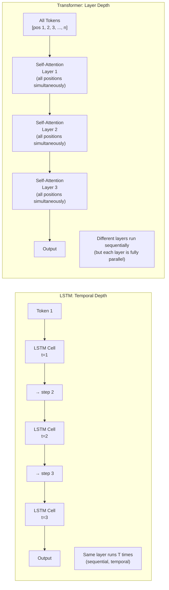

# Lesson 5.2 — What Transformers Do Differently (Brief Bridge)

---

> *This lesson is a bridge — it explains what Transformers replaced and why, without re-teaching Transformer architecture. Since you know Transformer internals, the focus here is on the contrast with RNN/LSTM, not on re-explaining self-attention or positional encoding from scratch.*

---

## Three Things Transformers Changed

### 1. No Recurrence — Positional Encoding Instead

RNNs encode position implicitly: the order in which tokens are processed determines their relative positions. Token at step 1 affects token at step 2, which affects step 3 — the order is built into the computation graph.

Transformers have no recurrence. All tokens are processed simultaneously. Without explicit order information, the model would treat "dog bites man" and "man bites dog" identically. To encode position, Transformers add **positional encodings** — vectors that represent each position — to the input embeddings before processing.

This is a direct trade-off: by removing the sequential constraint (to enable parallelism), Transformers had to explicitly encode what RNNs got for free (position order). The trade is worthwhile because positional encoding is a minor overhead; parallelism is a massive gain.

### 2. Self-Attention Replaces Recurrence for Context

In an LSTM, the hidden state at position t encodes context from all previous positions (with decaying influence for earlier positions). The mechanism is recurrence — each step updates the hidden state.

In a Transformer encoder, each position directly attends to every other position via self-attention. The mechanism is explicit: for every pair of positions (i, j), compute a relevance score. No intermediate positions carry information — position 1 connects to position 50 directly.

This gives Transformers a structural advantage for long-range dependencies:
- LSTM: position 1's influence on position 50 passes through 49 intermediate steps. It can survive (LSTM's cell state), but with some degradation.
- Transformer: position 1 directly attends to position 50. No intermediate steps. Attention weight is directly learned.

### 3. Layered Depth Instead of Temporal Depth

RNNs have **temporal depth**: the same layer runs T times (once per time step). The "depth" is in time, not in layers. This is why training is sequential.

Transformers have **layer depth**: L stacked transformer blocks, each processing the entire sequence simultaneously. The depth is in layers, not time. Each layer refines the representations produced by the layer below — building hierarchical abstractions.

*LSTM runs one layer T times sequentially. Transformer runs L different layers, each processing all T positions in parallel. The parallelism is within each layer, not across layers.*

---

## What Transformers Require That RNNs Don't

| Requirement | RNN/LSTM | Transformer |
|---|---|---|
| **Full sequence upfront** | No — can process streaming | Yes — all tokens needed for attention |
| **Memory per sequence** | O(H) — fixed | O(n²) — quadratic for attention |
| **Position encoding** | Implicit (order of processing) | Explicit (added to embeddings) |
| **Minimum viable hardware** | Low — even CPU viable | High — benefits from large GPU memory |

---

## The Capability Differences in Practice

Because of full parallelism and O(1) path length between any two positions, Transformers:

1. **Scale better with data**: More data + faster training = better models. Transformers can consume 10–100x more data in the same time as LSTM.
2. **Handle long-range dependencies more reliably**: Direct attention between any two positions, with no intermediate steps to corrupt the signal.
3. **Enable pretraining at scale**: BERT trained on 3 billion tokens in 4 days on 64 TPUs. An LSTM equivalent would require weeks or months. Pretraining LSTM at the scale of GPT-3 (300 billion tokens) is effectively impossible on current hardware.

---

> **Interview note:** *"What specifically does a Transformer do that an LSTM cannot?"*  
> Three things:  
> 1. **Full parallelism at training time** — Transformer processes all positions simultaneously; LSTM is strictly sequential.  
> 2. **O(1) path length between any two positions** — any two tokens attend to each other directly; LSTM requires information to travel through all intermediate steps.  
> 3. **Scale** — practical pretraining at billions/trillions of tokens is only feasible with parallel compute. LSTMs at that scale are computationally infeasible.  
> The Transformer does not "understand language better" in some abstract sense — it trains on more data faster, which produces better models empirically.

---

## Summary

- Transformers removed recurrence, replacing it with self-attention and positional encodings. The trade: explicit position encoding (small cost) for full training parallelism (massive gain).
- Self-attention gives O(1) connection path between any two positions, versus O(n) in LSTM. This enables more reliable long-range dependency modeling.
- LSTM has temporal depth (same layer runs n times). Transformers have layer depth (L different layers, each fully parallel). Depth in layers is compatible with GPU parallelism; depth in time is not.
- Transformers require the full sequence upfront and O(n²) memory — making streaming inference more complex and very long sequences expensive.
- The fundamental reason Transformers dominate: they match GPU hardware's parallel compute model, enabling training at scales (data volume, model size) that are simply impractical for sequential architectures.
