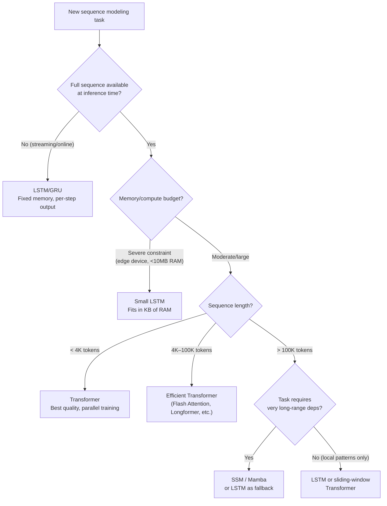

# Lesson 5.3 — When Would You Still Choose RNN/LSTM Today?

---

## The Nuanced Answer Interviewers Are Looking For

"Transformers are always better" is the worst answer you can give in an ML interview. It signals that you have memorized a ranking without understanding the engineering trade-offs. Every architecture exists for a reason — the question is whether that reason applies to your specific problem.

RNN/LSTM/GRU are not obsolete. They remain the correct choice in specific, well-defined scenarios. This lesson explains those scenarios precisely, with the reasoning — because an interviewer will ask you to justify your choice.

---

## Scenario 1: True Streaming Inference

**The situation:** You are processing a continuous data stream where you must produce an output after each incoming token, with fixed latency and no ability to "wait for the full sequence."

Examples:
- Real-time automatic speech recognition (ASR): generate text as audio comes in, without waiting for the speaker to stop
- Network intrusion detection: classify each incoming packet immediately, not after a full packet batch
- Sensor anomaly detection on IoT devices: flag anomalies in real time, one reading at a time

**Why LSTM wins:** An LSTM processes one token at a time, maintaining a fixed-size hidden state (H numbers). It produces an output at each step. Memory footprint is constant — independent of how long the stream has been running.

A Transformer's autoregressive inference maintains a **KV cache** (key-value pairs for all past tokens) to avoid recomputing attention over the full history on each step. This KV cache grows linearly with sequence length. For an infinite stream, the KV cache grows unboundedly. Eventually it exceeds available memory.

For an LSTM: H numbers regardless of stream length.  
For a Transformer with KV cache: O(n × H) — grows forever.

LSTM is the right architecture for unbounded streaming contexts.

---

## Scenario 2: Extreme Memory Constraints (Edge Devices)

**The situation:** You are deploying a model on a microcontroller, smart sensor, or embedded device with kilobytes of RAM, not gigabytes.

Examples:
- Keyword spotting on a smart device (detecting "Hey Siri" or "OK Google" offline)
- ECG anomaly detection on a wearable
- Predictive maintenance on an industrial sensor

**Why LSTM wins:** A small LSTM (H=32, H=64) can fit in tens of kilobytes. It processes one time step at a time with O(H) memory. The entire model — weights + runtime state — fits on the device.

Even the smallest practical Transformer requires sufficient memory for its embedding table, all layer weights, and the KV cache for at least some context length. For constrained devices, this is often infeasible.

---

## Scenario 3: Very Long Sequences Where O(n²) Attention Is Prohibitive

**The situation:** Your sequences are extremely long — tens of thousands to millions of tokens — and standard full attention is computationally impractical.

Examples:
- Long genomic sequences (DNA has millions of base pairs)
- Long-context document processing (10,000+ token legal contracts, books)
- Time series with very high sampling rates (seconds-level IoT data over months)

**Why LSTM is competitive:** For O(n) compute and O(H) memory at inference, LSTM's per-step cost is constant. Processing a 100,000-token sequence costs exactly 100,000 LSTM steps — expensive, but linear. A full Transformer attention over 100,000 tokens requires O(n²) = 10^10 operations and O(n²) memory — completely impractical without approximations.

**Caveat:** This is an active research area. Efficient Transformer variants (Flash Attention, Longformer, BigBird, Mamba/SSM) are closing this gap. For very long sequences today, the choice is not "LSTM vs Transformer" but "LSTM vs efficient Transformer variant." In some domains (genomics), SSM-based architectures (like Mamba) that maintain constant-size state are showing strong results.

---

## Scenario 4: Reinforcement Learning Agents with Partial Observability

**The situation:** A reinforcement learning agent must act in an environment where it cannot see the full state — it only sees observations, one at a time, and must infer the hidden state from history.

Examples:
- An RL agent playing a game where the board is only partially visible
- A robotic arm that cannot directly observe object positions, only force feedback
- A trading agent that must act at each time step based on recent market data

**Why LSTM works well here:** The LSTM's hidden state naturally represents the agent's "belief state" — a compressed summary of everything it has seen. The agent takes an action based on this hidden state, receives an observation, and updates the hidden state. This per-step sequential model matches the sequential nature of the agent-environment interaction. Most RL frameworks (OpenAI Gym, RLlib) support LSTM-based policies natively.

Transformers have been used in RL (Decision Transformer, Gato), but the KV cache overhead and non-streaming nature make them more complex to deploy in fast-cycling RL training loops.

---

## Full Decision Framework

*Use this decision tree to navigate the real architecture choice. "Transformer is always best" is not engineering — it is a pattern match.*

---

## Concrete Example: Real-Time Speech Recognition

You are building a speech-to-text system for a call center that must transcribe speech with < 200ms latency. The audio is continuous — the speaker does not pause after every sentence for the system to "batch" audio.

**Transformer-based approach:** You need to wait for a "chunk" of audio, encode it, attend over it, and decode. The KV cache grows with audio length. For a 30-minute call (thousands of audio frames), the memory requirement becomes problematic without aggressive cache management.

**LSTM-based approach (e.g., classic DeepSpeech, streaming LSTM ASR):** The LSTM reads one audio frame at a time, updates the hidden state, and outputs a character/phoneme at each step. Memory is constant regardless of call duration. Latency per step is the cost of one LSTM forward pass — very low.

This is why industrial real-time ASR systems (phone calls, live captions) often still use LSTM-based acoustic models. The Transformer's quality advantage is real — but for streaming with hard latency requirements, LSTM's architecture is more natural.

---

> **Interview note:** *"You're building a real-time system that processes medical sensor data (one reading per second, 24/7 operation). LSTM or Transformer?"*  
> LSTM. Three reasons: (1) streaming — you produce a prediction after each reading without buffering; (2) unbounded duration — 24/7 operation means unlimited sequence length; Transformer's KV cache would grow forever; (3) likely edge deployment — medical devices often have limited compute. An LSTM with hidden state H=64 could fit in <1MB with constant runtime memory. A Transformer cannot.

> **Interview note:** *"Are LSTM/GRU obsolete?"*  
> For most mainstream NLP tasks with full-sequence access and moderate compute: effectively yes — Transformers dominate on quality and training efficiency. But "obsolete" implies no use case. That is wrong. LSTM remains the correct engineering choice for streaming inference, edge deployment, and very long sequences where O(n²) attention is impractical. Additionally, in reinforcement learning, LSTM is still widely used for recurrent policies. The honest answer: LSTM is obsolete for the task it was originally most famous for (competitive NLP benchmarks). It is not obsolete as an architectural primitive.

---

## Summary

- **Never say "Transformer is always better."** Architecture choice depends on constraints: sequence availability, memory budget, sequence length, latency requirements.
- Choose LSTM/GRU over Transformer in four scenarios: (1) streaming inference where the full sequence is never available, (2) extreme memory constraints (edge/embedded devices), (3) very long sequences (>100K tokens) where O(n²) attention is impractical, (4) RL agents with partial observability requiring per-step state updates.
- LSTM's key runtime advantage: O(H) constant memory per step, regardless of sequence length. Transformer's KV cache grows O(n) with sequence length — unbounded for infinite streams.
- For modern NLP on reasonable sequence lengths with full data access: Transformer or efficient Transformer variants are the right default.
- LSTM is not obsolete. It is the right tool for specific, important engineering contexts where Transformers are impractical or unnecessarily complex.
