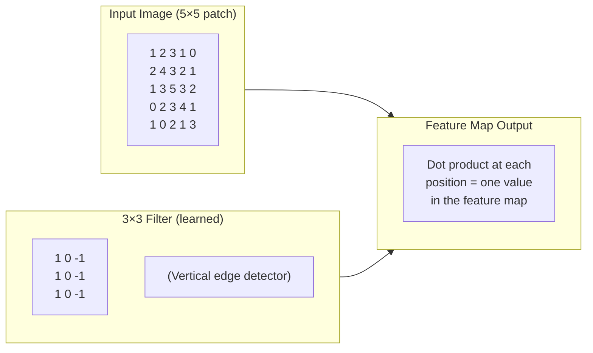
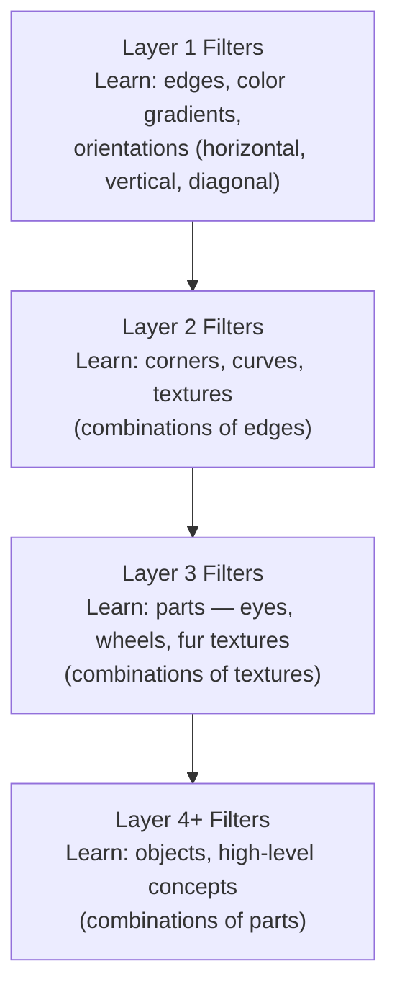

# Lesson 1.1 — How CNNs See: Convolution, Filters, Feature Maps

---

## The Problem: Why Feedforward Networks Fail on Images

A standard feedforward network treats every input as a flat vector. For a 224×224 RGB image, that means 224 × 224 × 3 = **150,528 inputs** connected to every neuron in the first layer. A single hidden layer with 1,000 neurons requires 150 million parameters — just for one layer. More importantly, it throws away all spatial information: the network treats pixel (0,0) and pixel (100,100) as completely independent, with no concept of adjacency, edges, or shapes.

This fails for a deeper reason: images have **spatial structure**. A cat's ear looks like a cat's ear whether it appears in the top-left or the bottom-right of the image. A feedforward network would need to learn the "ear detector" pattern 150,528 different times — once for every pixel position. This is both computationally wasteful and statistically impossible without enormous amounts of data.

Convolutional Neural Networks solve this with two core ideas: **local connectivity** (a neuron only looks at a small region) and **weight sharing** (the same filter slides across all positions). Together, they let the network learn a feature detector once and apply it everywhere.

---

## The Convolution Operation

A **filter** (also called a kernel) is a small matrix of learned weights, typically 3×3 or 5×5. It slides across the input image and at each position computes a dot product between the filter weights and the pixel values underneath it. The result is a single number — a scalar that measures how strongly that filter's pattern is present at that location.

**Step by step for a 3×3 filter on a grayscale image:**

1. Place the 3×3 filter at position (0,0) of the image
2. Multiply each filter weight by the corresponding pixel value (element-wise)
3. Sum all 9 products → one number (the activation at position (0,0))
4. Slide the filter one step right (stride=1) and repeat
5. After covering all positions, you have a 2D grid of activations — the **feature map**



*The filter slides across the input. At each position, the dot product produces one value in the feature map. The feature map shows where and how strongly this filter's pattern appears.*

**Multiple filters = multiple feature maps.** If you use 64 filters, you get 64 feature maps — one per filter. Each filter learns a different pattern: edges at different angles, color gradients, blobs, textures. The collection of 64 feature maps forms the output volume of the conv layer: a 3D tensor of shape (height × width × 64).

---

## What Filters Learn

You do not manually design filters. The filters are initialized randomly and learned through backpropagation — they update to minimize the loss just like any other weight. What they actually learn, at each layer:



*CNNs build hierarchical representations. Each layer detects patterns that are composed of the patterns found in the layer below.*

This hierarchy is why CNNs generalize. A "wheel detector" at layer 3 can recognize a wheel regardless of where it appears in the image — because the edge and curve detectors in earlier layers that feed into it already handle position invariance via weight sharing.

---

## Key CNN Vocabulary

**Stride**: how many pixels the filter moves per step. Stride=1 preserves spatial dimensions. Stride=2 halves them (downsampling).

**Padding**: adding zeros around the input border so the filter can be applied to edge pixels. "Same" padding preserves the spatial size; "valid" padding lets it shrink.

**Output size formula** (for one dimension):
```
output_size = floor((input_size - filter_size + 2 × padding) / stride) + 1
```

For a 32×32 input, 3×3 filter, stride=1, same padding: output = 32×32. For stride=2: output = 16×16.

**Number of parameters in a conv layer:**
```
params = filter_height × filter_width × input_channels × num_filters + num_filters (bias)
```

For a 3×3 filter with 64 input channels and 128 output filters:
`3 × 3 × 64 × 128 + 128 = 73,856 parameters`

This is the power of weight sharing: **73K parameters process the entire image**, regardless of image resolution. Compare to a fully connected layer: a 224×224×64 input with 128 outputs would require `224 × 224 × 64 × 128 = 410 million parameters`.

---

## Concrete Example: Amazon Product Image

Suppose Amazon wants to classify a product image as "electronics" or "clothing."

- **Layer 1 filters** detect low-level structure: straight lines (electronics have screens and edges), fabric textures (clothing has soft, irregular texture).
- **Layer 2 filters** detect mid-level structure: rectangular regions (screen borders), repeating patterns (fabric weave).
- **Layer 3+ filters** detect parts: a screen with buttons = electronics signal; collar and sleeve shapes = clothing signal.
- **Final layer**: a classifier on top of the accumulated feature maps makes the prediction.

The key insight: the same filter that detects "vertical edge" works whether the screen is on the left side or right side of the image. That is weight sharing making the model efficient and generalizable.

---

> **Interview note:** *"What is the difference between a fully connected layer and a convolutional layer?"*
> FC layer: every input connected to every output — no spatial awareness, O(input × output) parameters.
> Conv layer: each output connected to only a small local region (filter size), and the same filter weights are used at every position — weight sharing. This gives CNNs two key properties: (1) translation invariance — a pattern is detected regardless of where it appears, and (2) parameter efficiency — a 3×3 conv layer has orders of magnitude fewer parameters than an FC layer for image inputs.

> **Interview note:** *"What does a convolutional filter actually learn?"*
> Early layers learn low-level features: edges, corners, color gradients. Middle layers learn textures and parts. Deep layers learn semantic concepts. This hierarchy emerges purely from gradient-based learning — you do not hand-design it. The key is that each layer's filters learn to detect patterns that are useful combinations of the patterns the layer below detects.

---

## Summary

- Feedforward networks fail on images: they destroy spatial structure and require an impractical number of parameters.
- A convolutional filter is a small matrix of learned weights that slides across the input, computing a dot product at each position to produce a feature map showing where that pattern appears.
- **Weight sharing**: the same filter applies at every position — one "edge detector" works everywhere, not one per pixel location. This is why CNNs are parameter-efficient.
- Multiple filters per layer = multiple feature maps. Stacking conv layers builds a hierarchy: edges → textures → parts → objects.
- Output size: `floor((input - filter + 2×pad) / stride) + 1`. Parameter count: `filter_h × filter_w × in_channels × out_filters`.
