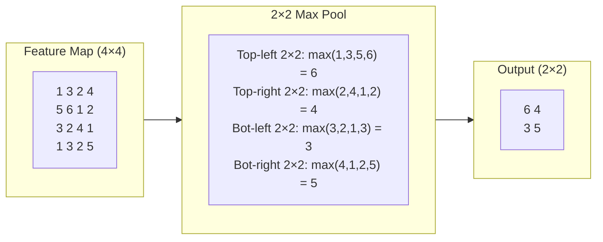
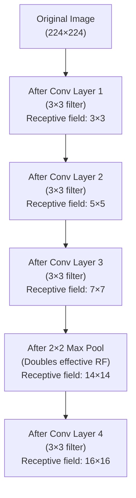
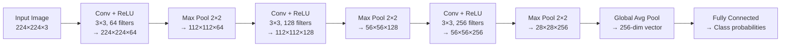

# Lesson 1.2 — Pooling, Receptive Field, and CNN Depth

---

## The Problem: Feature Maps Are Too Large and Too Position-Sensitive

After a conv layer, you have a feature map — a 2D grid showing where a filter's pattern appears. For a 224×224 image with 64 filters, the feature map is 224×224×64 = 3.2 million values. If you stack 10 conv layers without ever reducing this size, the computational cost is enormous and the final representation is still extremely high-dimensional.

There is a second problem: a feature map entry fires at a very specific pixel position. If the cat's ear is at pixel (45, 67), the "ear detector" fires at (45, 67). If the image is shifted by 2 pixels, the same ear is now at (43, 65) — and the feature map looks different. You want the model to be robust to small translations. The current feature map is not.

**Pooling** solves both problems: it downsamples the feature map (reducing size) while making the representation more position-invariant.

---

## Max Pooling: The Standard Solution

**Max pooling** divides the feature map into non-overlapping windows (typically 2×2) and takes the maximum value in each window.

For a 2×2 max pool with stride 2:
- Input: 4×4 feature map
- Output: 2×2 feature map
- Each output value = maximum activation in the corresponding 2×2 input region

*Max pooling takes the strongest activation in each region. If the feature is anywhere in the 2×2 window, it is preserved. Small translations are absorbed.*

**Why max, not average?** Max pooling says "did this feature appear anywhere in this region?" — a binary-style detection. Average pooling dilutes strong activations with weak ones. For feature detection (does this edge exist here?), max is almost always better.

---

## Receptive Field: What Each Neuron "Sees"

The **receptive field** of a neuron is the region of the original input image that influences its activation. This is one of the most important concepts in CNN design, and frequently misunderstood.

A single neuron in a conv layer with a 3×3 filter sees a 3×3 region of the input. But a neuron in the *next* conv layer sees a 3×3 region of the previous feature map — which itself was computed from a 3×3 region of the original image. So the second-layer neuron's receptive field in the original image is 5×5.

Each layer increases the effective receptive field:

*Stacking 3×3 conv layers builds receptive field gradually. Pooling effectively doubles the receptive field by halving spatial dimensions. Deep networks give neurons a global view of the image.*

**Why this matters for design:** If your task requires understanding the relationship between objects on opposite sides of the image (e.g., "does this image show two matching shoes?"), you need neurons with a large enough receptive field to see both objects simultaneously. Shallow networks cannot do this. Deeper networks (with pooling) can.

**The 3×3 preference:** Two stacked 3×3 conv layers have the same receptive field as one 5×5 layer, but fewer parameters (`2 × 3×3×C×C = 18C²` vs `5×5×C×C = 25C²`) and an extra nonlinearity. This is why modern CNNs use 3×3 filters almost exclusively.

---

## The Full CNN Forward Pass

Putting it together, a typical CNN forward pass looks like this:

*Spatial dimensions halve at each pool layer. Channel depth increases. The final representation is a small vector that feeds a classifier.*

**Global Average Pooling (GAP):** Instead of flattening the final feature map into a huge vector (28×28×256 = 200K), GAP takes the average of each channel across all spatial positions, producing a 256-dimensional vector. This dramatically reduces parameters before the classifier and also provides a form of spatial invariance — the network produces the same 256-vector regardless of where in the 28×28 map the activation is.

---

## Concrete Example: Why Depth Matters for Amazon Product Search

Amazon's product image classifier needs to distinguish between similar categories: "running shoes" vs "casual shoes" vs "formal shoes." The distinguishing features are subtle:
- Running shoes: mesh texture, thick outsole, specific sole pattern
- Formal shoes: smooth leather, thin sole, specific toe shape

These are mid-to-high-level features that require multiple layers to detect:
- Layer 1–2: detect edges and material textures (mesh vs leather vs stitching)
- Layer 3–4: detect regional patterns (sole thickness, toe shape region)
- Layer 5–6: combine parts into "this looks like a running shoe"

A 2-layer CNN cannot distinguish these — the receptive field is too small and the hierarchy too shallow. A 6-layer CNN with pooling builds the receptive field large enough to see the full shoe and compare parts.

---

> **Interview note:** *"Why does max pooling help with translation invariance?"*
> If a feature appears anywhere within the pooling window, the max value captures it — regardless of its exact position within the window. Shift an image by 1 pixel: the feature moves slightly within the window but the max value is the same. For larger translations, multiple pools compound this: after two 2×2 pools, a 4-pixel shift is absorbed. Translation invariance is approximate and local — it applies within the pooling window, not globally. Global average pooling provides full global invariance.

> **Interview note:** *"Why do modern CNNs prefer two stacked 3×3 filters over one 5×5 filter?"*
> Same effective receptive field (5×5), but two 3×3 layers have `2 × 3×3 = 18` parameter units per channel pair vs `5×5 = 25` for one 5×5 layer — roughly 28% fewer parameters. More importantly, two 3×3 layers have two ReLU nonlinearities, making the representation more expressive. This insight, popularized by VGG (2014), is why almost all modern CNNs use 3×3 filters.

---

## Summary

- Max pooling takes the maximum in each non-overlapping window (typically 2×2), halving spatial dimensions and absorbing small translations — a feature is detected if it appears *anywhere* in the window.
- The **receptive field** is the region of the original image a neuron "sees." Stacking conv layers and pooling grows the receptive field deeper into the image, enabling neurons to detect large-scale patterns.
- Two 3×3 conv layers = same receptive field as one 5×5, but fewer parameters and an extra nonlinearity — this is why modern CNNs use 3×3 filters exclusively.
- A standard CNN pipeline: `Conv+ReLU → Pool → Conv+ReLU → Pool → ... → Global Avg Pool → FC classifier`. Spatial size shrinks, channel depth grows, each layer builds on the hierarchy of the previous.
- Global Average Pooling replaces flattening for the final step, producing a compact fixed-size vector that is spatially invariant.
