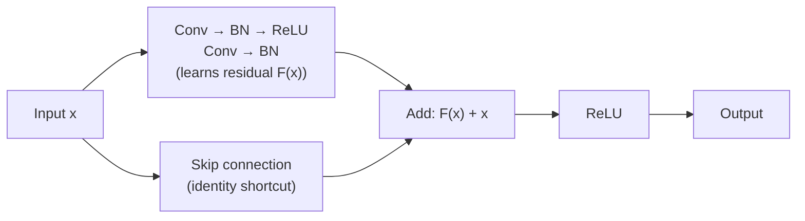
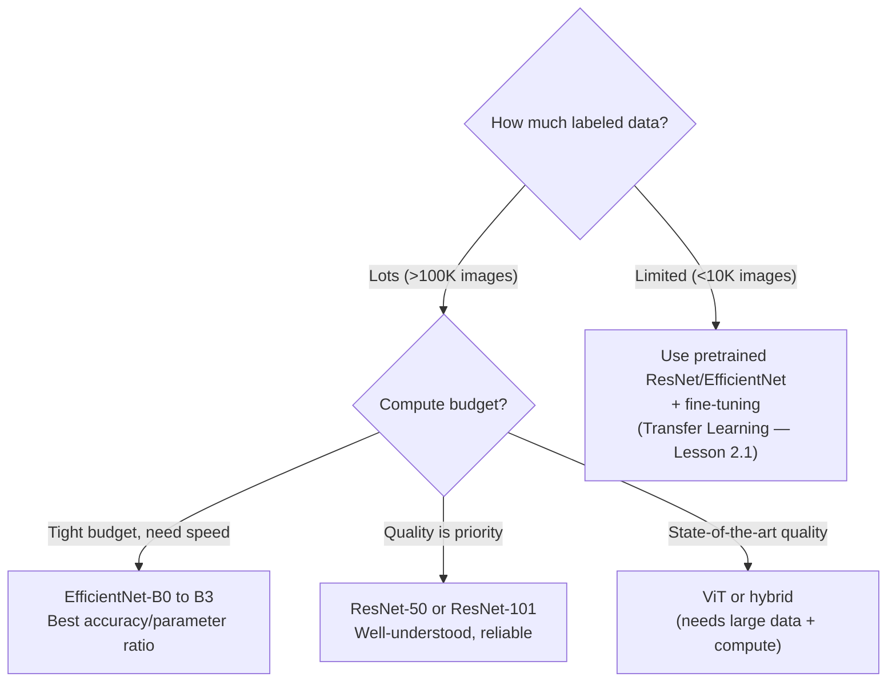

# Lesson 1.3 — CNN Architectures: From AlexNet to ResNet

---

## Why Architecture History Matters for Interviews

You do not need to memorize every layer of every architecture. What you need is the **design insight each architecture introduced** — because interviewers ask "why did ResNet use skip connections?" not "list all 152 layers of ResNet-152." Each major architecture solved a specific problem that the previous one could not. That problem-solution chain is what this lesson covers.

---

## AlexNet (2012): Deep Learning Wins ImageNet

**The problem it solved:** Before 2012, hand-crafted features (SIFT, HOG) dominated computer vision. AlexNet was the first deep CNN to win ImageNet at scale, proving that learned features beat hand-crafted ones.

**Key innovations:**
- ReLU activation instead of sigmoid/tanh — faster training, no saturation for large activations
- Dropout for regularization — prevented overfitting on the then-small ImageNet
- GPU training — made deep networks computationally feasible
- Data augmentation — random crops, flips to artificially expand the dataset

AlexNet achieved 15.3% top-5 error vs 26.2% for the runner-up. The gap shocked the community and triggered the deep learning era in vision.

---

## VGG (2014): Depth + Simplicity

**The problem it solved:** AlexNet used large filters (11×11, 5×5). VGG showed that using *only* 3×3 filters and going much deeper gives better results with a simpler, uniform design.

**Key insight:** Stack 3×3 conv layers. Two give a 5×5 receptive field with fewer parameters and more nonlinearities. Three give a 7×7 receptive field. Depth is more powerful than large filters.

**Limitation:** VGG-16 has ~138M parameters — enormously large by modern standards. Most of these are in the final fully-connected layers. It is slow and memory-hungry.

---

## ResNet (2015): The Skip Connection

**The problem it solved:** As networks got deeper (20, 30, 50 layers), training quality actually *degraded* — not from overfitting (training error also went up), but from optimization difficulty. Gradients became too small by the time they reached early layers. Deeper was not better.

**The insight:** What if each layer learns a *residual* (the difference from the identity) rather than a full transformation?

**The skip connection (residual block):**

```
Output = F(x) + x
```

Where `F(x)` is what the conv layers learn, and `x` is the input passed directly around the conv layers via a skip connection.



*The residual block adds the input directly to the layer output. If the layer learns F(x)=0 (identity), the block is harmless. This makes deeper networks safe to train.*

**Why this works — two reasons:**

1. **Gradient highway:** The skip connection creates a direct path for gradients from the loss back to early layers. Gradients no longer have to pass through every weight matrix in the chain — they can "shortcut" via the addition operation, which passes gradients backward with coefficient 1.

2. **Identity as a safe default:** If a layer is not helpful, it can learn F(x)=0 — making the block an identity function. No harm done. Without skip connections, a useless layer actively degrades performance.

ResNet-152 (152 layers) trained successfully and achieved 3.57% top-5 error on ImageNet — better than human-level performance (~5%).

---

## Architecture Comparison

| Architecture | Year | Layers | Params | Key Innovation | Limitation |
|---|---|---|---|---|---|
| **AlexNet** | 2012 | 8 | 60M | ReLU, dropout, GPU training | Large filters, not scalable |
| **VGG-16** | 2014 | 16 | 138M | Only 3×3 filters, depth | Enormous parameter count |
| **ResNet-50** | 2015 | 50 | 25M | Skip connections | Still conv-based, not parallel |
| **EfficientNet** | 2019 | varies | 5–66M | Compound scaling (W+D+R) | Complex design |
| **ViT** | 2020 | varies | 86M+ | Attention replaces conv | Needs huge data, high cost |

---

## EfficientNet (Brief): The Compound Scaling Insight

**The problem with ResNet scaling:** To make a bigger ResNet, researchers would just add more layers. But this is one-dimensional scaling. Should you also make the network wider (more filters)? Use higher resolution images?

EfficientNet introduced **compound scaling**: scale width, depth, and input resolution *simultaneously* using a fixed ratio, rather than tuning each independently. The result: much better accuracy per parameter than ResNet. EfficientNet-B0 matches ResNet-50 accuracy with 5.3M vs 25M parameters.

For interviews: you do not need EfficientNet internals. The insight is "scale all three dimensions together." That is the complete answer.

---

## What to Use in Practice



*Architecture selection is a trade-off between data availability, compute budget, and quality target.*

---

> **Interview note:** *"Why did ResNet use skip connections? What problem did they solve?"*
> Training deep networks (>20 layers) caused a degradation problem — training error *increased* as depth increased, ruling out overfitting as the cause. The problem was optimization: gradients couldn't reach early layers effectively through many layers of matrix multiplication. Skip connections create a direct gradient highway (the addition operation passes gradients through unchanged) and let layers learn residuals (corrections on top of the identity). If a layer learns nothing useful, the skip connection preserves the input unchanged. This made training 100+ layer networks stable and enabled significantly better accuracy.

> **Interview note:** *"ResNet-50 has 50 layers. How many parameters does it have compared to VGG-16 with 16 layers?"*
> ResNet-50: ~25M. VGG-16: ~138M. ResNet is 5x deeper but has 5x fewer parameters. This is because ResNet uses bottleneck blocks (1×1 convolutions to reduce dimensions before 3×3 conv) and global average pooling instead of large fully-connected layers at the end. The lesson: depth and parameter count are not correlated. Skip connections and architectural efficiency matter more than raw size.

---

## Summary

- AlexNet (2012): proved deep learned features beat hand-crafted ones. Introduced ReLU and dropout. Triggered the CV deep learning era.
- VGG (2014): showed that only 3×3 filters + depth beats large filters. Simple, uniform architecture. Very large parameter count (138M) from FC layers.
- ResNet (2015): introduced skip connections (`output = F(x) + x`) to solve training degradation in deep networks. Gradients shortcut via the addition; layers learn residuals. Trained 152-layer networks successfully.
- EfficientNet (2019): compound scaling of width, depth, and resolution simultaneously. Best accuracy per parameter among standard CNNs.
- In practice: ResNet-50 or EfficientNet-B3/B4 are the go-to backbones for most vision tasks. For limited data, use pretrained versions + fine-tuning (Lesson 2.1).
