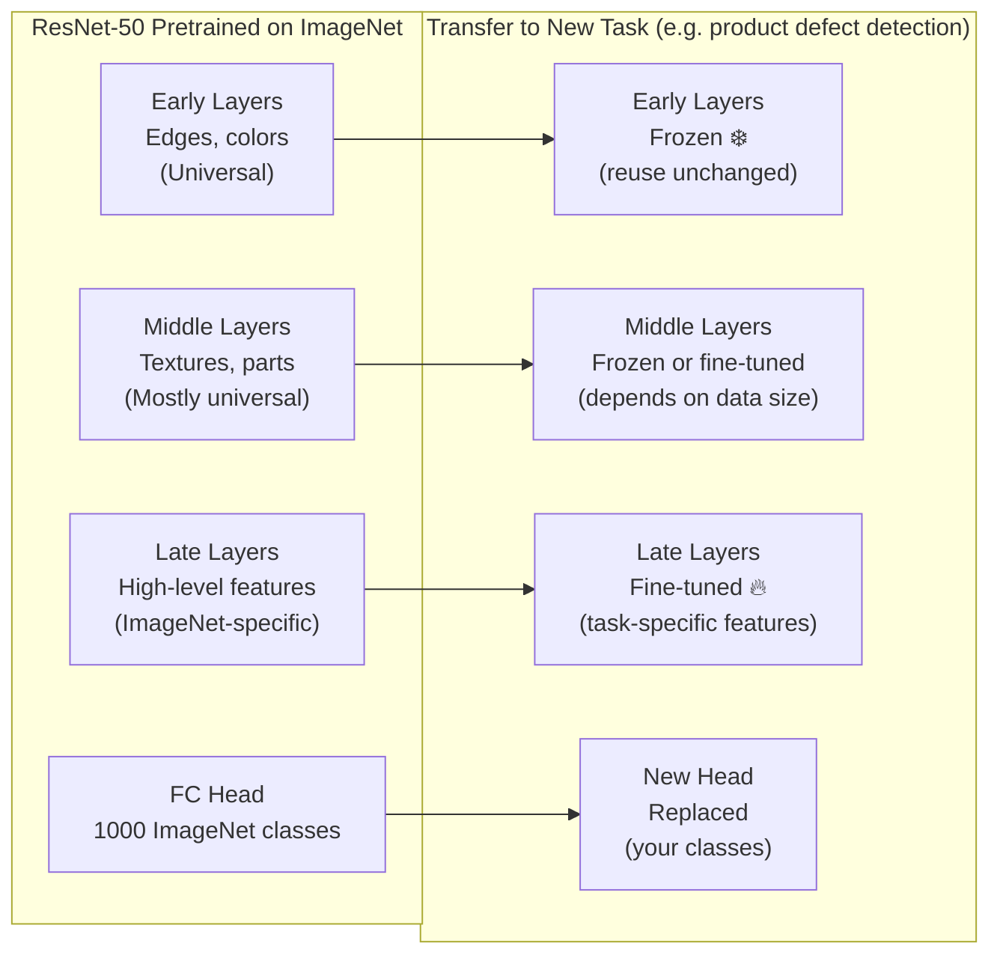
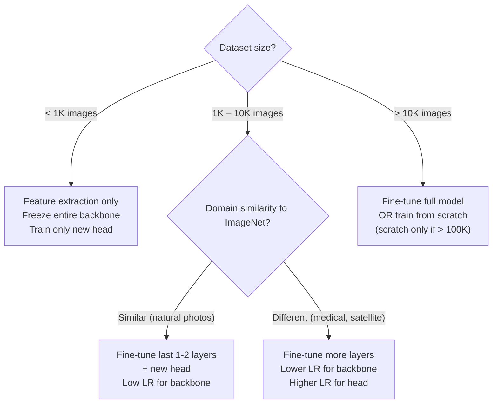

# Lesson 2.1 — Transfer Learning: Why It Works and When to Use It

---

## The Problem: You Never Have Enough Labeled Images

Training a ResNet-50 from scratch requires millions of labeled images and weeks of GPU time. In the real world, you almost never have this. A team building an Amazon product quality checker might have 5,000 labeled images of defective vs non-defective items. A medical imaging team might have 2,000 labeled X-rays. Training a deep CNN from scratch on this data produces an overfit, underperforming model.

The assumption behind training from scratch is that the model must learn everything about vision — edges, textures, shapes, objects — from your specific dataset. But a CNN trained on ImageNet (1.2 million images across 1,000 classes) has already learned all of that. It already knows what edges, textures, and object parts look like. You just need it to apply that knowledge to your specific problem.

This is **transfer learning**: take a model trained on a large general task, and reuse its learned representations for a different, smaller task.

---

## Why Transfer Learning Works: The Hierarchy Argument

The key insight is that the feature hierarchy in a CNN is largely **task-independent at the low and mid levels**:

- **Early layers** detect edges, corners, color gradients. These are universal — they appear in every image, regardless of whether it is a dog photo or a product image.
- **Middle layers** detect textures and parts. These are mostly universal but start to become domain-specific.
- **Late layers** detect high-level semantic features specific to the training task (e.g., "has floppy ears" for ImageNet dog breeds).

When you transfer to a new task, you keep the early and middle layer weights (they are already correct) and only update the late layers or the final classifier to fit your new task.



*Pretrained weights are reused for the universal layers. Only the task-specific layers (and new head) are updated. Frozen layers are not updated during training — their weights are fixed.*

---

## The Two Transfer Learning Strategies

### Strategy 1: Feature Extraction (Frozen Backbone)

1. Take a pretrained CNN (e.g., ResNet-50 on ImageNet)
2. Remove the final classification head
3. **Freeze all CNN weights** — they will not be updated during training
4. Add a new classifier head for your task (e.g., 2 outputs for binary classification)
5. Train **only** the new head on your dataset

**When to use:** Very small dataset (<1,000 images). Any training of the backbone risks overfitting. The pretrained features are good enough as-is, and the head is a simple logistic regression on top of them.

**Analogy:** You hire an expert (the pretrained model) to look at your images and describe them (feature extraction). You then train a simple classifier on those descriptions. The expert's vision doesn't change — only your classifier's interpretation of the descriptions does.

### Strategy 2: Fine-Tuning (Partial or Full)

1. Take a pretrained CNN
2. Replace the final head with your new classifier
3. **Unfreeze some or all of the CNN backbone**
4. Train with a **very low learning rate** (e.g., 1e-5 instead of 1e-3) so pretrained weights change slowly

**When to use:** Moderate dataset (5,000–100,000 images) and/or your domain is very different from ImageNet (e.g., medical images, satellite imagery, microscopy). The pretrained features are a good starting point but need adjustment for your domain.

**Critical rule:** Always use a much lower learning rate for pretrained layers than for the new head. The new head has random weights and needs large updates. The backbone has good weights and needs small corrections.

```python
import torchvision.models as models
import torch.nn as nn

# Load pretrained ResNet-50
model = models.resnet50(pretrained=True)

# Replace final FC layer (1000 classes → your N classes)
num_features = model.fc.in_features
model.fc = nn.Linear(num_features, num_classes)

# Strategy 1: Freeze backbone, only train head
for param in model.parameters():
    param.requires_grad = False
model.fc.requires_grad_(True)   # Only head trains

# Strategy 2: Fine-tune with different learning rates
optimizer = torch.optim.Adam([
    {'params': model.layer4.parameters(), 'lr': 1e-5},  # slow for backbone
    {'params': model.fc.parameters(),     'lr': 1e-3},  # fast for new head
])
```

---

## How Much Data Do You Need?



---

## Concrete Example: Amazon Product Quality Control

Amazon needs to classify product images as "acceptable" or "defective" (scratches, dents, wrong color). They have 3,000 labeled images.

**Wrong approach:** Train ResNet-50 from scratch. With 25M parameters and 3,000 images, the model memorizes training data and fails on new products. Test accuracy: ~62%.

**Right approach:** Take ResNet-50 pretrained on ImageNet. Freeze early layers (they already detect surface textures and edges — exactly what defect detection needs). Fine-tune the last block and train a new 2-class head.

Result: Test accuracy ~91%. The model already "knows" what smooth surfaces vs scratched surfaces look like from ImageNet training — it just needed to learn that scratched = defective.

---

> **Interview note:** *"How does transfer learning work? Why does a model trained on ImageNet help for medical imaging?"*
> Transfer learning works because early CNN layers learn universal features — edges, textures, gradients — that appear in all images regardless of domain. These features are useful for any visual task, including medical imaging. The later layers learn ImageNet-specific concepts (dog breeds, cars) that are less useful. So you keep the early layers (frozen, or lightly fine-tuned) and replace the task-specific head. Even for medical images, which look nothing like ImageNet photos, the low-level texture and edge detectors in early layers provide a better starting point than random initialization.

> **Interview note:** *"What learning rate should you use for fine-tuning? Why lower than normal?"*
> Much lower — typically 10x to 100x lower than you'd use for training from scratch. The pretrained weights are good representations. A large learning rate would destroy them in the first few gradient steps, undoing the benefit of pretraining. You want small corrections, not a full rewrite. The new classifier head (which starts with random weights) typically uses a higher learning rate — 10x–100x higher than the backbone's learning rate. This is called differential learning rates or layer-wise learning rate decay.

---

## Summary

- CNNs trained on large datasets (ImageNet) learn universal visual features (edges, textures, parts) that transfer to other tasks because visual patterns are shared across domains.
- **Feature extraction**: freeze the entire pretrained backbone; only train a new classification head. Best for very small datasets (<1K images).
- **Fine-tuning**: unfreeze some or all pretrained layers and train with a very low learning rate, alongside a higher-LR new head. Best for moderate datasets or domain-shifted data.
- Always use a lower learning rate for pretrained layers than for the new head to avoid destroying the pretrained representations.
- Transfer learning typically produces dramatically better results than training from scratch on small datasets — often 20–30+ percentage points better on moderate-size tasks.
