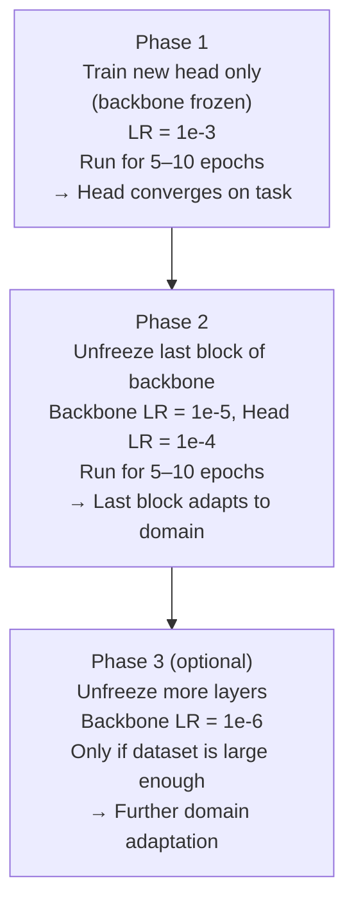

# Lesson 2.2 — Fine-Tuning Strategies: What to Unfreeze and When

---

## The Core Question in Fine-Tuning

Lesson 2.1 established the two extremes: freeze everything (feature extraction) or unfreeze everything (full fine-tuning). In practice, the optimal strategy almost always lies between these extremes — and knowing *which* layers to unfreeze, in what order, is what separates a good model from a great one.

This lesson covers the strategies you need to know for interviews — particularly for questions like *"How would you build a custom image classifier for X with limited labeled data?"*

---

## Layer-by-Layer Unfreezing (Gradual Fine-Tuning)

The most reliable fine-tuning strategy is **progressive unfreezing**: start with only the head unfrozen, then gradually unfreeze deeper layers.



*Progressive unfreezing avoids catastrophic forgetting — the backbone is already stable before you start modifying it.*

**Why this order?** If you unfreeze the backbone immediately (with random head weights), the large gradients from the untrained head flow back into the backbone and corrupt the pretrained weights. Phase 1 stabilizes the head first, then Phase 2 makes small targeted corrections to the backbone.

---

## Catastrophic Forgetting: The Risk You Must Avoid

**Catastrophic forgetting** happens when fine-tuning on a new task completely overwrites the pretrained representations. The model "forgets" ImageNet features and learns only the new task — losing the generalization that made transfer learning valuable in the first place.

It occurs when:
- Learning rate is too high for the backbone
- You unfreeze too many layers too early
- Training runs too long on a small dataset

Signs of catastrophic forgetting:
- Validation loss initially drops, then rises sharply
- Model performs well on training set, poorly on validation

**Prevention:**
1. Always use very low learning rate for backbone layers (1e-5 or lower)
2. Use progressive unfreezing
3. Early stopping based on validation loss
4. Weight decay (L2 regularization) on backbone parameters

---

## The Four Practical Scenarios

| Scenario | Dataset Size | Domain | Strategy |
|---|---|---|---|
| **A** | Small (<1K) | Similar to ImageNet | Feature extraction only. Freeze all. New head only. |
| **B** | Small (<1K) | Different (medical, satellite) | Feature extraction. The pretrained features still help even for different domains. |
| **C** | Medium (1K–50K) | Similar to ImageNet | Fine-tune last 1–2 blocks + head. LR differential. |
| **D** | Medium (1K–50K) | Very different | Fine-tune more deeply. Consider fine-tuning from an earlier point in the network. |
| **E** | Large (>50K) | Any | Full fine-tuning or train from scratch if domain is extremely different (e.g., satellite with unusual channels). |

The most important variable is **data size**, not domain similarity. With enough data, you can adapt even the earliest layers to a new domain.

---

## Data Augmentation as a Force Multiplier

Fine-tuning on small datasets almost always requires aggressive data augmentation to prevent overfitting. Standard augmentations for image classification:

```python
import torchvision.transforms as transforms

train_transform = transforms.Compose([
    transforms.RandomResizedCrop(224),         # random crop at random scale
    transforms.RandomHorizontalFlip(),          # 50% chance of horizontal flip
    transforms.ColorJitter(brightness=0.3,
                           contrast=0.3,
                           saturation=0.3),     # random color perturbation
    transforms.RandomRotation(degrees=15),      # small random rotation
    transforms.ToTensor(),
    transforms.Normalize(mean=[0.485, 0.456, 0.406],   # ImageNet mean
                         std=[0.229, 0.224, 0.225])    # ImageNet std
])
```

**Normalize using ImageNet statistics** even for non-ImageNet data when using a pretrained model — the model's weights were learned assuming these statistics. Deviating causes the first layer to receive out-of-distribution inputs.

---

## Concrete Example: Amazon Fashion Visual Search

Amazon wants to build "find similar items" for fashion: given a shoe photo, find visually similar shoes in the catalog.

**Task:** Learn an embedding space where similar shoes are close to each other.

**Strategy:** Fine-tune a pretrained ResNet-50 backbone to produce 128-dimensional embeddings, using triplet loss:
- Freeze layers 1–3 (universal texture/edge detectors — already correct for fashion)
- Fine-tune layers 4–5 (fashion-specific parts: buckles, soles, heels)
- Replace head with a 128-dim embedding layer

Training data: 50,000 labeled pairs (same shoe / different shoe). Learning rates: `1e-5` for backbone, `1e-3` for embedding head.

After fine-tuning: the embedding space clusters ballet flats together, running shoes together, stilettos together — the model learned that "sole thickness" and "heel shape" are discriminative features, on top of the texture/edge knowledge from ImageNet.

---

> **Interview note:** *"What is catastrophic forgetting in the context of fine-tuning?"*
> When fine-tuning a pretrained model, if the learning rate is too high or too many layers are unfrozen simultaneously, the gradient updates from the new task overwrite the pretrained weights entirely. The model "forgets" what it learned from the large dataset and becomes specialized only in the new task — losing the general visual representations that made pretraining valuable. The fix: use a very low learning rate for pretrained layers (1e-5 or lower), use progressive unfreezing (head first, then backbone gradually), and use early stopping.

> **Interview note:** *"For an Amazon product image classifier with 5,000 images, walk me through your approach."*
> Strong answer structure: (1) Start with a pretrained ResNet-50 (or EfficientNet-B3) backbone. (2) Replace the final FC layer with a new head matching your class count. (3) Phase 1: Freeze backbone entirely, train only the head for 10 epochs with LR=1e-3. (4) Validate — if plateauing, move to Phase 2. (5) Unfreeze the last ResNet block (layer4), set backbone LR=1e-5 and head LR=1e-4, train for another 10 epochs. (6) Apply aggressive augmentation throughout (random crop, flip, color jitter). (7) Monitor validation loss — stop when it stops improving. This approach will comfortably beat training from scratch by 15–25 percentage points on 5K images.

---

## Summary

- The safest fine-tuning strategy is **progressive unfreezing**: train head first (backbone frozen), then gradually unfreeze deeper backbone layers with very low learning rates.
- **Catastrophic forgetting**: high LR or premature backbone unfreezing destroys pretrained weights. Always use 10x–100x lower LR for backbone than for the new head.
- Data size determines strategy: <1K → feature extraction only; 1K–50K → fine-tune last blocks; >50K → full fine-tuning or train from scratch.
- Always normalize with ImageNet mean/std when using pretrained models, and apply aggressive augmentation on small datasets.
- The practical interview answer for "limited image data" tasks: pretrained ResNet/EfficientNet + progressive fine-tuning + differential learning rates.
