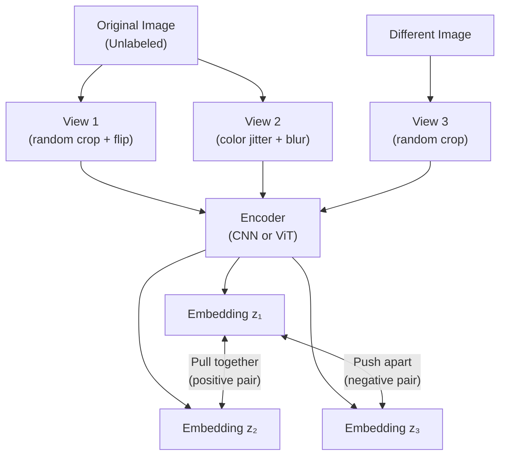

# Lesson 3.1 — Contrastive Learning: Learning Representations by Comparison

---

## The Problem: Labels Are Expensive, Unlabeled Data Is Everywhere

Supervised learning requires labeled data. For ImageNet, 1.2 million images were manually labeled — a massive human effort. For most real-world tasks, you cannot afford to label millions of examples. But you have abundant unlabeled data.

The question is: can a model learn useful visual representations from unlabeled images, without any human-provided labels?

Contrastive learning says yes — and the insight is elegant: **you can define your own labels by deciding which images should be "similar" and which should be "different," using structure that already exists in the data.**

---

## The Core Idea: Pull Positives Together, Push Negatives Apart

Contrastive learning trains a network to produce an embedding space where:
- **Similar samples** (positives) are close together
- **Dissimilar samples** (negatives) are far apart

The key question is: what counts as "similar" without human labels? The answer: **different views of the same image are positives; views of different images are negatives.**

A "view" is a randomly augmented version of an image — a random crop, color jitter, flip, blur. Two different augmentations of the same image should produce nearby embeddings. An augmentation of a completely different image should produce a far-away embedding.



*Two augmentations of the same image are pulled together. An augmentation of a different image is pushed away. No human labels needed — the pairing comes from the augmentation strategy.*

---

## SimCLR: The Framework That Made This Work

**SimCLR (Simple Contrastive Learning of Representations, Chen et al. 2020)** is the clearest implementation of contrastive learning:

**Step 1:** For a batch of N images, generate 2 augmented views of each → 2N views total.

**Step 2:** Pass all 2N views through a shared encoder (e.g., ResNet-50) to get representations `h`.

**Step 3:** Pass `h` through a small **projection head** (2-layer MLP) to get `z`. The loss is computed in `z` space; representations `h` are what you keep after training.

**Step 4:** Apply the **NT-Xent loss** (Normalized Temperature-scaled Cross Entropy):

```
L = -log [ exp(sim(z₁, z₂) / τ) / Σⱼ exp(sim(z₁, zⱼ) / τ) ]
```

Where:
- `sim(u, v) = uᵀv / (|u||v|)` — cosine similarity
- `τ` — temperature parameter (typically 0.1–0.5)
- The numerator: similarity between the two views of the same image
- The denominator: similarity between view 1 and all other 2(N-1) views in the batch

In plain English: **treat contrastive learning as a classification problem.** Given view 1, can you identify which of the other 2(N-1) views is the "correct" positive (the other augmentation of the same image)?

---

## The Role of the Projection Head

A critical and counterintuitive finding in SimCLR: the representation `h` (from the backbone) is better for downstream tasks than the projection `z` that the loss was computed on.

The projection head `g(h) = z` absorbs information that is useful for the contrastive task but harmful for downstream tasks — particularly, information about augmentation style (was this a darker version? a flipped version?). Discarding `z` after training and using `h` gives cleaner, more generalizable representations.

---

## What Makes Contrastive Learning Work: The Role of Augmentation

The choice of augmentation is critical. If augmentations are too weak (e.g., only tiny brightness changes), positives are too easy to distinguish from negatives — the model learns trivially without developing useful features. If augmentations are too strong (e.g., rotate 90° + strong color jitter), positives become unrecognizable — the model cannot pull them together.

The strongest augmentations in SimCLR's analysis:
1. Random cropping (most important)
2. Color jitter
3. Gaussian blur
4. Grayscale conversion

Random cropping forces the model to learn content-level features (what is this image *about*?) rather than position or color-level features.

---

## Hard Negatives: The Quality of Negatives Matters

A **hard negative** is a sample that is semantically similar to the anchor but from a different class. For example: for an anchor image of a Siberian Husky, a hard negative is a Malamute (visually very similar). An easy negative is a fire truck (completely dissimilar).

Training on hard negatives forces the model to learn fine-grained discriminative features. Training on only easy negatives leads to coarse, less useful representations.

In practice, larger batch sizes produce harder negatives: with N=8192 images in a batch, there are more chances to encounter a semantically similar-but-different image as a negative.

---

## Concrete Example: Amazon Product Similarity Without Labels

Amazon has millions of product images but labeling which products are "similar" is expensive. Contrastive learning solves this:

1. For each product image, generate 2 augmented views (random crop simulating different photo angles, color jitter for lighting variations)
2. Train a ResNet backbone with SimCLR: positives = two crops of the same product, negatives = crops of other products
3. After training, the encoder produces embeddings where the same product photographed from different angles is close together, and different products are far apart

No human labels needed. The resulting embeddings are used for visual product search: "find me 10 products with similar embeddings to this one."

---

> **Interview note:** *"What is contrastive learning, and why is it useful?"*
> Contrastive learning trains a model to produce representations where similar samples are close and dissimilar samples are far apart in embedding space — without needing human labels. Similarity is defined by the augmentation strategy: two augmented views of the same image are positives; augmented views of different images are negatives. This allows learning from unlabeled data at scale. The trained encoder produces representations that transfer well to downstream tasks — often matching or exceeding supervised pretraining when fine-tuned on labeled data.

> **Interview note:** *"Why is a larger batch size better for contrastive learning?"*
> In SimCLR-style training, negatives come from the other samples in the batch. With a batch of 256, you have 254 negatives per anchor — many of which may be easy (very dissimilar). With a batch of 8192, you have 8190 negatives, including many hard negatives (semantically similar-but-different images). Hard negatives force the model to learn fine-grained discriminative features. This is why contrastive learning typically requires large batch sizes (2048–8192) and correspondingly large GPU memory.

---

## Summary

- Contrastive learning creates a self-supervised training signal by defining positives (two augmented views of the same image) and negatives (augmented views of different images), requiring no human labels.
- The NT-Xent loss treats the task as: given one view, identify the correct positive among all negatives in the batch — a classification problem.
- **Projection head**: a small MLP appended during training, discarded after. The backbone representation `h` is better for downstream tasks than the projected `z`.
- Large batch sizes are critical for hard negatives — more samples per batch means more semantically challenging negatives.
- The resulting embeddings transfer to downstream tasks (classification, search, retrieval) and form the foundation of CLIP (Lesson 3.2).
