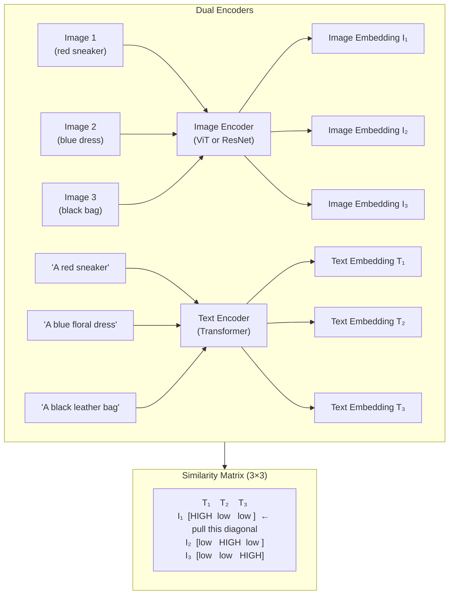
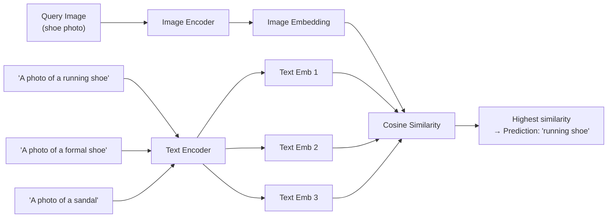

# Lesson 3.2 — CLIP: Aligning Images and Text at Scale

---

## The Problem: Vision Models Don't Understand Language

A CNN trained on ImageNet outputs probabilities over 1,000 fixed categories. If you want it to recognize a new category — "damaged product" or "a red sneaker with white laces" — you need labeled images for that category and retraining. The model has no connection between visual content and natural language descriptions.

The deeper problem: the world is not 1,000 categories. Amazon's product catalog has hundreds of millions of items. Predefining categories for all of them is impossible. What you need is a model that understands *free-form* language descriptions and can match them to visual content.

**CLIP (Contrastive Language-Image Pretraining, OpenAI 2021)** solves this by learning a shared embedding space where images and their text descriptions are close together. Instead of predicting a fixed set of labels, CLIP learns to align any image with any text — including descriptions it has never explicitly seen during training.

---

## How CLIP Works: Contrastive Learning Across Modalities

CLIP trains two encoders jointly:
1. **Image Encoder**: a CNN (ResNet) or Vision Transformer (ViT) that produces a fixed-size image embedding
2. **Text Encoder**: a Transformer that processes text and produces a text embedding of the same dimension

**Training data**: 400 million (image, text) pairs scraped from the internet — product images with captions, photos with alt-text, web images with surrounding text. The text is the naturally occurring description of the image.

**Training objective**: Contrastive learning across modalities.

For a batch of N (image, text) pairs:
- N correct pairs (an image with its actual caption) → **positives**
- N² - N incorrect pairs (an image paired with a different image's caption) → **negatives**

The loss pulls correct image-text pairs together and pushes incorrect pairs apart.

*CLIP learns to make the diagonal of the similarity matrix high (correct image-text pairs) and the off-diagonal low (incorrect pairs). This aligns the image and text embedding spaces.*

---

## What CLIP Enables: Zero-Shot Classification

The most powerful capability CLIP enables is **zero-shot classification** — classifying images into categories the model has never explicitly been trained to classify.

**How it works:**
1. You have an image and a set of candidate category names (e.g., "running shoe", "formal shoe", "sandal")
2. Convert each category name to a text prompt: *"A photo of a running shoe"*, *"A photo of a formal shoe"*, etc.
3. Encode the image → image embedding
4. Encode each text prompt → text embeddings
5. Compute cosine similarity between the image embedding and each text embedding
6. The category with the highest similarity is the prediction

No retraining. No labeled examples. You just provide text descriptions.

*Zero-shot CLIP: encode image, encode text options, pick the closest text. No labeled data, no retraining needed.*

---

## CLIP's Key Properties

| Property | Detail |
|---|---|
| **Training data** | 400M internet (image, text) pairs — naturally paired, no manual labeling |
| **Image encoder** | ResNet-50/101 or ViT-B/16 — produces fixed-size embedding |
| **Text encoder** | Transformer (similar to GPT-2) — produces same-dimension embedding |
| **Embedding space** | Shared: images and text in the same space; close = semantically related |
| **Zero-shot** | Works on unseen categories via text prompts |
| **Few-shot** | Add a few labeled examples + fine-tune head → competitive with fully supervised |

---

## Amazon Applications of CLIP

**1. Product search by text:** Customer types "navy blue minimalist wallet" → encode as text → find product images with nearest embedding → return those products. No keyword matching — semantic understanding.

**2. Cross-modal product matching:** A buyer uploads a photo of a competitor's product → find the nearest matching products in Amazon's catalog by image embedding similarity.

**3. Automated catalog tagging:** For millions of new products, automatically generate tags by finding which text descriptions ("leather", "sporty", "casual") have high cosine similarity to the product image embedding.

**4. Image moderation:** CLIP can detect whether an image embedding is close to text descriptions like "inappropriate content" — zero-shot content moderation.

---

## CLIP vs Traditional Supervised CNN

| | Traditional CNN | CLIP |
|---|---|---|
| **Training labels** | Manual labels for fixed classes | Natural language captions (free) |
| **Adding new categories** | Requires retraining | Just provide a new text prompt |
| **Understanding language** | None | Core capability |
| **Zero-shot classification** | Impossible | Native |
| **Cross-modal retrieval** | Impossible | Native |
| **Fine-tuning required** | Yes, for any new task | Often zero-shot is sufficient |

---

> **Interview note:** *"Explain CLIP in one paragraph."*
> CLIP trains two encoders — one for images, one for text — jointly using contrastive learning on 400M internet image-caption pairs. The training objective maximizes cosine similarity between an image and its correct caption while minimizing similarity to all other captions in the batch. The result: a shared embedding space where images and semantically related text descriptions are close together. This enables zero-shot classification (encode text categories, pick the closest one to an image embedding), cross-modal retrieval (search images with text queries), and automated tagging — all without task-specific labeled data.

> **Interview note:** *"How does CLIP enable zero-shot learning? What are its limitations?"*
> Zero-shot: encode the image, encode each candidate text class as a prompt ("A photo of a [class]"), compute cosine similarities, pick the highest. No labeled training data needed for the new classes.
> Limitations: (1) Performance degrades for fine-grained distinctions (differentiating 50 subspecies of birds) vs coarse categories. (2) Prompt engineering matters — "A photo of a dog" vs "dog" vs "a dog outdoors" can give different similarity scores. (3) CLIP struggles on specialized domains (medical imaging, satellite imagery) because internet-scraped training data is biased toward natural photos. For those domains, fine-tuning CLIP is necessary.

---

## Summary

- CLIP trains an image encoder and text encoder jointly with contrastive learning on 400M internet (image, caption) pairs, creating a shared embedding space where semantically related images and text are close.
- The N×N similarity matrix during training: the diagonal (correct pairs) is maximized, off-diagonal (incorrect pairs) is minimized.
- **Zero-shot classification**: encode candidate category names as text prompts, find the nearest to the query image embedding. No labeled data, no retraining.
- Key Amazon applications: semantic product search by text, cross-modal catalog matching, automated product tagging, zero-shot content moderation.
- Limitations: fine-grained discrimination, prompt sensitivity, and poor generalization to specialized domains (medical, satellite) where internet training data is scarce.
