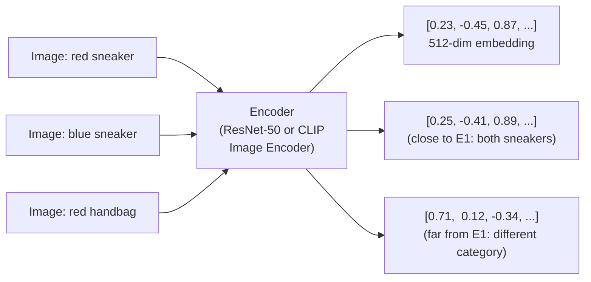
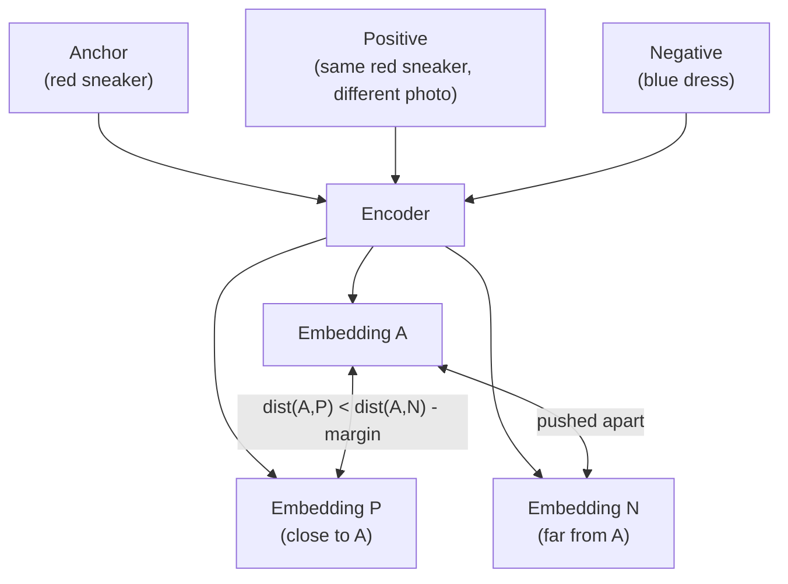

# Lesson 4.1 — Image Embeddings and the Vector Space Concept

---

## The Problem: How Do You Compare Images Mathematically?

Pixel-by-pixel comparison of images is meaningless. A photo of a red shoe and the same photo shifted 2 pixels to the right are very different in raw pixel values but visually identical. Two photos of completely different shoes might have nearly the same average pixel brightness.

To compare images meaningfully, you need a representation that captures *semantic content* — what is in the image — rather than raw pixel values. This is the role of **image embeddings**: fixed-size vectors that encode the semantic content of an image so that mathematically similar vectors correspond to visually similar images.

This is the foundation of every modern visual search system, including Amazon's.

---

## What Is an Embedding?

An **embedding** is a dense, fixed-size vector (e.g., 128, 512, or 2048 dimensions) produced by passing an image through a neural network (typically the layers up to, but not including, the final classification head).

The CNN or ViT acts as a **feature extractor**: it compresses the image into a compact numerical representation that captures the relevant semantic information. This vector lives in a high-dimensional **embedding space** — a geometric space where the position of a vector reflects the image's semantic content.



*The encoder maps images to vectors. Similar images (both sneakers) produce nearby vectors. Different images (sneaker vs handbag) produce distant vectors.*

---

## The Geometry of the Embedding Space

The embedding space has a key property: **semantic similarity corresponds to geometric proximity.** Images of the same object category cluster together. Images of different categories are far apart.

Two key similarity measures:

**Cosine similarity** — measures the angle between two vectors:
```
cos_sim(A, B) = (A · B) / (|A| |B|)
```
Range: [-1, 1]. Value of 1 = identical direction = maximally similar. Used when the magnitude of the vector is not meaningful — only the direction. CLIP embeddings are typically compared using cosine similarity.

**Euclidean distance** — measures the straight-line distance:
```
dist(A, B) = √(Σ (Aᵢ - Bᵢ)²)
```
Smaller = more similar. Used when the magnitude of the vector carries information. Common in metric learning (e.g., triplet loss).

**Which to use?** In practice, normalize all embeddings to unit length (L2 normalization), then cosine similarity and Euclidean distance produce the same ordering. Most modern systems normalize embeddings and use cosine similarity.

---

## How Embeddings Are Trained

### Option 1: Extract from Pretrained Model (No Extra Training)

Pass an image through a pretrained ResNet-50 or CLIP image encoder, take the output before the classification head (often the Global Average Pooling output, a 2048-dim vector for ResNet-50). This embedding is already semantically meaningful.

**Best for:** Rapid prototyping; when you have no labeled pairs and want a reasonable starting point.

### Option 2: Metric Learning (Train for Similarity)

Train the encoder specifically to produce embeddings where similar images are close. Common losses:

**Triplet Loss:**
```
L = max(0, dist(anchor, positive) - dist(anchor, negative) + margin)
```
For each training step, provide an anchor image, a positive (same class), and a negative (different class). Push the anchor closer to the positive and farther from the negative than the margin.



**Contrastive Loss / NT-Xent**: As covered in Lesson 3.1 — used in SimCLR and CLIP.

---

## Concrete Example: Amazon Visual Product Search

The system design for "find visually similar products" at Amazon:

**Offline (precompute):**
1. Pass all catalog images through the CLIP image encoder → 512-dim embeddings
2. Store all embeddings in a vector database (e.g., Amazon OpenSearch with k-NN plugin, or FAISS index)

**Online (query time):**
1. User uploads a query image
2. Pass query image through the same encoder → 512-dim query embedding
3. Search the vector database for the k nearest embeddings (by cosine similarity)
4. Return the k corresponding products

The entire system is possible because the embedding space has been structured (via CLIP or metric learning) so that "semantically similar products = nearby embeddings."

---

## Properties of a Good Embedding Space

| Property | What it means | How to achieve |
|---|---|---|
| **Intra-class compactness** | Same-category items cluster tightly | Triplet loss / contrastive loss |
| **Inter-class separation** | Different categories are far apart | Hard negative mining |
| **Semantic smoothness** | Similar categories are closer than distant ones | Train on semantic hierarchy |
| **Generalization** | Works on items not seen during training | Large diverse training data |

---

> **Interview note:** *"What is an image embedding, and why is it useful for product search?"*
> An image embedding is a fixed-size vector produced by a neural network that encodes the semantic content of an image. In the embedding space, visually similar images produce geometrically nearby vectors. This enables product search: you precompute embeddings for all catalog images, and at query time you encode the user's query image and find the nearest catalog embeddings. This is purely visual — no text keywords needed. The same infrastructure supports cross-modal search: encode a text query with CLIP's text encoder, then find nearest image embeddings.

> **Interview note:** *"Cosine similarity vs Euclidean distance for embedding comparison — which do you use?"*
> For most modern systems: normalize embeddings to unit length, then both metrics give the same ranking, so it doesn't matter. The practical choice: use cosine similarity for CLIP-style embeddings (trained to align directions, not magnitudes) and Euclidean for metric learning embeddings trained with triplet loss (where magnitude can carry meaning). In production, most systems normalize embeddings at index time, making this choice inconsequential.

---

## Summary

- An image embedding is a dense fixed-size vector from a neural network encoder that encodes semantic content. Geometrically nearby vectors = semantically similar images.
- Two similarity measures: **cosine similarity** (angle between vectors, range [-1,1]) and **Euclidean distance** (straight-line distance). After L2 normalization, both produce the same ranking.
- Embeddings are produced by: (1) feature extraction from pretrained models (fast, no labels needed), or (2) metric learning with triplet/contrastive loss (better for specific domains).
- The embedding space must have intra-class compactness, inter-class separation, and generalization to unseen items.
- This is the foundation of Amazon's visual product search: precompute catalog embeddings, store in a vector index, find nearest neighbors to a query embedding at search time.
