# Lesson 4.2 — Similarity Search: ANN, FAISS, and Visual Search Systems

---

## The Problem: Exact Search Doesn't Scale

You have 500 million product embeddings (Amazon's catalog scale). A user uploads a query image. You compute its 512-dim embedding. Now you need to find the top-k most similar embeddings among 500 million.

**Exact nearest neighbor search** computes the cosine similarity between the query and every single one of 500 million embeddings. At 512 dimensions, each comparison is 512 multiplications + additions. For 500M embeddings: 512 × 500M = 256 billion operations per query. At the rate of a modern CPU: multiple minutes per query.

That is completely unusable for a product search system that must return results in milliseconds.

**Approximate Nearest Neighbor (ANN) search** sacrifices a small amount of accuracy to reduce search time by orders of magnitude — from minutes to milliseconds. This is not an optional optimization; it is a fundamental requirement of any real-world embedding-based search system.

---

## How ANN Works: The Core Idea

Instead of searching all embeddings, ANN methods build an **index** — a precomputed data structure that organizes embeddings so you can skip most of them at query time. You search only the "promising" regions of the embedding space.

Three main families of ANN methods:

### 1. Inverted File Index (IVF)
Cluster all embeddings into K clusters using k-means. At query time, only search the C nearest cluster centers (C ≪ K), then search within those C clusters.

**Trade-off:** Larger K and smaller C → faster search, lower recall. Smaller K and larger C → slower, higher recall.

### 2. HNSW (Hierarchical Navigable Small World)
Build a multi-layer graph where each node is connected to its nearest neighbors. At query time, start at a coarse top layer and greedily navigate toward the query, then refine at lower layers.

**HNSW is the current industry standard** for high-recall ANN. It consistently achieves >95% recall at <10ms latency for millions of embeddings.

### 3. Product Quantization (PQ)
Compress embeddings by splitting them into sub-vectors and quantizing each sub-vector. Reduces memory by 8x–32x. Often combined with IVF (IVF-PQ).

**Trade-off:** Lower memory but lower recall. Useful when memory is the constraint, not speed.

---

## FAISS: The Practical Tool

**FAISS (Facebook AI Similarity Search)** is the most widely used library for ANN search. It implements all three methods above and is optimized for GPU acceleration.

```python
import faiss
import numpy as np

# Step 1: Build an index for 512-dim embeddings using IVF + HNSW
d = 512            # embedding dimension
nlist = 1000       # number of IVF clusters
quantizer = faiss.IndexFlatIP(d)         # inner product (for normalized embeddings = cosine sim)
index = faiss.IndexIVFFlat(quantizer, d, nlist, faiss.METRIC_INNER_PRODUCT)

# Step 2: Train the index (learn cluster centroids from a sample)
catalog_embeddings = np.random.randn(1_000_000, d).astype('float32')
faiss.normalize_L2(catalog_embeddings)    # normalize for cosine similarity
index.train(catalog_embeddings)

# Step 3: Add all catalog embeddings
index.add(catalog_embeddings)

# Step 4: At query time, find top-10 nearest products
query = np.random.randn(1, d).astype('float32')
faiss.normalize_L2(query)
index.nprobe = 50   # search 50 out of 1000 clusters (recall vs speed trade-off)
distances, indices = index.search(query, k=10)
# indices: the 10 most similar product IDs
```

---

## Full Visual Search System Architecture

```mermaid
flowchart TD
    subgraph Offline["Offline Pipeline (runs periodically)"]
        CAT["Catalog Images\n(500M products)"] --> ENC["Image Encoder\n(CLIP or fine-tuned ResNet)"]
        ENC --> EMB["512-dim Embeddings\nfor each product"]
        EMB --> IDX["FAISS Index\n(IVF-HNSW or IVF-PQ)\nBuilt + stored"]
    end

    subgraph Online["Online Query Pipeline (per user request)"]
        Q["User uploads\nquery image"] --> QENC["Same Image Encoder"]
        QENC --> QEMB["512-dim Query Embedding"]
        QEMB --> ANN["ANN Search\nFAISS Index\n(top-k results in ms)"]
        ANN --> RERANK["Optional Re-ranking\n(exact cosine on top-100\nto refine to top-10)"]
        RERANK --> RES["Return top-10\nvisually similar products"]
    end
```



*Offline: precompute and index all catalog embeddings. Online: encode query, search index in milliseconds, optional re-rank for precision.*

**Re-ranking:** ANN finds the approximate top-100 candidates quickly. An exact cosine similarity computation on just these 100 candidates gives a precise ranking. This two-stage approach combines ANN speed with exact-search accuracy for the final results.

---

## Key Metrics for Evaluating a Search System

| Metric | What it measures | Formula |
|---|---|---|
| **Recall@k** | Of the true top-k results, what fraction did we retrieve? | \|retrieved ∩ true_top_k\| / k |
| **Precision@k** | Of the k results returned, what fraction are truly relevant? | \|relevant in top-k\| / k |
| **Latency (p99)** | 99th percentile query response time | — |
| **QPS** | Queries per second the system can handle | — |
| **Index size** | Memory required for the FAISS index | — |

For Amazon product search: Recall@10 > 95% at p99 latency < 50ms is a reasonable production target.

---

## Concrete Example: Amazon Visual Search at Scale

**Problem:** Given any product photo uploaded by a user, return 10 visually similar in-catalog products within 100ms.

**Solution:**
1. **Offline**: Encode all 300M catalog images with CLIP's image encoder (512-dim). Build an IVF-HNSW FAISS index. Store on SSD + partially in GPU memory.
2. **Online**: User uploads image → encode with CLIP → query FAISS index (IVF search in 2ms) → return top-500 candidates → exact re-rank on top-500 (5ms) → return top-10 → total: ~20ms.
3. **Index updates**: New products are encoded and added to the index incrementally without full rebuild.

---

> **Interview note:** *"Design a visual product search system for Amazon. Walk me through it."*
> Strong answer hits these points: (1) Embedding generation — use CLIP (or fine-tuned CNN) to encode all catalog images offline into 512-dim vectors. (2) Indexing — store in FAISS with IVF-HNSW; build offline, update incrementally as new products arrive. (3) Query pipeline — encode query image with same encoder, ANN search in FAISS (< 5ms for millions of items), optional re-rank exact cosine on top-N. (4) Metrics — Recall@10 and p99 latency. (5) Scalability — shard the index across multiple servers; route queries to the right shard by product category.

> **Interview note:** *"What is the recall-latency trade-off in ANN search?"*
> More clusters searched in IVF (higher nprobe) → higher recall but slower. Fewer clusters → faster but may miss some true nearest neighbors. This is tuned empirically: plot recall@k vs latency for different nprobe values and pick the operating point that meets your latency SLA with acceptable recall. In practice, nprobe=50–200 out of nlist=1000 clusters gives >95% recall at 5–20ms for million-scale indexes.

---

## Summary

- Exact nearest neighbor search is O(N × d) — infeasible at hundreds of millions of embeddings at query time.
- **ANN (Approximate Nearest Neighbor)** builds an index structure (IVF clusters, HNSW graphs, PQ compression) to skip most of the search space, achieving millisecond search at the cost of slightly reduced recall.
- **FAISS** is the standard library: IVF-HNSW for high recall, IVF-PQ for memory efficiency. Supports GPU acceleration.
- Production visual search: two-stage — ANN to get top-N candidates, exact cosine re-rank on top-N to get final top-k.
- Key metrics: Recall@k, Precision@k, p99 latency, QPS. For Amazon-scale: target Recall@10 > 95%, p99 < 50ms.
