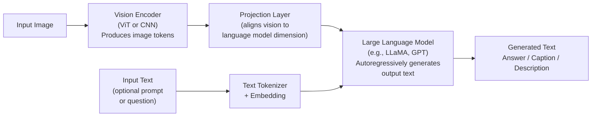
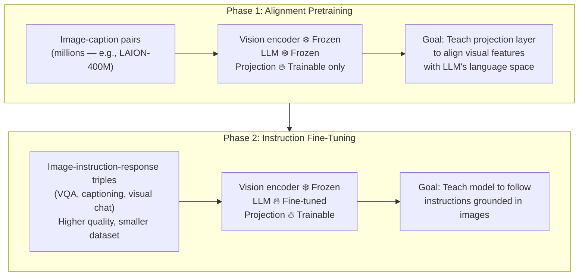

# Lesson 5.1 — Vision-Language Models: Connecting Vision and Language

---

## The Problem: Images and Text Live in Separate Worlds

CLIP (Lesson 3.2) aligns images and text in a shared embedding space — but CLIP cannot *generate* language. It can tell you that a product image is most similar to the text "a red sneaker" — but it cannot answer the question "What is wrong with this product?" or "Write a description of this product for the catalog."

For tasks requiring language generation from visual input — image captioning, visual question answering (VQA), multimodal chat — you need a model that can both *see* (understand images) and *speak* (generate language). This is the domain of **Vision-Language Models (VLMs)**.

---

## What a VLM Does

A VLM takes image(s) and/or text as input and produces text as output. The key capabilities:

| Task | Input | Output |
|---|---|---|
| **Image captioning** | Image | "A red sneaker on a white background" |
| **Visual QA** | Image + "What color are the laces?" | "White" |
| **Multimodal chat** | Image + conversation | Conversational response about the image |
| **Product description** | Product image | Catalog-ready product description |
| **Image-grounded reasoning** | Image + question | Reasoned answer referencing image content |

---

## The Architecture Blueprint

All modern VLMs share the same fundamental blueprint:

*Image → vision encoder → project to LLM's embedding dimension → feed to LLM alongside text tokens → LLM generates output. The LLM sees image content as a sequence of special tokens.*

The three components:

1. **Vision Encoder**: A pretrained ViT or CNN that converts the image into a sequence of visual feature vectors. For example, ViT-L/14 produces a sequence of 256 visual tokens, each a 1024-dim vector.

2. **Projection Layer**: A linear layer or small MLP that maps visual tokens from the vision encoder's dimension to the LLM's embedding dimension. This is the bridge between the two pretrained models.

3. **Language Model (LLM)**: A pretrained autoregressive transformer (LLaMA, GPT, etc.) that generates text. It receives the projected visual tokens + text tokens as a combined sequence and generates output token by token.

---

## Key VLM Architectures (Concept Level)

### BLIP-2 (2023)
**Key idea:** Instead of full fine-tuning, use a lightweight Q-Former (Query Transformer) as the projection layer. The Q-Former has a fixed set of learnable query vectors that "query" the visual encoder's output for the most relevant information. Only the Q-Former is trained — both the vision encoder and LLM stay frozen.

**Why:** Frozen LLM + frozen vision encoder + trainable Q-Former = very efficient training. Most of the parameters are frozen; only the Q-Former's few million parameters need training data.

### LLaVA (2023)
**Key idea:** The simplest possible projection — just a single linear layer from ViT output to LLM input dimension. Despite this simplicity, works well when you fine-tune the full LLM on high-quality image-instruction data.

**Training recipe:** (1) Pretrain the linear projection on image-caption pairs (vision encoder + LLM frozen). (2) Fine-tune the full model on instruction-following visual data (conversation, VQA, etc.).

### Amazon Nova Multimodal
Amazon's Nova model family includes multimodal variants (Nova Pro, Nova Lite) that follow this same blueprint — vision encoder + projection + LLM — with additional training for e-commerce and Alexa-specific use cases.

---

## The Projection Layer: The Critical Bridge

The projection layer is small but critical. Without it, visual tokens (from a 1024-dim ViT output space) and text tokens (from a 4096-dim LLM embedding space) are incompatible — the LLM cannot process visual features directly.

The projection layer:
- Takes visual feature vectors from the vision encoder (shape: `[num_visual_tokens, vision_dim]`)
- Maps them to the LLM's embedding dimension (shape: `[num_visual_tokens, llm_dim]`)
- The LLM then processes these projected visual tokens exactly like text tokens

After projection, the LLM sees a mixed sequence: `[visual_token_1, ..., visual_token_256, text_token_1, ...]`. It cannot tell which tokens are visual and which are text — it processes them all with self-attention.

---

## Training Strategy

VLMs are typically trained in two phases:

---

## Concrete Example: Amazon Product Description Generation

Amazon has millions of new products from third-party sellers with incomplete or missing descriptions. A VLM can automate this:

1. **Input:** Product image + prompt: *"Write a 3-sentence product description for this item, highlighting material, color, and key features."*
2. **Vision encoder:** ViT processes the product image → 256 visual tokens capturing product shape, texture, color
3. **LLM:** Receives visual tokens + text prompt → generates: *"This slim leather bifold wallet features a rich espresso brown finish with a fine-grain texture. It includes 6 card slots, 2 bill compartments, and a dedicated ID window. The compact design fits comfortably in any pocket."*

No human writer needed. Scalable to millions of products.

---

> **Interview note:** *"What is a Vision-Language Model? How does it work at a high level?"*
> A VLM combines a vision encoder (processes images into feature vectors) with a language model (generates text). The image is passed through a vision encoder (like ViT) to produce a sequence of visual tokens. These are projected to the LLM's input dimension via a projection layer and concatenated with text tokens. The LLM then autoregressively generates output text, attending to both visual and text tokens. The result: a model that can answer questions about images, generate captions, and perform visual reasoning.

> **Interview note:** *"What is the difference between CLIP and a VLM like LLaVA?"*
> CLIP: two encoders (image + text), trained contrastively to produce aligned embeddings. Output: embedding vectors. Use case: retrieval, zero-shot classification, search. CLIP cannot generate text.
> LLaVA (VLM): image encoder + projection + full LLM. Output: generated text. Use case: captioning, VQA, multimodal chat, instruction following. VLMs can generate arbitrary language given an image, not just embeddings.
> The relationship: many VLMs use CLIP's image encoder as their vision backbone — they build *on top of* CLIP's pretrained visual representations.

---

## Summary

- VLMs combine a vision encoder (ViT/CNN → visual tokens), a projection layer (maps visual dimension to LLM dimension), and a pretrained LLM (generates text autoregressively).
- The LLM sees visual tokens and text tokens as a unified sequence — it generates output by attending to both.
- BLIP-2: uses a Q-Former projection, keeps both vision encoder and LLM frozen for efficiency. LLaVA: simple linear projection + fine-tuned LLM for better instruction following.
- Training: Phase 1 (alignment) trains only the projection on image-caption pairs. Phase 2 (instruction fine-tuning) trains the LLM on VQA/chat data.
- Amazon Nova Multimodal follows this blueprint and is relevant to Amazon product description generation, Alexa multimodal, and visual catalog enrichment.
