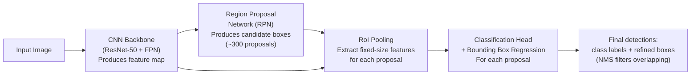
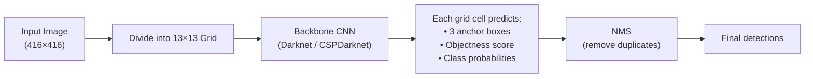

# Lesson 6.1 — Object Detection: YOLO vs R-CNN

---

## The Problem: Classification Is Not Enough

Image classification answers: "What is in this image?" — one label for the whole image.

Object detection answers: "What is in this image, and *where exactly* is each object?" — a bounding box and class label for every object instance.

This is fundamentally harder: the model must simultaneously decide how many objects are present, where each one is, and what each one is. For Amazon Go (cashierless stores), the system must detect every product being picked up — with precise location and identity — in real time. Classification alone cannot do this.

---

## The Two Families: Two-Stage vs One-Stage

All object detectors fall into two families:

| | Two-Stage (R-CNN family) | One-Stage (YOLO family) |
|---|---|---|
| **Stage 1** | Generate region proposals (candidate bounding boxes) | Skip — predict directly |
| **Stage 2** | Classify each proposal | — |
| **Speed** | Slower (two passes) | Much faster (one pass) |
| **Accuracy** | Generally higher, especially on small objects | Slightly lower, improving rapidly |
| **Use case** | When accuracy is priority (medical imaging, quality control) | When speed is priority (real-time, edge) |

---

## Two-Stage: The R-CNN Family

**R-CNN (2014):** Selective search proposes ~2000 candidate regions. Each region is warped to a fixed size and classified by a CNN. Very slow (~47 seconds/image).

**Fast R-CNN (2015):** Run the CNN once on the whole image, extract features, then apply region proposals to the feature map (not the raw image). Much faster (~2s).

**Faster R-CNN (2015):** Replace selective search with a **Region Proposal Network (RPN)** — a small CNN that runs on the feature map and proposes regions. Fully end-to-end trainable. ~0.2s per image.



*Faster R-CNN: one feature extraction pass, then RPN proposes regions, RoI pooling extracts features per region, head classifies each.*

**NMS (Non-Maximum Suppression):** Multiple proposals often overlap on the same object. NMS keeps the highest-confidence box and suppresses all other boxes with IoU (Intersection over Union) above a threshold (typically 0.5). This is a critical post-processing step in all detectors.

---

## One-Stage: YOLO

**YOLO (You Only Look Once)** divides the image into an S×S grid. Each grid cell predicts:
- B bounding boxes (center x, center y, width, height, confidence)
- C class probabilities

All predictions are made simultaneously in a single forward pass.



*YOLO processes the full image once. Each grid cell directly predicts boxes and classes simultaneously.*

**Anchor boxes:** YOLO uses predefined anchor boxes of different aspect ratios (tall, wide, square) as reference shapes. Each grid cell predicts adjustments to these anchors. This helps detect objects of different shapes (a wide truck vs a tall person).

**YOLO versions:** YOLO (2016) → YOLOv3 (2018) → YOLOv5 (2020) → YOLOv8/YOLOv9 (2023). Each version improved accuracy while maintaining speed.

---

## Key Metrics

**IoU (Intersection over Union):**
```
IoU = Area of overlap / Area of union
```
Measures how well the predicted box matches the ground truth box. IoU > 0.5 is typically counted as a correct detection.

**mAP (mean Average Precision):**
The standard metric. Average Precision (AP) is computed per class (area under precision-recall curve). mAP = average of AP across all classes.

---

## Concrete Example: Amazon Go

Amazon Go must detect products being picked up from shelves in real time (< 50ms latency) using ceiling cameras.

**Choice: YOLO.** Two-stage detectors (Faster R-CNN) at ~200ms per frame cannot run at 30 FPS. YOLOv8 at ~15ms per frame on a GPU easily handles real-time detection. The slight accuracy trade-off vs Faster R-CNN is acceptable — the product shelves are well-lit and structured, not cluttered random scenes.

---

> **Interview note:** *"What is the difference between one-stage and two-stage object detectors?"*
> Two-stage (Faster R-CNN): first generate region proposals (where might objects be?), then classify each proposal (what is in each region?). More accurate, especially for small objects, but slower — two sequential forward passes.
> One-stage (YOLO): directly predict all bounding boxes and classes in a single forward pass on a grid. Much faster — suitable for real-time. Historically lower accuracy on small objects, but YOLOv8+ has largely closed this gap.
> Amazon Go uses one-stage detectors for real-time product detection. Medical imaging systems use two-stage for higher accuracy.

> **Interview note:** *"What is NMS and why is it needed?"*
> Non-Maximum Suppression. Object detectors produce many overlapping predicted boxes for the same object (multiple grid cells or anchors each detect it). NMS keeps the box with the highest confidence score and suppresses all other boxes whose IoU with it exceeds a threshold (e.g., 0.5). Without NMS, you'd report the same car 15 times. NMS runs as a post-processing step on the raw detector output and is critical for clean final predictions.

---

## Summary

- Object detection = classification + localization. Output: class label + bounding box for every object instance.
- **Two-stage (R-CNN family):** propose regions → classify proposals. Higher accuracy, slower. Faster R-CNN uses a Region Proposal Network (RPN) for end-to-end training.
- **One-stage (YOLO):** divide image into grid, each cell predicts boxes + classes in one pass. Faster, suitable for real-time. YOLOv8+ approaches two-stage accuracy.
- **IoU**: measures predicted vs ground truth box overlap. **mAP**: standard detection metric, averaged over classes and IoU thresholds.
- **NMS**: post-processing step that suppresses duplicate overlapping detections, keeping only the highest-confidence box per object.
