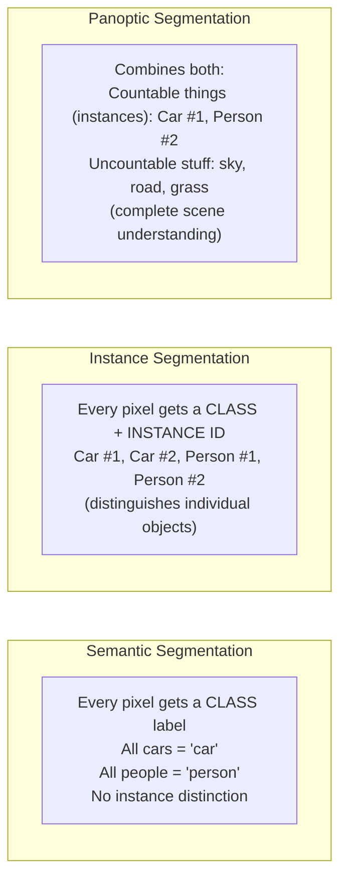
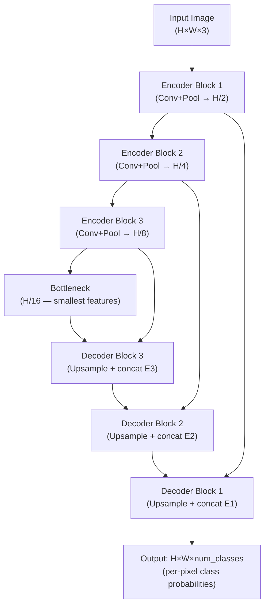
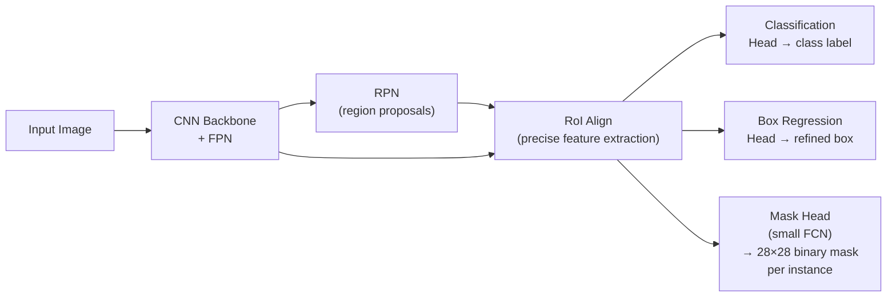

# Lesson 6.2 — Segmentation: Semantic vs Instance vs Panoptic

---

## The Problem: Bounding Boxes Are Too Coarse

Object detection gives you a bounding box — a rectangle around the object. But a rectangle is a crude approximation. The box around a person also contains background pixels. For tasks like "measure the exact area of this defect" or "count the pixels of each product on a shelf" or "separate a foreground object for compositing," you need **pixel-level precision** — which pixel belongs to which object.

**Segmentation** assigns a class label (and optionally an object ID) to every pixel in the image, not just a bounding box.

---

## The Three Types of Segmentation

| Type | Per-pixel output | Distinguishes instances? | Handles background? |
|---|---|---|---|
| **Semantic** | Class label | No — all cars are "car" | Yes (background = a class) |
| **Instance** | Class + instance ID | Yes | No — background unlabeled |
| **Panoptic** | Class + instance ID (where applicable) | Yes for objects | Yes — treats background as "stuff" |

---

## Semantic Segmentation: FCN and U-Net

**Fully Convolutional Network (FCN):** Replace the final FC layers of a CNN with conv layers. The network produces an output of the same spatial size as the input, with one value per pixel per class. This was the key insight: a fully convolutional network can produce dense per-pixel predictions.

**U-Net architecture (the standard today):**

*U-Net's skip connections (from encoder to decoder at each scale) preserve fine spatial details that are lost during downsampling. The encoder extracts what; the decoder localizes where.*

**Why skip connections?** Downsampling loses spatial detail (where exactly is the boundary?). Skip connections re-inject high-resolution features from the encoder into the decoder, enabling precise boundary localization. Without skip connections, segmentation masks have blurry, imprecise edges.

---

## Instance Segmentation: Mask R-CNN

**Mask R-CNN** extends Faster R-CNN by adding a third head that predicts a binary mask (inside/outside the object) for each detected region, alongside the class and box heads.

*Mask R-CNN adds a mask branch to Faster R-CNN. Each detected instance gets its own pixel mask.*

**RoI Align vs RoI Pooling:** Faster R-CNN used RoI Pooling which quantizes (rounds) coordinates, introducing misalignment. Mask R-CNN uses RoI Align (bilinear interpolation) for exact coordinate mapping — critical for precise pixel masks.

---

## Which Type for Which Task?

| Scenario | Best Type | Reason |
|---|---|---|
| Scene parsing (label all pixels) | Semantic | Only need class labels, not instance counts |
| Counting objects (cars, products) | Instance | Need to distinguish each car as separate |
| Full scene understanding (autonomous driving) | Panoptic | Need both "this is road" (stuff) and "this is car #3" (thing) |
| Medical tumor area measurement | Semantic or Instance | Need pixel-precise boundary; instance if multiple tumors |
| Amazon Go product tracking | Instance | Must track which specific product each customer picks up |
| Background removal (product photos) | Semantic or Instance | Need to separate foreground object from background |

---

## Concrete Example: Amazon Go Instance Segmentation

Amazon Go needs to know not just "there is a product" (detection) but "which specific pixels belong to this specific product being picked up." Bounding boxes are insufficient — products partially overlap on shelves.

Mask R-CNN (or its successor, Mask2Former) provides instance segmentation: each product pick-up gets its own pixel mask. The system can:
- Count exact quantity of each product removed
- Handle partial occlusion (mask of the visible portion)
- Track the mask across frames to confirm the product left the shelf

---

> **Interview note:** *"What is the difference between semantic and instance segmentation?"*
> Semantic segmentation assigns a class label to every pixel but does not distinguish individual instances — all pixels belonging to "car" get the same label, whether there are 1 car or 10 cars. Instance segmentation additionally distinguishes each individual object — Car #1, Car #2, Car #3 each get a unique mask. Semantic is simpler; instance requires detecting and separating each object individually. Panoptic segmentation combines both: instance-level for countable objects (cars, people) and semantic-level for background stuff (sky, road).

> **Interview note:** *"Why does U-Net use skip connections?"*
> The encoder downsamples the image to extract semantic features (what is in the image), but downsampling loses fine spatial detail (exactly where are the boundaries?). The decoder upsamples back to full resolution to produce per-pixel predictions, but the upsampled features are spatially imprecise. Skip connections inject high-resolution encoder features at each decoder scale, allowing the decoder to combine semantic understanding (from deep features) with precise spatial localization (from shallow, high-resolution features). Without skip connections, segmentation boundaries are blurry and imprecise.

---

## Summary

- **Semantic segmentation**: per-pixel class label; no instance distinction. U-Net is the standard architecture — encoder-decoder with skip connections.
- **Instance segmentation**: per-pixel class + instance ID; each object has its own mask. Mask R-CNN is the standard — Faster R-CNN + mask prediction head.
- **Panoptic segmentation**: combines semantic (stuff: sky, road) with instance (things: car #1, person #2) for complete scene understanding.
- U-Net skip connections solve the encoder-decoder spatial detail loss: they inject high-resolution encoder features into the decoder at each scale, enabling precise boundary prediction.
- Amazon Go uses instance segmentation to track individual product picks — bounding boxes are insufficient for overlapping products on shelves.
