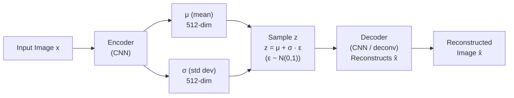

# Lesson 7.1 — VAE: Learning Structured Latent Spaces

---

## The Problem: Autoencoders Cannot Generate New Data

A plain **autoencoder** learns to compress an image into a small latent vector `z` (encoder), then reconstruct the image from `z` (decoder). It is trained by minimizing reconstruction loss. The latent space, however, is completely unstructured — there is no guarantee that points near each other in the latent space correspond to similar images, or that random points in the latent space decode to meaningful images.

If you pick a random `z` vector and run it through the decoder, you usually get noise — because that `z` might fall in a region of the latent space the encoder never visited.

**Variational Autoencoders (VAEs)** solve this by imposing structure on the latent space: instead of encoding an image to a single point `z`, the encoder outputs a probability distribution over `z`. This forces the latent space to be continuous and smooth — enabling both meaningful compression *and* generation of new samples.

---

## How VAE Works

**The key change from a plain autoencoder:** Instead of encoding to a fixed vector `z`, the encoder outputs two vectors:
- `μ` (mean vector) — the center of the distribution for this image
- `σ` (standard deviation vector) — the uncertainty/spread

The latent code `z` is then sampled from this distribution: `z ~ N(μ, σ²)`.



*The encoder outputs a distribution (μ, σ) instead of a single point. z is sampled from this distribution. The decoder reconstructs from z. The reparameterization trick (z = μ + σ·ε) makes sampling differentiable.*

---

## The Loss Function: Two Terms

```
L_VAE = Reconstruction Loss + KL Divergence
      = E[||x - x̂||²]  +  KL(N(μ,σ²) || N(0,1))
```

**Reconstruction loss:** How well does the decoder reproduce the original image? Pixel-level MSE or binary cross-entropy.

**KL Divergence:** Measures how much the learned distribution N(μ,σ²) differs from the standard normal N(0,1). This term pushes the encoder to produce distributions centered near 0 with spread near 1 — regularizing the latent space to be smooth and filled.

**Why KL regularization matters:** Without it, the encoder collapses to `σ→0` (a plain autoencoder) — every image maps to a single point, not a distribution. The KL term prevents this and ensures the latent space is continuous: nearby `z` values decode to similar images, and random `z` values decode to recognizable images.

---

## The Reparameterization Trick

The challenge: sampling `z ~ N(μ, σ²)` is not differentiable — you cannot backpropagate through a random sampling operation.

**The fix:** Instead of sampling `z` directly, write:
```
z = μ + σ · ε,   where ε ~ N(0, 1)
```

Now `ε` is the random part (not differentiable, but that's okay — it has no parameters), and `μ` and `σ` are the learnable parameters. Gradients flow through `μ` and `σ` via the deterministic transformation. This is the **reparameterization trick** — it moves the stochasticity outside the parameters.

---

## What VAE Enables

**1. Generation:** Sample a random `z ~ N(0,1)` and decode it. Since the KL term regularized the latent space to be smooth and filled, random `z` values produce recognizable images.

**2. Interpolation:** Interpolate linearly between the `z` of two images → smooth transition between them. In a plain autoencoder, the midpoint `z` decodes to noise; in a VAE, it decodes to a plausible intermediate image.

**3. Structured manipulation:** If you discover that dimension 47 of the latent space controls "brightness" and dimension 112 controls "background color" (through exploration), you can adjust these dimensions to generate edited versions of an image.

---

## Concrete Example: Product Image Augmentation

Amazon needs to generate synthetic product training images to augment small datasets (e.g., only 50 images of a new product). A VAE trained on product images:

1. Encodes the 50 real images into the latent space → produces (μ, σ) for each
2. Samples new `z` vectors near the encoded real images (within 2–3 standard deviations)
3. Decodes these `z` values → generates plausible new product images with slight variations (lighting, angle, background)

This produces 5,000+ synthetic training images from 50 real ones, dramatically improving the classifier trained on them.

**Limitation:** VAE-generated images tend to be slightly blurry compared to GAN-generated images — because the MSE reconstruction loss encourages averaging over possible reconstructions rather than sharpness.

---

## VAE vs GAN: At a Glance

| | VAE | GAN |
|---|---|---|
| **Training stability** | Stable (standard backprop) | Unstable (adversarial dynamics) |
| **Image quality** | Lower (blurry) | Higher (sharp, photorealistic) |
| **Latent space** | Structured, continuous (by design) | Unstructured (no explicit regularization) |
| **Generation control** | Easy — manipulate z dimensions | Harder — latent space not organized |
| **Use case** | Anomaly detection, interpolation, structured generation | High-quality image synthesis, data augmentation |

---

> **Interview note:** *"What is the difference between a plain autoencoder and a VAE?"*
> A plain autoencoder maps each image to a single point in latent space — no structure is imposed. Points nearby in latent space may decode to very different images, and random latent points produce noise. A VAE encodes each image to a distribution (μ, σ) and regularizes via KL divergence to keep distributions close to N(0,1). This structures the latent space: it is continuous (nearby z = similar images), smooth (random z = recognizable image), and supports generation, interpolation, and controlled editing.

> **Interview note:** *"What is the reparameterization trick and why is it needed?"*
> Sampling z ~ N(μ, σ²) is not differentiable — you cannot backpropagate through a random sampling operation. The reparameterization trick rewrites the sample as z = μ + σ · ε, where ε ~ N(0,1) is a fixed random noise sample with no learnable parameters. Now gradients flow through μ and σ normally. The trick moves the randomness outside the computation graph, making the stochastic layer differentiable and enabling end-to-end training.

---

## Summary

- A plain autoencoder produces unstructured latent spaces — random `z` points decode to noise. VAE imposes structure by encoding to distributions (μ, σ) and regularizing via KL divergence.
- VAE loss = reconstruction loss (how well x̂ matches x) + KL divergence (how close the learned distribution is to N(0,1)).
- The **reparameterization trick** (`z = μ + σ·ε`) makes sampling differentiable by factoring out the randomness into ε.
- VAE enables: generation (sample random z → decode), interpolation (linearly blend two z values), and structured manipulation.
- VAE produces blurry images; GAN produces sharper images. VAE's latent space is more structured and controllable; GAN's is less organized.
