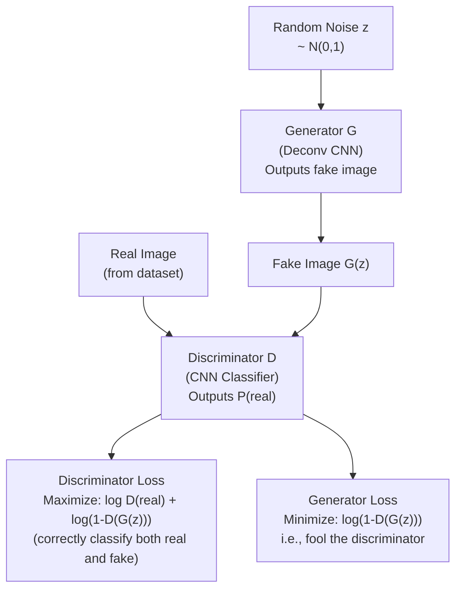

# Lesson 7.2 — GAN: Adversarial Training and Its Problems

---

## The Problem: VAEs Generate Blurry Images

VAEs produce good latent structure but poor image sharpness. The MSE reconstruction loss penalizes pixel-level errors — it finds the "average" of all plausible reconstructions, which looks blurry. For applications like generating photorealistic product images, synthetic training data, or image editing, you need sharpness.

**Generative Adversarial Networks (GANs, Goodfellow et al. 2014)** take a completely different approach: instead of defining a fixed loss function, they pit two networks against each other in a game. The result is images so sharp and photorealistic they are often indistinguishable from real photos.

---

## The Adversarial Game: Generator vs Discriminator

A GAN has two networks trained simultaneously with opposing objectives:

**Generator G:** Takes a random noise vector `z ~ N(0,1)` as input and outputs a synthetic image. Goal: generate images indistinguishable from real images.

**Discriminator D:** Takes an image (real or generated) and outputs a probability that the image is real. Goal: correctly classify real images as real and generated images as fake.



*G generates fake images. D classifies real vs fake. G trains to fool D; D trains to detect G's fakes. They improve together.*

**The training loop:**
1. Sample real images from the dataset
2. Sample noise `z`, generate fake images with G
3. Update D: maximize its ability to distinguish real from fake
4. Update G: maximize D's error (generate images D thinks are real)
5. Repeat

The minimax objective:
```
min_G max_D  E[log D(x)]  +  E[log(1 - D(G(z)))]
```

In equilibrium, G generates images from the true data distribution and D outputs 0.5 for all images — it can no longer distinguish real from fake.

---

## Training Dynamics and Why They're Hard

The generator and discriminator must improve together. If one gets too far ahead of the other, training collapses.

**Problem 1: Mode Collapse**

The generator finds a small set of images that fool the discriminator and generates only those — ignoring most of the data distribution. For a model trained on shoes, mode collapse might mean generating only one style of black sneaker, perfectly, while ignoring all other shoe types.

*Why it happens:* The generator optimizes to fool D. The easiest way is to find specific images D rates as "real" and generate only those, ignoring everything else.

*Mitigation:* Minibatch discrimination (let D see batches, not just individual images), unrolled GANs, Wasserstein GAN loss.

**Problem 2: Training Instability (Vanishing Gradients)**

If the discriminator becomes too good too early, it classifies all generated images with probability ~0. The gradient of the generator loss vanishes — the generator receives no useful training signal and stops improving.

*Mitigation:* Use different learning rates for G and D. Train D fewer steps per G update (1 D step : 5 G steps is common). Use Wasserstein GAN (WGAN) which uses a critic with a continuous loss instead of a binary classifier.

**Problem 3: No Explicit Latent Space**

Unlike VAEs, GANs have no encoder. You cannot take a real image and find its `z`. You cannot interpolate between two specific real images. The latent space is implicit and unstructured.

---

## GAN Architecture Variants (High Level)

| Variant | Key Idea | Amazon Use Case |
|---|---|---|
| **DCGAN** | Deep conv generator + discriminator. Standard baseline. | General image generation |
| **Conditional GAN (cGAN)** | Both G and D receive a class label. Generates images of a specific class. | "Generate a red sneaker image" |
| **CycleGAN** | Unpaired image-to-image translation. | Convert product photos from studio to outdoor style |
| **StyleGAN** | Separate style and structure control. High-quality face/object generation. | High-fidelity product image generation |

---

## Concrete Example: Synthetic Training Data for Product Detection

Amazon trains product detectors for categories with very few real images (new product launches). GANs generate photorealistic synthetic product images:

1. Train a conditional GAN on existing product photos (conditioned on product category)
2. Generate 10,000 synthetic images of the new product in various poses, backgrounds, lighting
3. Mix synthetic + real images for detector training
4. Result: detector performance on new products with 50 real images approaches performance with 2,000 real images

This reduces the labeling bottleneck for new product launches.

---

## GAN vs VAE vs Diffusion (At a Glance)

| | GAN | VAE | Diffusion |
|---|---|---|---|
| **Image quality** | Very high | Lower (blurry) | Highest |
| **Training stability** | Unstable | Stable | Stable |
| **Latent control** | Poor (no encoder) | Good (structured z) | Good (conditioning) |
| **Speed (inference)** | Fast (one forward pass) | Fast (one forward pass) | Slow (many denoising steps) |
| **Mode collapse risk** | Yes | No | No |

---

GAN uses two separate loss functions based on Binary Cross Entropy. The discriminator minimises a two-term loss — one for correctly labelling real images as real, and one for labelling fake images as fake. The generator minimises a one-term loss — it only cares about making the discriminator believe its fake images are real. In practice we use the non-saturating form for the generator, which is -log(D(G(z))) instead of log(1 - D(G(z))), because the original formula gives near-zero gradients early in training when the generator is weak.

-> Instead of minimising log(1-D(G(z))), we MAXIMISE log(D(G(z))), i.e. minimise -log(D(G(z))). Same goal, but much stronger gradients early in training.

---

> **Interview note:** *"What is mode collapse in a GAN, and how do you fix it?"*
> Mode collapse: the generator converges to producing only a few types of outputs (modes) that fool the discriminator, ignoring the full diversity of the data distribution. For example, a GAN trained on 1,000 shoe styles generates only one style endlessly.
> Fixes: (1) Minibatch discrimination — let the discriminator see statistics across the batch, so it can detect lack of diversity. (2) Wasserstein loss (WGAN) — replaces the binary real/fake classifier with a continuous "critic" score; WGAN loss provides meaningful gradients even when the distributions are non-overlapping, making training smoother. (3) Training schedule — train G more steps per D step when D dominates.

> **Interview note:** *"GAN, VAE, or Diffusion model — which would you use for generating synthetic product training images?"*
> GAN: fastest inference, high quality, but unstable to train and may miss diversity (mode collapse). VAE: stable, but images are blurry — synthetic data that looks blurry may not improve detector performance.
> Diffusion: highest quality and diversity, stable training, but slow inference (many denoising steps). For synthetic training data generation (not real-time), diffusion is increasingly the preferred choice. For fast prototyping or when you need a single image per product style quickly, GAN (especially StyleGAN or cGAN) is practical. In an interview, demonstrating awareness of all three and the trade-offs signals depth.

---

## Summary

- GANs train a **generator** (noise → fake image) against a **discriminator** (real vs fake classifier) in an adversarial game. The generator improves by fooling the discriminator; the discriminator improves by detecting the generator's fakes.
- In equilibrium: G generates images indistinguishable from real data; D outputs 0.5 on everything.
- **Mode collapse**: G generates only a few modes, ignoring data diversity. Fix: WGAN loss, minibatch discrimination.
- **Training instability**: discriminator dominates early → vanishing generator gradients. Fix: balanced training schedule, WGAN.
- GANs produce sharp, high-quality images but have no explicit encoder (no latent space control) and unstable training. VAEs are more controllable; Diffusion models have the best quality + stability but slower inference.
