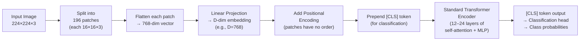
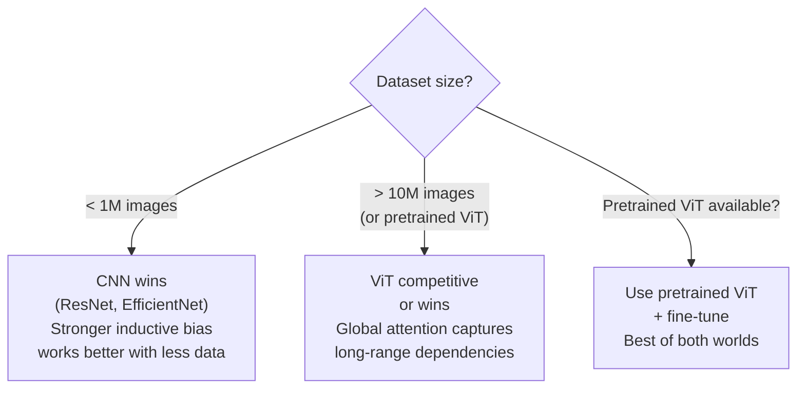

# Lesson 8.1 — ViT: Images as Token Sequences

---

## The Problem: CNNs Have a Local Bias

CNNs process images through local filters. A 3×3 conv layer only sees a 3×3 neighborhood at each step. Global relationships — "the object in the top-left corner relates to the object in the bottom-right corner" — require many stacked layers and large receptive fields to capture. CNNs have a strong **inductive bias** toward local patterns, which is useful for small datasets but limits their ability to capture global context directly.

Transformers, on the other hand, can attend to any part of the input sequence directly in a single layer — O(1) path length between any two positions. The question is: can you apply a Transformer to images directly? Since you know Transformer architecture, this lesson focuses on *how* images become tokens, and what changes vs CNNs.

---

## The Core Idea: Patch Tokenization

A Transformer expects a sequence of tokens. An image is a 2D grid of pixels — not a sequence. **ViT (Vision Transformer, Dosovitskiy et al. 2020)** solves this by dividing the image into fixed-size patches and treating each patch as a token.

**For a 224×224 image with 16×16 patches:**
- Number of patches: (224/16) × (224/16) = 14 × 14 = **196 patches**
- Each patch: 16×16×3 = 768 raw pixels
- Each patch is flattened (768 values) and projected to the model dimension D via a linear layer → **196 tokens of dimension D**

*Image is split into patches. Each patch is flattened, projected to dimension D, position-encoded, and processed by a standard Transformer encoder.*

**[CLS] token:** A special learnable token prepended to the sequence (borrowed from BERT). After all attention layers, the [CLS] token's representation aggregates global information from the whole image and is used for classification.

**Positional encoding:** Patches have no inherent order (unlike words in text, where order is everything). Learned position embeddings are added to each patch embedding so the model knows the spatial arrangement.

---

## ViT vs CNN: The Core Trade-offs

| | CNN | ViT |
|---|---|---|
| **Inductive bias** | Strong (local, translation equivariant) | Weak (must learn spatial structure from data) |
| **Data efficiency** | High — learns well from small datasets | Low — needs very large datasets (ImageNet-21k, JFT-300M) |
| **Global context** | Requires many layers to capture | Immediate (self-attention is global from layer 1) |
| **Scalability** | Diminishing returns with scale | Improves strongly with scale (more data + more params) |
| **Parameters** | Fewer at standard sizes | More (ViT-B/16: 86M; ViT-L/16: 307M) |
| **Speed (inference)** | Fast | Slower (quadratic attention on 196 tokens per layer) |

**The key insight:** CNN's local inductive bias is an advantage when data is scarce (the model doesn't need to learn what "local" means). ViT's weak inductive bias is a disadvantage when data is scarce but becomes an advantage when data is abundant — the model can learn richer, less constrained representations.

---

## When ViT Wins and When CNN Wins

---

## ViT's Role in Modern Vision Systems

ViT has largely replaced CNN backbones in state-of-the-art systems when large pretraining data is available:

- **CLIP**: uses ViT-B/32 or ViT-L/14 as the image encoder — 196 patches per image, self-attention processes them globally.
- **VLMs (LLaVA, BLIP-2)**: use ViT as the vision encoder to produce visual tokens for the LLM.
- **DINO/DINOv2**: self-supervised ViT training that produces excellent visual features for downstream tasks.

---

## Concrete Example: Why CLIP Uses ViT

CLIP's image encoder needs to capture global semantic content — "is this image related to the text 'red sneaker with white sole'?" Global context matters: the color of the sneaker (top-left region) and the sole color (bottom region) must be processed together. A CNN needs many layers to establish this long-range relationship; a ViT establishes it in layer 1 via self-attention across all 196 patch tokens simultaneously.

This is why CLIP ViT-L/14 (using 14×14 patches → 256 tokens for 224×224) outperforms CLIP ResNet-50 on zero-shot transfer tasks — the global attention captures the whole-image semantic relationships that contrastive learning rewards.

---

> **Interview note:** *"Why does ViT need more data than a CNN to train from scratch?"*
> CNNs have a strong inductive bias: local connectivity (each neuron only sees a small neighborhood) and translation equivariance (a feature is detected regardless of position). These are correct assumptions for natural images — they reduce the amount of data needed to learn that "an edge is an edge wherever it appears." ViT has no such bias — it processes patches with full self-attention and must learn spatial locality from data alone. Without enough data, ViT learns arbitrary, data-specific attention patterns that don't generalize. With ImageNet-21k (14M images) or JFT-300M (300M images), ViT learns robust spatial structure and matches or beats CNNs.

> **Interview note:** *"A ViT with 16×16 patches on a 224×224 image produces 196 tokens. What happens as patch size decreases to 8×8?"*
> 8×8 patches on a 224×224 image → (224/8)² = 784 tokens. Each token represents a smaller region → finer spatial resolution → better for tasks requiring precise localization (detection, segmentation). But the self-attention cost is O(n²) in tokens: 196 tokens → 196² = 38K; 784 tokens → 784² = 615K operations per attention layer — ~16x more compute. Smaller patches = better spatial resolution but much higher compute cost. This is why most ViT variants use 16×16 or 14×14 patches for efficiency.

---

## Summary

- ViT tokenizes images into 16×16 (or 14×14) patches, flattens each, linearly projects to dimension D, adds positional encodings, and processes them with a standard Transformer encoder.
- A [CLS] token is prepended and its final representation is used for classification.
- CNNs have strong local inductive bias → better on small datasets. ViT has weak inductive bias → better at scale (10M+ images or pretrained checkpoints).
- ViT is now the standard backbone in CLIP and VLMs because global self-attention captures whole-image semantic relationships that cross-modal contrastive learning rewards.
- Smaller patches → finer resolution but O(n²) attention cost grows quadratically. Trade-off between spatial detail and compute.
