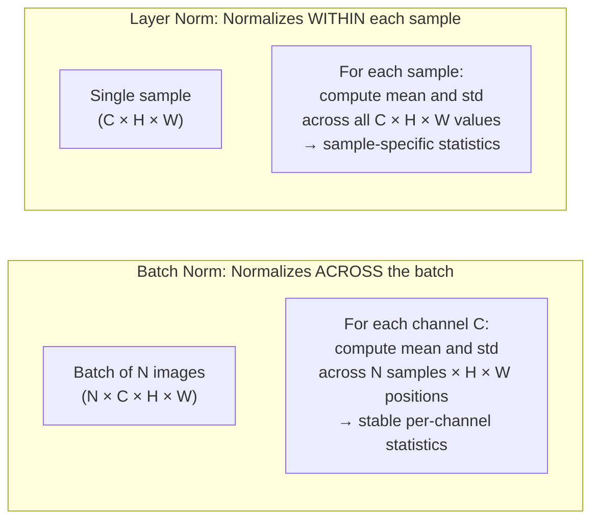

# Lesson 8.2 — Batch Normalization and Layer Normalization

---

## The Problem: Internal Covariate Shift

During training, the distribution of inputs to each layer changes as the weights of the preceding layers update. Layer 5 is trained expecting a certain distribution of inputs from layer 4. But as layer 4's weights change, the distribution it produces changes — layer 5 must constantly re-adapt to a moving target. This is called **internal covariate shift** and it makes training deep networks slow, requiring very low learning rates and careful initialization.

**Normalization layers** solve this by standardizing the inputs to each layer — forcing them to have zero mean and unit variance (then optionally rescaling). This stabilizes the distribution of activations across the network and allows much higher learning rates, faster convergence, and more stable training of very deep networks.

---

## Batch Normalization (BN)

**Batch Normalization (Ioffe & Szegedy, 2015)** normalizes each feature (channel) across the batch dimension.

For a mini-batch of N samples, for each feature dimension d:

```
μ_d = (1/N) Σᵢ xᵢ_d        (batch mean for feature d)
σ²_d = (1/N) Σᵢ (xᵢ_d - μ_d)²  (batch variance for feature d)

x̂ᵢ_d = (xᵢ_d - μ_d) / √(σ²_d + ε)  (normalize)
yᵢ_d = γ_d · x̂ᵢ_d + β_d            (rescale with learned γ, β)
```

**In plain English:** For each feature/channel, compute the mean and variance *across the batch* (across all N training examples in this mini-batch). Subtract the mean, divide by standard deviation. Then apply learned scale (γ) and shift (β) parameters — the network can undo the normalization if needed.



---

## Layer Normalization (LN)

**Layer Normalization (Ba et al., 2016)** normalizes within each individual sample — across all features (channels × spatial positions), independently for each sample in the batch.

Same formula as BN but the mean and variance are computed per sample, not per batch:

```
μ_i = mean over all features of sample i
σ²_i = variance over all features of sample i

x̂ᵢ_d = (xᵢ_d - μᵢ) / √(σ²ᵢ + ε)
yᵢ_d = γ_d · x̂ᵢ_d + β_d
```

---

## The Key Difference and When to Use Each

| | Batch Normalization | Layer Normalization |
|---|---|---|
| **Normalizes across** | Batch dimension (N samples) | Feature dimension (per sample) |
| **Depends on batch size?** | Yes — statistics are less stable with small N | No — each sample is independent |
| **Works at inference?** | Uses running mean/var (estimated during training) | Works the same as training |
| **Works with batch size 1?** | No — variance over 1 sample is meaningless | Yes — fully self-contained |
| **Standard for** | CNNs (image classification, detection) | Transformers, RNNs, VLMs |
| **Placement in CNN** | After conv, before ReLU: `Conv → BN → ReLU` | — |
| **Placement in Transformer** | Rarely used | Before or after attention: Pre-LN or Post-LN |

---

## Why Transformers Use Layer Norm, Not Batch Norm

1. **Variable sequence lengths:** Batches in NLP have different sequence lengths. Batch statistics computed across different-length sequences are ill-defined. Layer Norm, operating per sample, handles variable lengths naturally.

2. **Small batch sizes:** Language model training often uses batch size 1 or very small batches per GPU (with gradient accumulation). Batch Norm with batch size 1 fails — mean is the sample itself, variance is 0.

3. **Recurrent structure:** In RNNs and Transformers, each position's statistics depend on the current input sequence content, not on other sequences in the batch. Layer Norm captures this per-sequence normalization correctly.

---

## Concrete Example: ResNet vs BERT Normalization

**ResNet (CNN):** Each conv layer is followed by Batch Norm. During training, BN computes mean and std across the batch (e.g., 64 images × spatial positions for each channel). The network learns to classify images with stable, normalized activations at each layer. At inference, BN uses running mean and variance accumulated during training — a moving average.

**BERT (Transformer):** Every attention and MLP block uses Layer Norm. For a single sentence of 512 tokens, Layer Norm normalizes across the 768-dim embedding for each token independently. No batch statistics — works perfectly with a single sample at inference.

---

> **Interview note:** *"Why does BatchNorm fail with small batch sizes?"*
> BatchNorm computes mean and variance across the N samples in the current mini-batch. With batch size 1, the "batch mean" is just the sample's own value, and the "batch variance" is 0 — the normalization is meaningless. With batch size 2–4, the statistics are noisy and unreliable. In practice, BatchNorm requires batch size ≥ 16–32 for stable statistics. For models that must run with small batches (meta-learning, large model fine-tuning with limited GPU memory), Layer Norm or Group Norm are preferred alternatives.

> **Interview note:** *"Where does BatchNorm go in a CNN? Before or after the activation?"*
> The standard placement is: `Conv → BatchNorm → ReLU`. BN is applied before the nonlinearity (ReLU), on the unnormalized convolution output. This normalizes the pre-activation values to zero mean and unit variance, then ReLU clips the negative half. Some papers experiment with `Conv → ReLU → BN` but the standard practice remains BN before activation. In ResNets, the block is: `Conv → BN → ReLU → Conv → BN → (add skip connection) → ReLU`.

---

## Summary

- **Internal covariate shift**: the distribution of each layer's inputs changes as earlier layer weights update, slowing training. Normalization layers stabilize these distributions.
- **Batch Normalization**: normalizes each feature across the batch (N samples). Requires sufficient batch size (≥16). Standard for CNNs. Uses learned γ (scale) and β (shift) after normalization.
- **Layer Normalization**: normalizes each sample across all its features. Batch-size independent. Standard for Transformers, RNNs, VLMs. Works identically at training and inference.
- CNN placement: `Conv → BN → ReLU`. Transformer placement: before or after attention + MLP blocks (pre-LN is more stable for deep networks).
- Transformers use LN (not BN) because of variable sequence lengths, small batch sizes during training, and per-sequence statistics being the correct abstraction.
