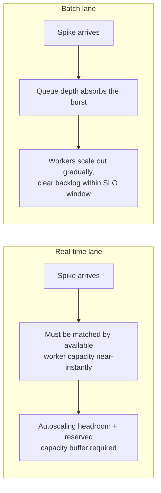

# 1.3 Spike Traffic and Burst Capacity Planning

## Problem

The averages computed in Lesson 1.2 (≈38.6 docs/sec overall, ≈7.7 docs/sec real-time) describe
steady-state load — they say nothing about what happens when traffic suddenly exceeds that
average. Real systems don't arrive in a flat stream: end-of-month invoice processing, tax
season for contracts and ID documents, a marketing campaign driving a surge of real-time
uploads, or a downstream outage causing a retry storm can all push instantaneous load well
above the provisioned average. Provisioning only for the average is a guaranteed way to violate
the latency SLOs stated in Lesson 1.1 the first time real-world traffic behaves like real-world
traffic.

## Solution / Concept: Spike Multiplier and Percentile-Based Sizing

**Spike multiplier** = peak instantaneous rate ÷ average rate, over some observation window.
This is the core sizing tool: rather than provisioning for the average, provision for a
target percentile of observed (or forecasted) load — commonly **P99** for a hard SLO, with
autoscaling covering the gap above that up to some ceiling.

**Worked example, using the Lesson 1.2 baseline and an assumed spike multiplier:**

Real-time traffic in particular is the sensitive lane here — its SLO (a few seconds, p95, per
Lesson 1.1) can't be met by "the queue will smooth it out later" the way batch traffic can.

```
Real-time average: ≈ 7.7 docs/sec (from Lesson 1.2)

Assumption: real-time peak-to-average ratio of 8x during business-hour peaks
(a reasonable starting assumption for a B2B upload workflow with a business-hours usage
pattern — replace with the real observed P99/average ratio as soon as traffic data exists).

Peak real-time rate ≈ 7.7 × 8 ≈ 61.6 docs/sec
```

This peak number — not the 7.7 docs/sec average — is what the **real-time worker pool** and
its autoscaling ceiling need to be sized against (Ch 5.3, Ch 7.2).

**Batch traffic behaves differently under a spike**, and this difference is the single most
important idea in this lesson:

```
Batch average: ≈ 30.9 docs/sec (from Lesson 1.2)

Assumption: a large customer performing a bulk backlog upload could push batch submissions to
5x average for a sustained period.

Peak batch submission rate ≈ 30.9 × 5 ≈ 154.5 docs/sec
```

Because batch has a **completion-window SLO** (e.g., "processed within a few hours"), not a
per-document latency SLO, this spike does **not** need to be matched by instantaneous compute
capacity. Instead, it needs to be absorbed by **queue depth** — the queue holds the backlog,
and workers scale out at a sustainable pace to clear it within the SLO window, rather than the
system needing to instantly 5x its GPU fleet.



## Autoscaling Lag — the Gap Spike Planning Must Cover

Provisioned infrastructure (GPU worker nodes especially) does not scale instantly — spinning up
a new GPU-backed worker can take minutes, not seconds. This means there is always a **gap
between when a spike starts and when autoscaled capacity actually comes online.**

- **For batch traffic**, the queue itself covers this gap — submissions simply wait a bit
  longer in the queue while new workers spin up, and as long as the total backlog clears
  within the SLO window, this is invisible to anyone.
- **For real-time traffic**, this gap cannot be absorbed by a queue without breaking the
  latency SLO — the standard mitigation is maintaining a **standing capacity buffer** above
  the P99 estimate (some amount of always-on, non-autoscaled headroom) specifically to cover
  the autoscaling lag window, combined with predictive scaling ahead of known peak periods
  (e.g., scale up before business hours start, rather than reactively after load already rose).

## When a Spike Exceeds Even the Provisioned Ceiling

Every autoscaling policy has a maximum ceiling (cost and account/infra limits, if nothing
else). What happens when real demand exceeds that ceiling matters as a designed behavior, not
an accident:

- **Real-time lane:** apply **backpressure** — return a clear signal (e.g., HTTP 429 with a
  `Retry-After` hint, or a degraded/faster-but-less-accurate processing path) rather than
  silently queueing requests until the latency SLO is violated anyway. A predictable, explicit
  failure mode is preferable to an invisible SLO breach.
- **Batch lane:** no shedding is needed in the same sense — the queue simply grows deeper, and
  the completion-window SLO may slip. This should be **visible via monitoring** (queue depth
  trend, projected time-to-clear) well before the SLO is actually breached, so it can be
  addressed (temporary extra capacity, customer communication) rather than discovered after
  the fact.

## Trade-offs

| Approach | Gain | Cost |
|---|---|---|
| Provisioning real-time capacity for a high percentile (e.g., P99) with a standing buffer | Meets latency SLO even during predictable/moderate spikes | Standing buffer capacity costs money even when idle — a direct cost/reliability trade-off, revisited in Ch 11 |
| Relying on the queue to absorb batch spikes rather than matching peak instantaneously | Avoids paying for capacity that would sit idle most of the time; batch's own SLO tolerates this | Requires the completion-window SLO to be realistic and monitored — an under-provisioned batch fleet with a growing backlog can silently breach its SLO if nobody is watching queue-depth trend |
| Backpressure/shedding on real-time when ceiling is exceeded | Predictable, explicit failure mode instead of a silent SLO violation | Requires client-side handling of 429/retry responses — a real API design commitment (Ch 3.1), not just a backend implementation detail |

## When to Use Which

- **Standing capacity buffer + predictive scaling**: real-time lane, always — this is not
  optional given the latency SLO stated in Lesson 1.1.
- **Queue-depth absorption with gradual scale-out**: batch lane, always — this is what makes
  batch cheaper to run than real-time at the same volume, and is the reason the 80/20 traffic
  split matters so much for cost (Ch 11).
- **Backpressure/shedding**: both lanes, as a last-resort safety valve once even the
  provisioned ceiling is exceeded — should be designed and tested deliberately, not left as
  undefined behavior under extreme load.

## Summary

Spike planning is about sizing for peak, not average, and — critically — treating batch and
real-time traffic differently under a spike, because they have different SLOs. Real-time
traffic needs standing capacity headroom and predictive scaling to survive the gap before
autoscaling catches up; batch traffic can let its queue absorb the same relative spike and
scale out gradually, as long as the completion-window SLO is monitored. Both lanes need an
explicit, designed behavior (backpressure for real-time, monitored backlog growth for batch)
for the case where even provisioned capacity is exceeded — an undefined failure mode here is a
guaranteed incident waiting to happen.