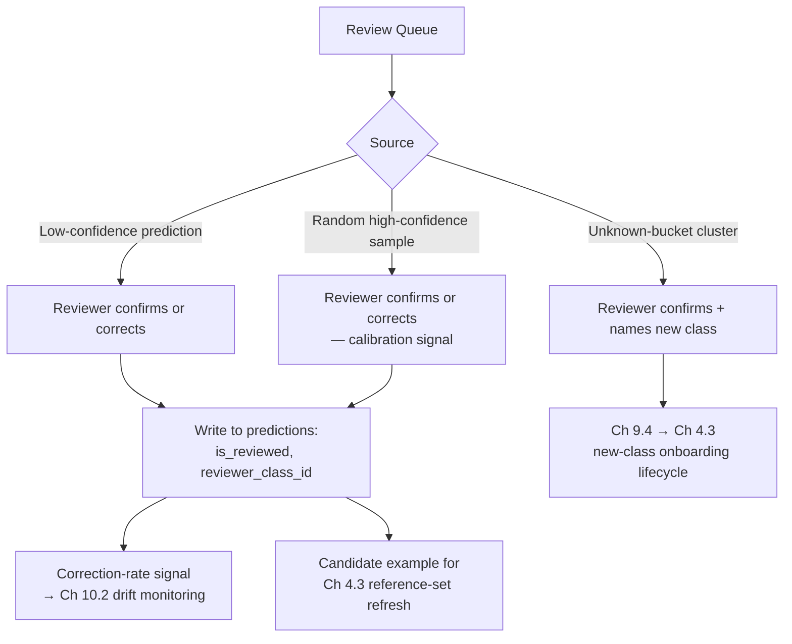

# 10.3 Human Review Workflows and Feedback Capture

## Problem

Human review has been referenced throughout this notes set — as a functional requirement
(Chapter 1.1), as the mechanism that discovers new classes (Chapter 9.4), and as the source of
the correction-rate drift signal (Chapter 10.2) — but the actual workflow (what goes into the
review queue, what a reviewer does, and precisely how corrections feed back into the system)
hasn't been specified. Without a deliberate design here, "human review" remains a checkbox
requirement rather than a working feedback loop.

## Solution / Concept: Review Queue Composition, Workflow, and Feedback Routing

### What goes into the review queue

Three distinct sources, each serving a different purpose:

1. **Low-confidence predictions** (below a "fairly confident" threshold, but above the
   Chapter 9.4 "unknown" threshold — i.e., the model made a real prediction but isn't highly
   sure of it) — the standard active-learning signal, prioritized because these are the most
   likely to be wrong and the most informative to correct.
2. **A random sample of high-confidence predictions** — not for catching mistakes
   specifically, but for **ongoing quality assurance and calibration monitoring**: if
   high-confidence predictions are, in practice, wrong at a non-trivial rate, that's a
   calibration problem (echoing the calibration discussion from the original late-fusion
   design) worth knowing about even though nothing flagged those predictions as uncertain.
3. **Unknown-bucket clusters** (Chapter 9.4) — candidates for genuinely new classes, requiring
   a different reviewer action (confirm/name a new class) than the other two sources
   (confirm/correct an existing label).

### Reviewer workflow

At a role level: a reviewer is shown the original document (fetched from object storage,
Chapter 4.1), the model's predicted label and confidence, and takes one of a small set of
actions — confirm the label as correct, correct it to a different existing class, or (for
unknown-bucket clusters specifically) confirm and name a new class. Each action writes back to
the schema already designed for this in Chapter 4.2: `predictions.is_reviewed = true`,
`predictions.reviewer_class_id` set if corrected, `predictions.reviewed_at` timestamped.

### Where feedback goes

Every review action feeds into multiple downstream processes, each already designed in earlier
chapters:

- **Drift monitoring** (Lesson 10.2) — corrections aggregate into the per-class correction-rate
  signal that triggers reference-set refreshes.
- **Reference-set refresh** (Chapter 4.3) — corrected examples are candidates for improving the
  correct class's reference set.
- **New-class onboarding** (Chapter 9.4) — confirmed unknown-bucket clusters trigger the
  zero-downtime class-addition lifecycle.

## Trade-offs

### Review queue composition

| Choice | Gain | Cost |
|---|---|---|
| Including a random high-confidence sample, not just low-confidence predictions | Catches calibration problems (confidently-wrong predictions) that a pure low-confidence queue would never surface | Consumes review capacity on predictions that are usually already correct — a real cost against the more obviously valuable low-confidence and unknown-bucket review work |

### Feeding corrections back into reference sets

**This is the most important trade-off in this lesson.** Automatically adding every
reviewer-corrected example directly to the corrected class's reference set (Chapter 4.3) is
tempting — it's the fastest possible feedback loop — but risks **reference-set
contamination**: a reviewer error, or a genuinely atypical edge-case document that happens to
be labeled correctly but isn't representative of the class as a whole, can quietly degrade that
class's reference set if added without any further curation.

| Approach | Gain | Cost |
|---|---|---|
| Fully automatic: every correction immediately added to the reference set | Fastest possible feedback loop — reference sets improve continuously with zero manual curation overhead | Real contamination risk — a single reviewer mistake or an unrepresentative edge case directly degrades future classification for that class, with no safeguard |
| Curated: corrections queued for periodic reference-set audit, or requiring multiple independent corrections to agree before being added automatically | Protects reference-set quality — the actual asset the whole embedding/prototype architecture depends on (Chapter 2.3) | Slower feedback loop — a genuine drift signal takes longer to translate into an improved reference set |

**Recommended for this system:** the curated approach — periodic reference-set audit, or a
multiple-agreement threshold before automatic addition — given how directly reference-set
quality determines classification accuracy across the entire system (Chapter 2.3's core
architecture). The cost of a slower feedback loop is small relative to the cost of silently
degrading a class's reference set through unreviewed automatic additions.

## When to Use / When Not To

- **All three review-queue sources** should be active from the point human review exists at
  all (a stated Chapter 1.1 requirement) — omitting the random high-confidence sample in
  particular means calibration problems can go undetected indefinitely.
- **Curated (not fully automatic) reference-set feedback** is the right default for this
  system, given reference-set quality's outsized importance — fully automatic feedback could be
  reconsidered only with strong evidence that reviewer accuracy is consistently high enough to
  make the contamination risk negligible, which should be demonstrated with data, not assumed.

## Summary

The review queue draws from three sources serving three distinct purposes — low-confidence
predictions for catching likely errors, a random high-confidence sample for catching
calibration problems, and unknown-bucket clusters for discovering new classes — and every
reviewer action writes back into the schema and feeds three downstream processes already
designed in earlier chapters: drift monitoring, reference-set refresh, and new-class
onboarding. The one point requiring deliberate restraint is reference-set feedback itself:
given how much classification accuracy depends on reference-set quality, corrections should be
curated before being added to a class's reference set, not applied fully automatically, trading
some feedback-loop speed for protection against contamination.