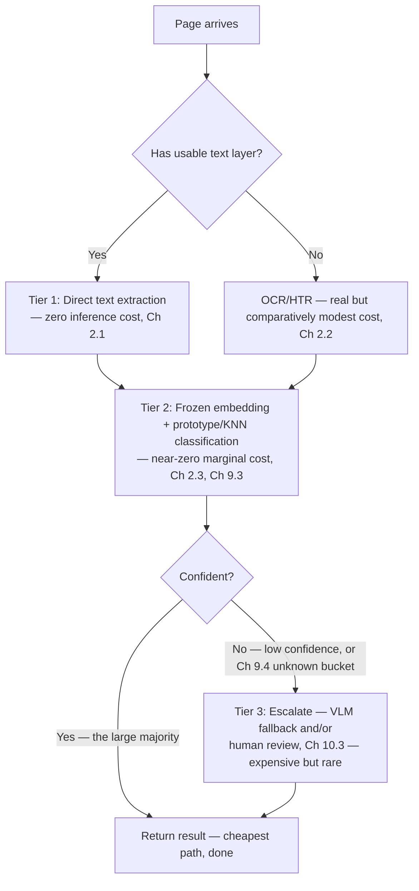

# 11.2 Tiered/Cascaded Design for Cost Control at 100M-Doc Volume

## Problem

Given that GPU inference and VLM fallback calls are real, meaningful cost drivers (Lesson
11.1), running every document through the most capable (and most expensive) available method
would make cost scale linearly with volume — directly violating the cost-sensitivity
requirement from Chapter 1.1. The system already contains the right instinct in two separate
places (Chapter 2.4's hierarchical early-exit, and the CLIP+VLM-fallback pattern referenced in
the earlier ML-design phase) — this lesson generalizes that instinct into an explicit,
system-wide cost architecture.

## Solution / Concept: Three Tiers, Cheapest First



- **Tier 1 — direct text extraction.** Already free by design (Chapter 2.1) whenever a text
  layer exists; the cost lever here is simply making sure the text-layer detection threshold
  correctly routes as many pages as legitimately possible to this free path, rather than
  over-routing to OCR unnecessarily.
- **Tier 2 — embedding-based classification.** The default path for the large majority of
  documents: a frozen backbone plus brute-force or ANN comparison (Chapter 2.3, Chapter 9.3),
  with near-zero marginal cost per additional document once the backbone and reference sets
  are in place.
- **Tier 3 — escalation, by design rare.** Low-confidence documents that Tier 2 can't resolve
  confidently, and documents landing in the Chapter 9.4 "unknown" bucket, escalate to a more
  expensive resource: a general VLM call, human review (Chapter 10.3), or both. This tier is
  expensive per-unit but, by design, should only ever apply to a small minority of traffic.

**This is the same principle already present twice in this system, now made explicit and
general:** Chapter 2.4's hierarchical early-exit is a page-level cost tier ("stop as soon as
confident, don't process more pages than necessary"); this lesson is the model-selection-level
version of the identical principle ("use the cheap model first, escalate to an expensive
model or a human only when the cheap model can't resolve it confidently") — the same cited
industry pattern (a ~4% VLM fallback rate cutting total cost roughly 10x versus a VLM-only
approach) applies directly here.

## Quantifying the Effect

If, for example, only ~5% of documents require Tier 3 escalation (an illustrative assumed rate,
to be replaced with real observed data) at 100M documents/month:

```
Tier 3 volume: 100,000,000 × 5% = 5,000,000 documents/month needing escalation
```

Even at a real per-call VLM cost, this is a small fraction of total volume — the aggregate cost
is dominated by Tier 2's near-zero marginal cost applied to the other 95%, which is exactly the
mechanism that keeps total cost from scaling linearly with the most expensive alternative. The
5% figure itself, however, is not free to ignore: at 100M/month, even a moderate per-call VLM
cost multiplied by 5 million calls is a real, trackable budget line (feeding directly into
Chapter 10.2's cost/drift monitoring), not a rounding error — which is exactly why the
escalation threshold matters as much as it does.

## The Escalation-Threshold Trade-off

| Threshold setting | Effect | Cost |
|---|---|---|
| Too aggressive (low confidence bar before escalating) | More documents escalate to Tier 3 | Directly increases VLM/human-review spend — at 100M/month scale, even a few extra percentage points of escalation rate translates to a large absolute number of expensive calls |
| Too conservative (high confidence bar, rarely escalates) | Fewer documents escalate, minimizing Tier 3 cost | Risks silently returning low-quality results on genuinely hard cases — this doesn't eliminate the cost, it **shifts** it downstream into user complaints, support burden, and reviewer correction load (Chapter 10.3), which is real cost, just relabeled and less visible in an infra dashboard |

**This threshold must be tuned against real accuracy/cost data** (Chapter 10.2's monitoring),
not set arbitrarily — it's a genuine cost/accuracy trade-off with a real dollar value on both
sides, not a free parameter to optimize in only one direction.

## Lane-Specific Tiering Policy

Consistent with this notes set's running theme of differentiating batch and real-time traffic:
escalating to a VLM adds real latency, which the real-time lane's tight SLO (Chapter 1.1) may
not comfortably absorb — the real-time lane should carry a **tighter escalation budget**
(escalate less liberally, accepting slightly more low-confidence results returned as-is, or
routing to asynchronous human review after the fact rather than blocking on synchronous
escalation). The batch lane, with no per-document latency constraint, can afford to escalate
more liberally, since only aggregate cost — not latency — is the constraint there.

## Trade-offs

| Choice | Gain | Cost |
|---|---|---|
| Three-tier cascaded design (vs. running every document through the most capable method) | Keeps aggregate cost dominated by the cheapest tier's near-zero marginal cost — directly satisfies the Chapter 1.1 cost-sensitivity requirement | Requires an accurate confidence signal to decide when to escalate — a poorly calibrated Tier 2 (echoing the calibration discussion from the original fusion-architecture design) undermines the entire tiering strategy |
| Lane-specific escalation budgets | Protects the real-time SLO from escalation-induced latency, while letting the batch lane optimize purely for cost | Adds one more axis of policy to tune and monitor per lane, on top of the batching and autoscaling policies already differentiated in Chapters 5 and 7 |

## Summary

The system already contains the cost-tiering instinct in two places — page-level early-exit
(Chapter 2.4) and the cheap-primary/expensive-fallback classification pattern referenced
earlier — and this lesson generalizes it into an explicit three-tier cost architecture: free
direct text extraction, near-zero-marginal-cost embedding classification for the large
majority, and expensive VLM/human-review escalation reserved for a small, deliberately-tuned
minority of genuinely uncertain cases. The escalation threshold is the single most consequential
cost/accuracy dial in the whole system at 100M-document scale, and — consistent with every
other policy in this notes set — is tuned differently per traffic lane, tighter for real-time
where escalation latency threatens the SLO, looser for batch where only aggregate cost matters.