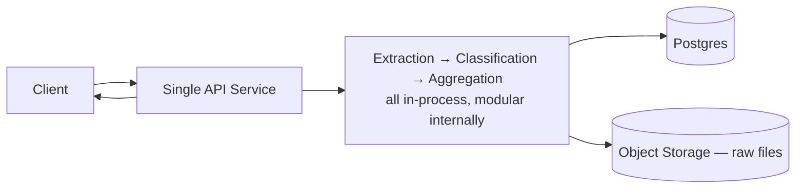

# 2.1 Single-Service Architecture — The Deliberately Simple Starting Shape

## Problem

With a stated target of 100M documents/month and 50 classes (Chapter 1), there's real pressure
to start designing microservices, Kafka clusters, and sharded databases from day one "because
we know we'll need it eventually." This is a trap. At low traffic, none of that complexity has
anything to prove itself against — there's no real load pattern yet, the classification
pipeline itself hasn't been validated for accuracy, and premature infrastructure investment
slows down the one thing that actually matters early: finding out whether the classifier
works and iterating on it quickly. The cost of starting simple and refactoring later is much
lower than the cost of operating unnecessary distributed-systems complexity while still trying
to figure out if the product even works.

## Solution / Concept: A Modular Monolith, Not a Distributed System

The MVP is **one deployable service** that internally is still cleanly separated into the
logical stages established in the earlier ML-design notes — ingestion, content extraction,
classification, aggregation — but all running in-process or as tightly-coupled internal calls,
not as independently deployed services communicating over a network.

**Why "modular" matters even inside a monolith:** the internal boundaries between extraction,
classification, and aggregation should be real code boundaries (separate modules/classes with
clean interfaces) even though they're not yet separate deployments. This is what makes the
later transition to microservices (Chapter 8) a matter of moving existing, already-separated
code across a network boundary, rather than untangling a genuinely tangled codebase under
production pressure.

At this stage, submissions can reasonably be processed **synchronously within the request** for
small documents, or via a very lightweight in-process task queue for anything that takes more
than a couple of seconds — a full external message queue (Chapter 5) is not yet justified.

## Trade-offs

| Choice | Gain | Cost |
|---|---|---|
| Single deployable service | Fast to build, fast to iterate on the classifier itself, trivial to reason about (one log stream, one deploy, no network calls between pipeline stages) | Doesn't scale independently — extraction and classification compete for the same process's resources; a slow OCR call blocks capacity that classification could have used |
| Modular internal structure despite single deployment | Makes the eventual microservices split (Ch 8) mechanical rather than a rewrite | Requires discipline to maintain real boundaries even when it would be "easier" to let modules reach into each other's internals |
| Synchronous/in-process processing for small early volume | No queue infrastructure to build or operate yet | Breaks quickly once volume or per-document processing time grows — this is the first, and most obvious, breakpoint (Lesson 2.5) |

## When to Use / When Not To

- **Use this architecture** while validating classifier accuracy, iterating on the class
  taxonomy, and operating at traffic low enough that a single service's compute and DB
  connections aren't saturated — a reasonable rule of thumb is: as long as p95 latency and
  error rates stay within SLO without needing more than one or two instances of the service.
- **Move past this architecture** as soon as any one of the breakpoints in Lesson 2.5 is hit —
  most commonly, request volume or per-document processing time growing to the point where
  synchronous handling starts violating the real-time latency SLO (Ch 1.1), which is exactly
  the trigger covered in Chapter 5 (introducing a queue and producer-consumer split).

## Summary

The MVP is one deployable service, not a distributed system — this is a deliberate choice, not
a shortcut taken out of ignorance of the 100M-scale target. The only design discipline that
matters at this stage is keeping the internal pipeline stages (extraction, classification,
aggregation) as clean, separately-reasoned-about modules, so that later chapters' scaling
decisions are additive (introduce a queue, split into services, shard the database) rather
than requiring the MVP's core logic to be rewritten.