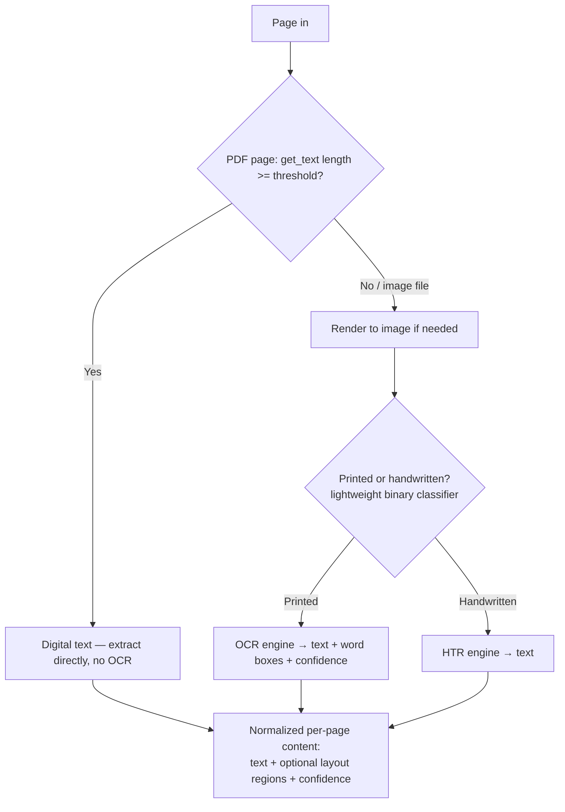

# 2.2 Content Extraction Pipeline

## Problem

Before any classification can happen, heterogeneous inputs — digital PDFs, scanned PDFs,
handwritten scans, photos, spanning multiple pages per document — need to be turned into a
normalized, machine-usable representation. Getting this wrong (e.g., running expensive OCR on
pages that already have a perfect text layer, or feeding handwriting into a printed-text OCR
engine) either wastes compute at scale or silently produces wrong content that no downstream
model can recover from.

## Solution / Concept: A Per-Page Routing Decision, Independent of Aggregation

The extraction pipeline makes exactly one decision per page, and makes it the same way
regardless of the document's original file type:

**Why this is a per-page, not per-document, decision:** a scanner-produced `.pdf` is
structurally just an image object per page — indistinguishable from a phone photo once
rendered. A digitally-generated multi-page document can still have one scanned page mixed in
(e.g., a stapled signature page). Deciding this once per document, rather than per page, causes
silent mis-routing on exactly the mixed documents that are common in practice.

**Three distinct extraction tools, chosen based on the routing decision above:**

- **Direct text extraction** (`page.get_text()`) — free, instant, used whenever a real text
  layer exists. No model inference at all.
- **OCR** (chosen for MVP: **EasyOCR**, for ease of setup; **PaddleOCR** or cloud APIs
  like AWS Textract/Google Document AI are the natural upgrade path if throughput or accuracy
  demands it later — see the breakpoints in Lesson 2.5) — for printed text on pages with no
  usable text layer. Returns text, word-level bounding boxes, and confidence scores.
- **HTR** (chosen for MVP: **TrOCR**) — for handwritten pages. Printed-OCR engines fed
  handwriting don't fail cleanly; they output confidently-wrong text, so the printed/handwritten
  decision must be made *before* choosing the engine, not discovered after a bad result.

A lightweight **printed-vs-handwritten binary classifier** (not a heuristic on OCR confidence
alone — that conflates handwriting with any low-quality printed scan) sits between "no text
layer" and the OCR/HTR fork. This is a genuinely easier problem than full OCR (closer to a
texture-classification task: stroke-width uniformity, baseline regularity) and can be trained
cheaply on public data (RVL-CDIP for printed, IAM for handwritten).

## Trade-offs (Recap, Applied to This Architecture)

| Decision point | Option chosen for MVP | Why | What changes at scale |
|---|---|---|---|
| OCR engine | EasyOCR | Fast to integrate, GPU-accelerated, no system-level install friction for an MVP | At real GPU-fleet scale, evaluate PaddleOCR (often better throughput/accuracy trade-off) or a cloud OCR API (removes GPU fleet management for this stage entirely, at a per-call cost — see Ch 11.1 cost breakdown) |
| Printed/handwritten detection | Dedicated lightweight binary classifier | Safer than OCR-confidence heuristics, which conflate handwriting with poor-quality printed scans | Unchanged at scale — this stays a cheap, small model regardless of volume; it's not a bottleneck |
| Word-box granularity | Word-level, not line-level, OCR output | Required if the classification pipeline (Lesson 2.3) later uses a layout-aware model expecting word-level boxes | If the OCR engine defaults to line-level detection, either reconfigure it for word-level output or accept coarser layout signal — a real accuracy/engineering trade-off to revisit if layout-aware classification underperforms |
| Preprocessing (deskew, binarize, perspective-correct) | Rely on the OCR tool's built-in preprocessing rather than a custom pipeline | Modern OCR tooling already handles most of this; building custom preprocessing preemptively is wasted effort | Add explicit perspective correction specifically if phone-photo uploads become a large, measurably low-accuracy fraction of traffic — a targeted fix, not a default |

## When to Use / When Not To

- **This exact tool selection (EasyOCR + a small printed/handwritten classifier + TrOCR)** is
  appropriate while validating the pipeline and at low-to-moderate traffic, where ease of setup
  and iteration speed matter more than squeezing out maximum throughput or accuracy per dollar.
- **Revisit tool selection** once GPU cost or OCR throughput shows up as a bottleneck in the
  capacity numbers from Chapter 1.2 — this is a tool-swap, not an architecture change, because
  the routing decision and pipeline shape (Lesson 2.5's diagram) don't need to change when the
  underlying OCR engine changes.

## Summary

Content extraction makes one per-page decision — does a usable text layer exist — and branches
accordingly into direct extraction, OCR, or HTR, with a dedicated lightweight classifier
deciding printed vs. handwritten before OCR is ever applied to a page that needs HTR instead.
The specific tools chosen for the MVP (EasyOCR, a small printed/handwritten classifier, TrOCR)
are swappable without touching this routing logic — the architecture is stable even as the
underlying models change with scale.