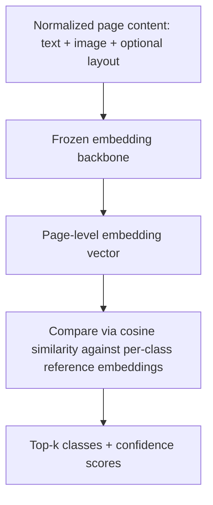

# 2.3 Classification Pipeline

## Problem

Once a page's content is normalized (Lesson 2.2), a decision has to be made about what model
architecture actually assigns a class label — and this decision has to account for a
requirement stated in Chapter 1 that a fixed-softmax 5-class model directly contradicts: the
class taxonomy must grow toward ~50 classes **without full retraining**. Any classification
design chosen for the MVP that ignores this requirement will need to be thrown away, not
extended, once class #6 shows up.

## Solution / Concept: Signal Choice, Then Fusion Depth, Then Extensibility

Three layered decisions, each with real trade-offs:

### Decision 1 — Which signal(s) to consume

Text and image signal are both always available per page after extraction (Lesson 2.2) —
it's not "text OR image depending on source." Different classes lean on different signals: an
ID document is identified mostly by visual layout/photo, a contract mostly by text content. A
pure text-only or pure image-only model is therefore unsafe as a general design once the class
list spans both kinds of classes.

### Decision 2 — Fusion depth: late fusion vs. joint fusion

| | Late fusion (independent models + combiner) | Joint fusion (LayoutLMv3-style) |
|---|---|---|
| Expressiveness | Cannot learn cross-modal interactions | Can — text and image attend to each other inside the model |
| Compute/data cost | Low | Higher (needs OCR + word-box alignment, bigger model) |
| Fit for MVP | Good — cheap, fast to iterate | Reserve for phase 2 once a baseline exists to compare against |

**Chosen for MVP:** late fusion — independent text and image classifiers, combined via a
learned **stacking** combiner (a small model trained on the two models' output probability
vectors), with **calibration** (temperature scaling) applied to each model's outputs before
combining, since raw softmax scores from differently-trained models aren't inherently
comparable.

### Decision 3 — Extensibility: fixed head vs. embedding + prototype/KNN

This is the decision that actually determines whether the system survives the 50-class
requirement. A model fine-tuned with a fixed-size softmax output layer (`num_labels=5`)
hard-codes the class count into the model's architecture — adding class #6 means growing that
layer and retraining, and worse, the frozen backbone underneath may never have learned to
represent whatever distinguishes the new class, since it was only ever pushed to separate the
original 5 (a form of catastrophic forgetting / representation staleness).

**Chosen for MVP (and carried forward, not just a phase-1 placeholder):** an **embedding +
prototype/KNN architecture**. A backbone (for MVP: a frozen pretrained embedding model — CLIP
as a cheap starting point, or LayoutLMv3's base model used purely as a frozen feature extractor,
not fine-tuned with a classification head) maps every page to a fixed-size vector. Each class
is represented by a small set of reference embeddings (or their average, a "prototype")
computed from a handful of labeled examples. Classification = nearest-neighbor / highest
cosine-similarity match against the reference set.

**Why this survives the 50-class requirement:** adding a new class means collecting a handful
of labeled examples, embedding them with the same unchanged backbone, and adding them to the
reference set — no retraining, no risk of disturbing existing classes' decision boundaries.
This directly satisfies the "5 → 50 classes without full retraining" requirement from Chapter
1.1, and is the reason this choice is made even at MVP scale rather than deferred.

## Trade-offs

| Choice | Gain | Cost |
|---|---|---|
| Late fusion (stacking) over joint fusion, for MVP | Fits free/modest compute budgets; fast to build and iterate | Leaves cross-modal interaction signal on the table — a real accuracy ceiling versus joint fusion, worth benchmarking once a baseline exists |
| Embedding + prototype/KNN over a fixed softmax head | Satisfies the 50-class extensibility requirement from day one; no retraining to add a class | Generally lower raw accuracy than a fully fine-tuned classifier at a *fixed* class count, since the backbone is frozen and never adapted specifically to the exact 5 (or 50) classes; requires enough reference examples per class and a reasonably close pretrained backbone (see domain-adaptation trade-offs) |
| CLIP as the starting embedding backbone | Zero training, works out of the box, decent general visual-similarity signal | Known weak at reading dense embedded text — classes distinguishable mainly by subtle text content may need the text-model signal (Decision 1) to compensate, or a document-domain-pretrained backbone (LayoutLMv3/DiT) instead |

## When to Use / When Not To

- **Late fusion + embedding/prototype architecture** is the right MVP choice whenever the
  extensibility requirement (Ch 1.1) is real and near-term (as stated: growth toward 50
  classes), even if it costs some raw accuracy compared to a fixed fine-tuned model.
- **A fixed fine-tuned softmax head** would only be defensible if the class list were
  genuinely frozen for the foreseeable future — not the case here, so it's explicitly rejected
  even at small scale, to avoid building something that has to be thrown away at class #6.
- **Joint fusion (LayoutLMv3/Donut)**, used as a frozen embedding extractor rather than a
  fine-tuned classifier, is the natural upgrade path once CLIP's text-blindness becomes a
  measured accuracy problem — swapping the backbone doesn't require touching the
  embedding+prototype architecture itself.

## Summary

The MVP classification pipeline makes three layered decisions: use both text and image signal
(neither alone is safe), combine them via calibrated late fusion (stacking) rather than the
more expensive joint-fusion architectures, and — most importantly — build on a **frozen
embedding + prototype/KNN** architecture rather than a fixed-size fine-tuned classifier, because
the extensibility requirement to grow from 5 to ~50 classes without retraining is a stated,
near-term requirement, not a hypothetical future concern.