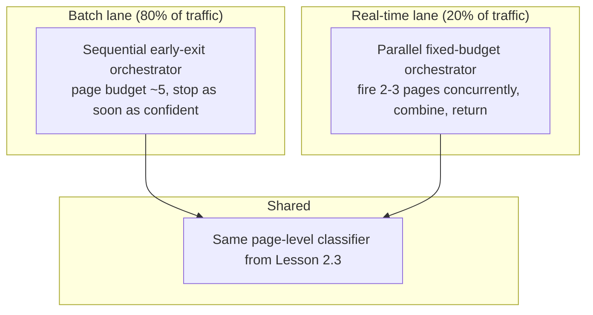

# 2.4 Page-to-Document Aggregation

## Problem

The classification pipeline (Lesson 2.3) produces a similarity/confidence score **per page**,
but the system must return exactly one label **per document**, which may span many pages. Which
pages to actually run through the (expensive) extraction-and-classification path, and how to
combine their results, is a separate design question from both extraction (Lesson 2.2) and
classification (Lesson 2.3) — and it's the first place where the 80/20 batch/real-time split
from Chapter 1.1 needs to change the system's behavior, not just its numbers.

## Solution / Concept: Hierarchical Early-Exit, With Different Orchestration Per Traffic Lane

**Core mechanism — hierarchical early-exit:** classify page 1. If confidence clears a
threshold, stop and commit. If not, add page 2, combine evidence (e.g., average the similarity
scores), check again. Continue until confidence clears the threshold or a page-budget cap is
hit (e.g., 5 pages). This **self-adapts to document length** without any explicit
`if page_count == 1` logic — a 1-page ID document stops after 1 page; a 40-page contract stops
at the budget cap.

**Why the orchestration differs by traffic lane (this is the key MVP decision):** the
classifier itself doesn't care whether it's called sequentially or in parallel — it's a
property of the layer *around* it, not the classifier. Two orchestration policies wrap the same
underlying classifier:

- **Batch orchestrator (sequential early-exit):** minimizes average compute cost, since no
  human is waiting — most documents likely resolve confidently within 1–2 pages, so this
  captures the bulk of the compute savings the early-exit design exists for.
- **Real-time orchestrator (parallel, smaller fixed budget):** deliberately sacrifices the
  "maybe I only needed 1 page" compute savings in exchange for predictable low latency —
  firing a small, fixed number of pages concurrently keeps wall-clock time close to a single
  page's processing time, meeting the real-time SLO from Chapter 1.1.

## Trade-offs

| Choice | Gain | Cost |
|---|---|---|
| Hierarchical early-exit (vs. always processing all pages, or a fixed first-N) | Adapts compute spend to document length and confidence automatically; captures most of full-document robustness at a fraction of average cost | Adds a stopping-condition threshold that needs tuning on a validation set — get it wrong and either compute is wasted (threshold too strict) or accuracy suffers (threshold too loose) |
| Two separate orchestrators sharing one classifier (vs. one global strategy) | Batch traffic gets the cost savings its SLO tolerates; real-time traffic gets the latency guarantee its SLO requires; classifier improvements benefit both automatically | More orchestration code to maintain, and requests must be correctly routed to the right lane upstream (this becomes an explicit API/queue design concern in Chapters 3 and 5) |
| Parallel processing specifically for real-time, not sequential | Wall-clock latency ≈ one page's processing time, not N× | Pays full compute cost for all N pages fired, even when page 1 alone would have sufficed — an intentional cost/latency trade specific to the smaller 20% of traffic |

## When to Use / When Not To

- **Use hierarchical early-exit** as the default aggregation mechanism regardless of lane — the
  *mechanism* is shared; only the *orchestration around it* (sequential vs. parallel) differs.
- **Use sequential orchestration** wherever the completion-window SLO (Ch 1.1) tolerates it —
  this is the cost-minimizing choice and should be the default for the 80% batch majority.
- **Use parallel orchestration** only where a tight, per-request latency SLO genuinely requires
  it — applying parallel processing to batch traffic would be pure wasted cost with no
  corresponding benefit, since nothing is waiting on the result.

## Summary

Aggregation is not one design decision but two: the confidence-driven stopping mechanism
(hierarchical early-exit, shared across all traffic) and the orchestration strategy around it
(sequential for cost-sensitive batch traffic, parallel for latency-sensitive real-time
traffic). Keeping the classifier itself agnostic to which orchestrator calls it is what makes
this split cheap to build and maintain — it's a routing decision at the orchestration layer,
not two different classification systems.