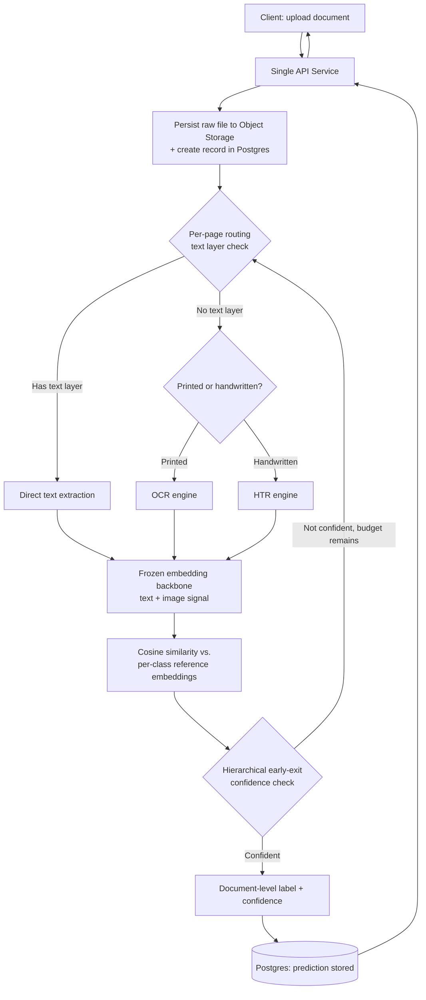

# 2.5 MVP Architecture Diagram and Breakpoints

## Problem

Lessons 2.1–2.4 each made one design decision in isolation. Before moving on to scale the
system (Chapters 3–11), it's worth assembling those decisions into one concrete picture of what
the MVP actually looks like end-to-end, and — just as importantly — stating explicitly what
signals mean this architecture is no longer sufficient. Without stated breakpoints, teams tend
to notice a system is struggling only after it's already violating SLOs in production.

## The Full MVP Architecture

**What this diagram represents:** a single deployable service (Lesson 2.1), internally
structured through the per-page routing decision (Lesson 2.2), a frozen embedding + reference-
comparison classifier (Lesson 2.3), and hierarchical early-exit aggregation (Lesson 2.4) — all
processed synchronously or via a lightweight in-process mechanism, with Postgres and object
storage as the only external dependencies. No message queue, no separate services, no cache
layer yet — those are all introduced in later chapters, each in response to a specific
breakpoint below.

## Breakpoints — Concrete Signals This Architecture Is About to Fail

| Signal | What it indicates | What chapter addresses it |
|---|---|---|
| Real-time p95 latency approaching the SLO (Ch 1.1) under normal load, not just spikes | The single service can no longer process requests synchronously fast enough — extraction and classification are competing for the same process's resources | Ch 5 (queue + producer-consumer split), Ch 3.1 (sync vs. async API contract) |
| Sustained traffic approaching even a modest fraction of the 38.6 docs/sec average from Ch 1.2 | One service instance (or even a few) can't keep up with combined extraction + classification + DB write load | Ch 5 (workers), Ch 7 (horizontal scaling) |
| Postgres connection count or write latency climbing under load | A single database instance is becoming a shared bottleneck across all pipeline stages | Ch 4.4 (partitioning, sharding, read replicas) |
| Class count approaching double digits, with reference-set lookups (Lesson 2.3) taking noticeably longer or accuracy degrading | Brute-force cosine similarity against a growing reference set doesn't scale cleanly, and coverage-per-class becomes harder to maintain by hand | Ch 9 (hierarchical taxonomies, vector DB / ANN search) |
| Repeated identical or near-identical documents being fully reprocessed | No caching layer exists yet — wasted compute on duplicate work | Ch 6 (caching strategy) |
| Any traffic spike (Ch 1.3) causing real-time latency SLO violations, or batch backlog growing unboundedly | The MVP has no autoscaling or dedicated capacity buffer — it scales (if at all) by manually adding instances | Ch 7.3 (spike handling in practice) |
| Codebase difficulty: extraction, classification, and aggregation code starting to interfere with each other's deploys, or needing independent scaling (e.g., classification needs more GPU, extraction needs more OCR throughput, in different ratios) | The internal modular boundaries (Lesson 2.1) are ready to become real service boundaries | Ch 8 (monolith → microservices) |
| Storage growth (Ch 1.2: ~100TB/month at target scale) causing single-object-store-bucket or single-DB-instance management pain | Data architecture needs explicit lifecycle/partitioning policy, not ad-hoc growth | Ch 4.1, 4.3, 4.4 |

## Trade-offs of Deferring These Concerns

| Choice | Gain | Cost |
|---|---|---|
| Not building a queue, cache, or microservices split until a breakpoint is actually observed | Avoids wasted engineering effort on infrastructure that isn't yet needed; keeps the system simple and easy to reason about while the classifier itself is still being validated | Requires genuine monitoring of the breakpoint signals above — without visibility into these signals, the team finds out about a breakpoint from an incident, not from a dashboard |

## Summary

The MVP is a single service wrapping the routing, extraction, classification, and aggregation
decisions from Lessons 2.1–2.4, backed only by object storage and a single Postgres instance.
It is not meant to scale to 100M documents/month as-is — it's meant to validate the pipeline
correctly and cheaply while explicit, monitored breakpoints (latency approaching SLO, traffic
approaching capacity limits, class count growing, storage growing, duplicate work being
reprocessed) signal exactly when and why each subsequent chapter's infrastructure becomes
necessary, rather than being built speculatively ahead of need.