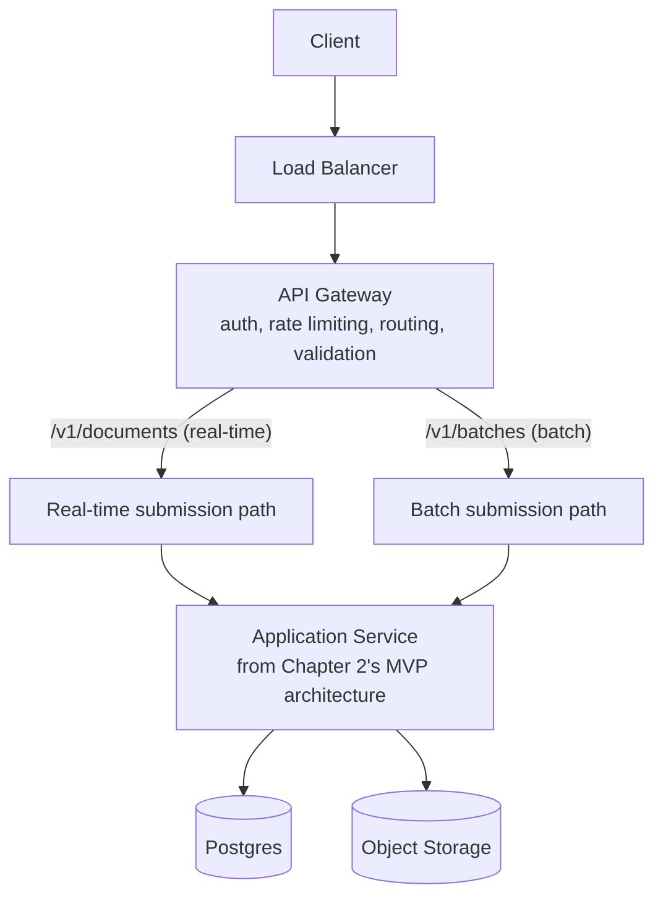

# 3.3 Where the API Gateway and Load Balancer Sit

## Role (no trade-off debate — used directly, as is standard practice)

Two standard infrastructure components sit in front of the service(s) built in Chapters 2–3,
each with a specific, well-established role in this system:

- **Load Balancer** — distributes incoming requests across multiple running instances of the
  API service, so no single instance becomes a bottleneck and traffic survives an individual
  instance failing or being taken down for a deploy. Sits at the very front of the request
  path, before anything else.
- **API Gateway** — handles cross-cutting concerns that shouldn't be reimplemented inside the
  application service itself: authentication/API-key validation, rate limiting per client,
  request routing (directing `/v1/documents` real-time traffic and `/v1/batches` traffic to
  the appropriate backend path — increasingly relevant once Chapter 8 splits these into
  separate services), request validation (rejecting malformed submissions before they consume
  any pipeline resources), and basic request/response logging for observability (Ch 10.2).

## Updated Architecture Diagram

At this stage (still pre-queue, pre-microservices), both the real-time and batch paths still
route into the same underlying service from Chapter 2 — the gateway's routing distinction here
is mostly about applying different rate limits and validation rules per lane, not yet about
hitting genuinely different backend infrastructure. That changes starting in Chapter 5, once a
queue and dedicated worker pools are introduced per lane.

## Summary

The load balancer and API gateway are standard, off-the-shelf components placed at the front of
the request path — a load balancer for distributing traffic across instances, and a gateway for
auth, rate limiting, request validation, and lane-aware routing. Their presence here doesn't
change any of the pipeline design from Chapter 2; they simply sit in front of it, and their
routing role becomes more consequential once Chapter 5 gives the real-time and batch lanes
genuinely separate backend paths to route into.