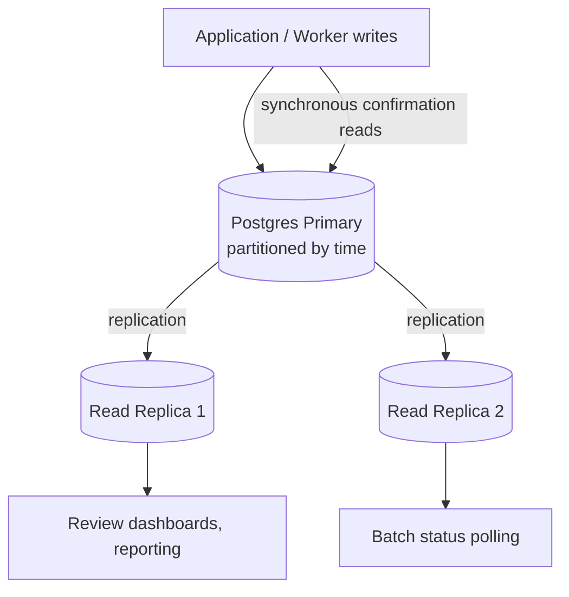

# 4.4 Partitioning, Sharding, and Read Replicas

## Problem

At the target scale from Chapter 1.2 (≈100M documents/month, ≈3 pages/document, ≈38.6
documents/sec average), the tables designed in Lesson 4.2 grow large fast: `documents` gains
~100M rows/month, `pages` gains up to ~300M rows/month (fewer in practice due to early-exit
reducing actual pages processed, per Ch 1.2's adjusted ~58 page-inferences/sec figure), and
`predictions` grows in step with `documents`. A single, unpartitioned Postgres instance handling
both the full write load and every read query (status polling, human review dashboards,
analytics) against ever-growing tables will eventually degrade — index maintenance cost rises,
vacuum operations take longer, and query planning against huge tables slows down — well before
raw write throughput itself becomes the bottleneck.

## Solution / Concept: Three Separate Techniques, Applied in Order of Increasing Complexity

### 1. Table Partitioning (by time) — the first, lowest-complexity step

Partition `documents`, `pages`, and `predictions` by month (or week, depending on observed
growth), using Postgres native declarative partitioning:

```sql
CREATE TABLE documents (
    -- ... columns as in Lesson 4.2 ...
) PARTITION BY RANGE (submitted_at);

CREATE TABLE documents_2027_01 PARTITION OF documents
    FOR VALUES FROM ('2027-01-01') TO ('2027-02-01');
-- new partitions created on a rolling basis (automated, e.g. via a scheduled job)
```

**Why this helps:** queries and indexes stay scoped to a much smaller partition instead of the
full historical table, since most operational queries (recent status checks, this week's review
queue) only touch recent data. It also makes **data lifecycle management** (archiving or
deleting old raw data per retention policy, Ch 12) a matter of dropping an old partition —
fast — rather than a slow `DELETE` against a massive table.

### 2. Read Replicas — for read-heavy paths that shouldn't compete with writes

The write path (new documents, new predictions, review corrections) and several read-heavy
paths (batch status polling by clients, human review dashboards, analytics/reporting queries)
have very different access patterns. Routing read-heavy, latency-tolerant queries to one or
more **read replicas** keeps them from competing with the primary's write throughput and from
degrading write latency for the actual processing pipeline.

**Rule of thumb for this system:** anything the API's real-time lane needs synchronously (e.g.,
confirming a submission was recorded) reads from the primary; anything else read-heavy
(dashboards, batch status polling, reporting) reads from a replica, accepting slight replication
lag as a reasonable trade for not impacting write performance.

### 3. Sharding — the last resort, and likely unnecessary at this system's actual numbers

Sharding (horizontally splitting data across multiple independent database instances, e.g., by
`tenant_id` or a hash of `document_id`) is the most complex option — it introduces cross-shard
query complexity, loses easy cross-shard transactional guarantees, and adds real operational
burden (routing logic, rebalancing, cross-shard joins for anything spanning tenants).

**Honest capacity check against Chapter 1.2's numbers:** write throughput at target scale is
roughly 38.6 documents/sec plus associated page and prediction rows — call it on the order of a
few hundred writes/sec at peak. A well-configured, properly partitioned single Postgres primary
(with read replicas absorbing read load) can handle this comfortably; modern Postgres instances
routinely handle write throughput an order of magnitude higher than this. **Sharding is not
justified by write throughput alone at this system's stated target scale** — partitioning plus
read replicas is very likely sufficient.

**What would actually justify sharding:** a single logical database exceeding what one
(even well-resourced) primary instance can hold operationally (storage ceiling, backup/restore
time growing unmanageable, vacuum/maintenance windows becoming impractical even with
partitioning), or a genuine multi-tenant isolation requirement (e.g., data residency
requirements forcing certain tenants' data onto region-specific infrastructure) — a compliance
driver, not a pure throughput driver, in this system's case.



## Trade-offs

| Technique | Gain | Cost | Justified at this system's scale? |
|---|---|---|---|
| Time-based partitioning | Keeps queries/indexes fast against recent data; makes retention/archival cheap | Requires automated partition creation/maintenance; queries spanning many partitions (rare historical analytics) are slower | Yes — should be in place from the point tables start growing meaningfully, well before 100M/month is reached |
| Read replicas | Isolates read-heavy, latency-tolerant traffic from the write path | Replication lag means replica reads are not perfectly real-time; adds one more component to operate | Yes — justified as soon as dashboards/polling load becomes measurable, likely well before write throughput is a concern |
| Sharding | Removes the single-primary ceiling entirely | Significant operational and query complexity; loses easy cross-shard consistency | **Not justified by throughput alone at the stated 100M/month target** — only reconsider if driven by storage/maintenance ceilings or compliance/data-residency requirements |

## When to Use Which

- **Partitioning:** adopt early — the cost is low and the benefit (query performance, easy
  retention) compounds as tables grow, well before any other technique here is needed.
- **Read replicas:** adopt as soon as read-heavy paths (dashboards, polling, reporting) are
  observed to add measurable load to the primary — a clear, monitorable signal, not a
  speculative one.
- **Sharding:** do not adopt preemptively for this system. Revisit only if a concrete,
  observed ceiling (storage, maintenance window length) or a compliance requirement (data
  residency) makes it necessary — not simply because "100M documents sounds like it needs
  sharding."

## Summary

At this system's actual target numbers (≈38.6 docs/sec average, ≈100M docs/month), the honest
capacity math shows that **time-based partitioning combined with read replicas is very likely
sufficient** — sharding, the most operationally complex option, is not justified by throughput
alone and should be treated as a last resort triggered by a genuine storage/maintenance ceiling
or a compliance-driven data-residency requirement, not adopted preemptively just because the
top-line document count sounds large.