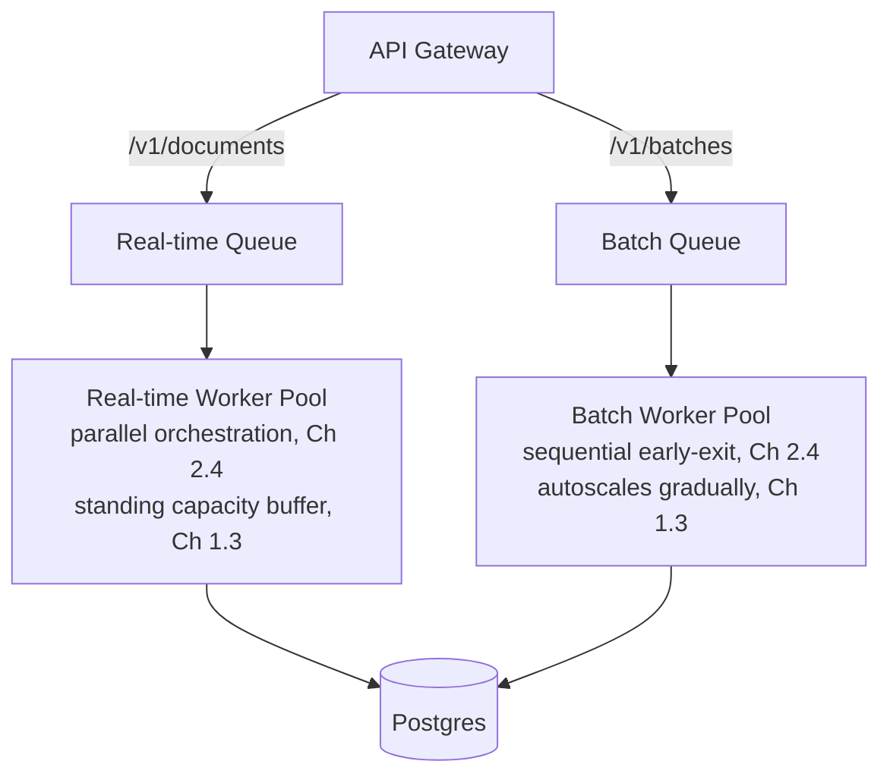

# 5.2 Producer-Consumer Architecture for an 80% Batch / 20% Real-Time Mix

## Problem

Given that a queue-based producer-consumer architecture is needed (Lesson 5.1), the next
question is structural: do batch and real-time submissions share **one** queue and **one**
worker pool, or do they get **fully separate** ones? This isn't a minor implementation detail —
get it wrong and the 80% batch majority can directly degrade the 20% real-time minority's
latency, defeating the entire purpose of having stated differentiated SLOs in Chapter 1.1.

## Solution / Concept: Three Options, and Why Full Separation Wins Here

### Option 1 — One shared queue, one shared worker pool

Simplest to operate (one system), but suffers **head-of-line blocking**: if a large batch
submission (thousands of documents) is enqueued, a real-time document arriving moments later
waits behind that entire backlog before a worker becomes free — directly violating the
real-time latency SLO (Chapter 1.1) the moment any meaningful batch volume is in flight. This
option is rejected outright — the failure mode is too direct a violation of a stated
requirement to be acceptable.

### Option 2 — One queue technology, with message priority

Real-time messages are enqueued with higher priority, so workers consuming from the queue pull
priority messages first, ahead of any waiting batch backlog. This avoids head-of-line blocking
without operating two separate queue systems.

**Real limitation:** priority alone doesn't solve **resource contention** — if all workers are
currently busy processing batch documents when a real-time message arrives, that real-time
message still waits for a worker to free up, even if it jumps the queue the instant one does.
Priority reduces queueing delay but doesn't guarantee available processing capacity, which is
what the real-time SLO actually needs.

### Option 3 — Fully separate queues and fully separate, dedicated worker pools (chosen)

Real-time and batch traffic get entirely independent queues and independent pools of workers,
with **no resource sharing** between them.

**Why this is the right choice for this system specifically, not a default reflex:**

1. **Chapter 1.1 already states differentiated SLOs** — the two lanes are requirements-level
   different, not just traffic-volume different.
2. **Chapter 2.4 already established the two lanes need genuinely different orchestration**
   (parallel fixed-budget for real-time, sequential early-exit for batch) — a shared worker
   pool would need to branch its behavior per message anyway, so separating the pools isn't
   adding meaningfully more complexity than a "smart" shared pool would already require.
3. **Chapter 1.3's spike planning depends on this separation** — the standing capacity buffer
   for real-time and the queue-depth-absorption strategy for batch are only guaranteed to not
   interfere with each other if they're operating on genuinely separate infrastructure. A
   batch spike (Chapter 1.3's worked example: up to ~155 docs/sec peak) must be physically
   incapable of consuming the capacity reserved for real-time's ~62 docs/sec peak.

## Trade-offs

| Option | Gain | Cost |
|---|---|---|
| Shared queue + pool | Simplest to operate — one system | Head-of-line blocking directly violates the real-time SLO under any real batch load — rejected |
| Shared queue, priority messages | Avoids queueing delay for real-time messages without running two queue systems | Doesn't solve worker/GPU resource contention — real-time messages can still wait for a busy worker to free up |
| Fully separate queues + pools (chosen) | Complete isolation — a batch spike cannot ever consume real-time's capacity; each pool independently tuned (batching strategy, autoscaling policy, Lesson 5.3) | Real-time's dedicated capacity must be maintained even when real-time traffic is momentarily low — an idle-capacity cost, the same trade-off already accepted in Chapter 1.3 for the standing buffer |

## When to Use Which

- **Full separation (chosen) is the right design for this system** given the explicit
  differentiated-SLO requirement and the differing orchestration needs already established.
  This isn't a universal recommendation for every system with mixed traffic — it's the correct
  call specifically because Chapter 1.1 made the SLO difference a stated requirement rather
  than an implementation detail.
- **A shared-queue-with-priority approach** would be reasonable in a system where the "real-time"
  lane's SLO is only moderately tighter than batch's, and where operating two full pipelines
  is a genuine cost concern relative to the business value of strict isolation — not the case
  stated for this system.

## Summary

Given the stated 80/20 traffic split with genuinely different SLOs and already-established
different orchestration needs per lane (Chapter 2.4), fully separate queues and dedicated
worker pools — not a shared queue, with or without priority — is the chosen design. This
guarantees a batch traffic spike can never consume the capacity reserved for real-time
requests, directly enabling the spike-handling strategy already designed in Chapter 1.3, at the
cost of maintaining separate standing infrastructure per lane rather than one shared pool.