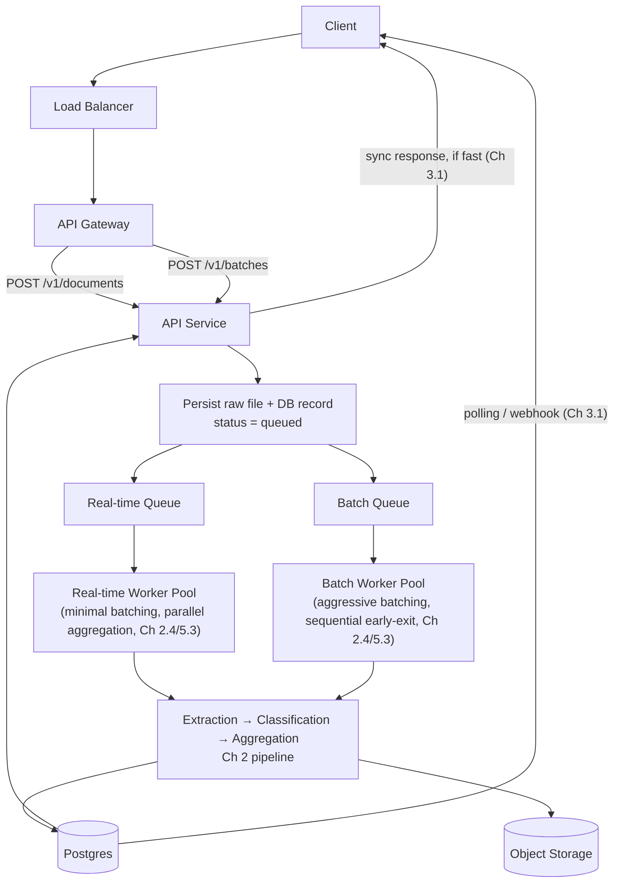

# 5.4 Where the Queue Sits

## Role (no trade-off debate — used directly, as is standard practice)

A message queue (e.g., a managed service such as SQS, or a self-hosted broker such as
RabbitMQ or Kafka — chosen based on organizational standards, not re-litigated here) sits
between the API/producer side and each lane's worker pool, holding lightweight messages
(document/batch references, not raw file bytes) until a worker is available to consume them.
Its role in this system specifically:

- **Decouples ingestion rate from processing rate** (Lesson 5.1) — the API can accept
  submissions as fast as it can write a queue message, independent of processing speed.
- **Buffers traffic spikes** (Chapter 1.3) — particularly for the batch lane, where queue depth
  growing is the intended, designed response to a burst of submissions, not a failure state.
- **Enables independent, lane-specific worker pool scaling** (Lesson 5.2, 5.3) — two separate
  queues (real-time, batch) feed two separate, independently-scaled and independently-batched
  worker pools.
- **Supports retry and dead-letter handling** for failed processing attempts — covered
  operationally in Chapter 10.1, not detailed here.

## Updated Architecture Diagram

This is the full picture of the asynchronous processing layer: the API service acts purely as a
**producer** (persist + enqueue + acknowledge), and two independent worker pools act as
**consumers**, each running the same underlying pipeline logic from Chapter 2 but with the
lane-specific orchestration and batching policies established in Chapter 2.4 and Lesson 5.3.

## Summary

The queue is standard infrastructure, used here in its ordinary role: a durable buffer between
acceptance and processing. What's specific to this system is not the queue technology itself,
but the decision (Lesson 5.2) to run **two** of them — one per traffic lane — each feeding a
worker pool tuned to that lane's own SLO and batching strategy, which is what makes the
differentiated real-time/batch requirements from Chapter 1.1 actually enforceable at the
infrastructure level, not just at the API contract level.