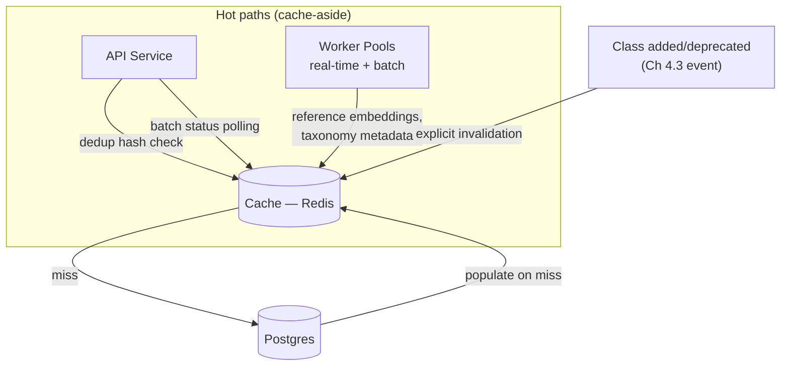

# 6.2 Where the Cache Sits

## Role (no trade-off debate — used directly, as is standard practice)

A cache (e.g., Redis) sits in front of Postgres for the four hot paths identified in Lesson
6.1, using a standard **cache-aside** pattern: on read, check the cache first; on a miss, read
from Postgres and populate the cache; on a write that affects cached data (a class being added
or deprecated, per Chapter 4.3), explicitly invalidate or refresh the relevant cache entries
rather than waiting for a TTL to expire naturally — correctness here matters more than
simplicity, since a stale reference-embedding cache could silently misclassify documents.

## Updated Architecture Diagram

This sits alongside, not instead of, the architecture built in Chapters 2–5 — the cache
intercepts reads on the four identified hot paths (dedup checks, reference embeddings,
taxonomy metadata, batch status), while writes and all other reads continue to go directly
through to Postgres as already designed.

## Summary

The cache is standard infrastructure playing its ordinary role — a fast, in-memory layer in
front of the database for read-heavy, write-rare data. What matters in this system specifically
is *which* data sits behind it (Lesson 6.1's four candidates) and that invalidation is tied
explicitly to the class-taxonomy-change event from Chapter 4.3, since this is the one path
where a stale cache entry translates directly into a wrong classification, not just a slightly
outdated read.