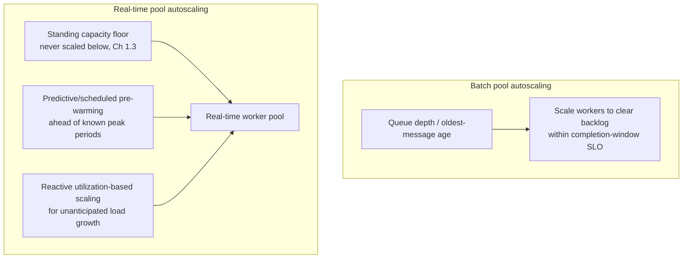

# 7.2 Horizontal Scaling and Autoscaling Policies for Steady Growth

## Problem

A fixed-size worker pool (Chapter 5.3) is either over-provisioned most of the time (wasting
cost, directly working against the cost-sensitivity requirement in Chapter 1.1) or
under-provisioned during real load (violating SLOs). Traffic also isn't uniform across a day —
Chapter 1.3 already noted real-time traffic likely follows a business-hours pattern. The pool
sizes need to track actual load, not sit at a fixed guess — but "autoscale based on load" is
underspecified until a concrete signal and policy are chosen, and the right signal differs
meaningfully between the two lanes established in Chapter 5.2.

## Solution / Concept: Different Autoscaling Signals Per Lane

### Batch worker pool — queue-depth-driven autoscaling

The batch lane's SLO is a completion window (Chapter 1.1), so the natural autoscaling signal is
**queue depth and oldest-message age**: scale workers up as depth/age grows past a threshold,
scale down as the backlog clears. This directly ties capacity to actual backlog, rather than to
a proxy metric like CPU utilization, and is exactly the mechanism that lets the batch lane
absorb a spike (Chapter 1.3) by growing its queue rather than needing instant capacity — the
autoscaler's job is simply to *clear* that queue within the completion-window SLO, not to
prevent it from growing in the first place.

### Real-time worker pool — a combination of predictive and reactive scaling, on top of a floor

The real-time lane can't rely purely on reactive autoscaling, because of the autoscaling-lag
gap already identified in Chapter 1.3 — by the time a reactive policy detects rising load and
provisions new capacity (commonly minutes for GPU-backed instances), a latency-SLO violation
may have already occurred. Two complementary mechanisms address this:

- **A standing capacity floor** (Chapter 1.3's "standing buffer") — the autoscaler never scales
  the real-time pool below this floor, regardless of currently observed load, specifically to
  cover the gap before reactive scaling can respond to a sudden spike.
- **Predictive/scheduled scaling** — where load has a known pattern (e.g., business-hours
  peaks), pre-warm additional capacity *ahead* of the expected peak, rather than waiting for
  reactive metrics to cross a threshold after the peak has already begun.
- **Reactive utilization-based scaling on top** — for load growth beyond what the floor and
  predictive schedule anticipate, standard utilization-based autoscaling (e.g., GPU utilization
  or requests-in-flight per worker) adds further capacity, accepting that this layer alone has
  the lag problem the other two mechanisms exist to cover.

## Trade-offs

| Approach | Gain | Cost |
|---|---|---|
| Queue-depth-driven autoscaling (batch) | Directly ties capacity to actual backlog; simple, robust signal that doesn't require traffic forecasting | Reacts only after a backlog has already started forming — acceptable given the completion-window SLO tolerates this |
| Standing floor + predictive + reactive scaling (real-time) | Covers the autoscaling-lag gap that pure reactive scaling can't, protecting the tight latency SLO | Standing floor and predictive pre-warming both cost money even when the anticipated load doesn't fully materialize — an explicit, accepted cost of the latency SLO, same trade-off already made in Chapter 1.3 |
| Predictive scaling based on historical patterns | Reduces reliance on reactive scaling's inherent lag | Requires reasonably reliable traffic pattern data — brittle if usage patterns shift (e.g., a new large customer with a different usage rhythm) without the schedule being updated |

## When to Use Which

- **Queue-depth autoscaling** is the correct default for any workload matching the batch lane's
  shape (completion-window SLO, no per-request latency sensitivity) — a broadly reusable
  pattern, not specific to this system.
- **Standing floor + predictive + reactive scaling** is warranted specifically because the
  real-time lane's SLO (Chapter 1.1) is tight enough that pure reactive autoscaling's inherent
  lag is unacceptable — for a system with a looser real-time SLO, reactive-only scaling might
  be sufficient and the standing floor could be reduced or removed.
- **Revisit predictive schedules** whenever traffic patterns are observed to genuinely shift
  (Chapter 10.2's monitoring) — a stale predictive schedule provides false confidence.

## Summary

Batch and real-time worker pools are autoscaled using different primary signals, consistent
with their different SLOs: the batch pool scales reactively off queue depth, since its SLO
tolerates a growing backlog as long as it clears in time; the real-time pool combines a
never-scaled-below standing floor, predictive pre-warming ahead of known peaks, and reactive
utilization-based scaling on top, specifically to cover the autoscaling-lag gap that a tight
latency SLO can't tolerate.