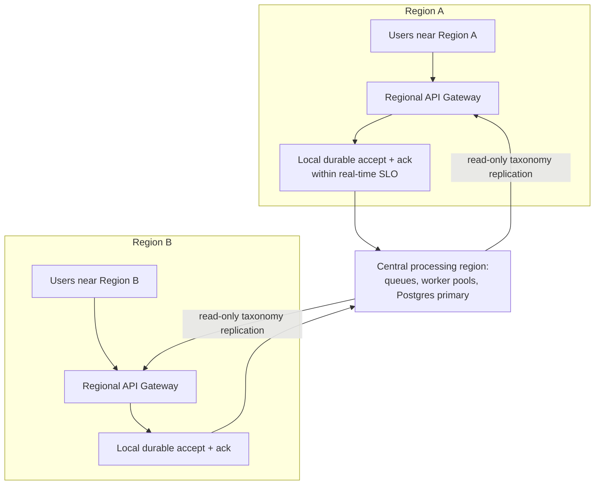

# 7.4 Multi-Region, Data Locality, and Latency vs. Consistency Trade-offs

## Problem

Everything built through Chapter 7.3 assumes a single region. Two separate pressures can push
toward multi-region: **latency** for geographically distant users (a real-time submission from
a user far from the deployed region incurs network latency that eats into the tight SLO from
Chapter 1.1 before any processing even begins), and **disaster recovery/compliance** (surviving
a full regional outage, or data-residency requirements keeping certain data within a specific
jurisdiction — the latter deferred in detail to Chapter 12, but noted here as a driver). Neither
pressure is automatically present just because volume is high — multi-region is a response to
geography and regulation, not to raw document count.

## Solution / Concept: Two Multi-Region Patterns, and a Hybrid Recommendation

### Pattern 1 — Active-passive (disaster recovery only)

A single active region handles all traffic and writes; a passive standby region maintains a
replicated copy of the data and can be promoted to active in a regional outage. This solves DR
but does **nothing** for latency — distant users still hit the single active region for every
request.

### Pattern 2 — Active-active multi-region

Multiple regions each serve local traffic, each capable of accepting writes. This solves both
latency (users hit their nearest region) and DR (any single region's outage doesn't take down
the whole system), but introduces a real **consistency problem**: if the same logical data
(e.g., a class taxonomy update from Chapter 4.3, or a duplicate-submission hash check from
Chapter 3.2) can be written in more than one region, the regions must reconcile — either via
synchronous cross-region consensus (adds significant latency to every write, defeating much of
the latency benefit) or eventual consistency (a window where two regions can briefly disagree,
e.g., on whether a document was already submitted, or on the current class taxonomy version).

### Recommended hybrid for this system

Given that **latency sensitivity applies specifically to the real-time lane** (Chapter 1.1),
and the batch lane already tolerates delay by design (Chapter 1.1's completion-window SLO):

- **Real-time API ingestion**: deploy regionally close to users — accept submissions and
  acknowledge receipt locally, minimizing the network-latency component of the real-time SLO.
- **Processing and system-of-record storage**: can remain centralized in a primary region (or a
  small number of regions), since the actual extraction/classification/aggregation work
  (Chapter 2) and the Postgres system-of-record (Chapter 4) don't have the same tight
  per-request latency requirement once the submission has already been durably accepted near
  the user — the queue (Chapter 5) already decouples acceptance from processing, so the
  cross-region hop from local acceptance to centralized processing adds latency to
  *processing time*, not to the *acknowledgment* the real-time SLO is actually measured against
  (depending on where exactly the SLO is defined to end — worth being precise about this when
  adopting this pattern).
- **Taxonomy/class-reference data** (Chapter 4.3, 6.1): replicated read-only to each region,
  with writes (class additions/deprecations) still flowing through the primary region — this
  data changes rarely, so eventual-consistency replication lag is a non-issue in practice.

## Trade-offs

| Pattern | Gain | Cost |
|---|---|---|
| Active-passive | Simple, solves DR, no cross-region consistency complexity in normal operation | Does nothing for latency to distant users |
| Full active-active | Best latency for all users, strongest DR posture | Genuine cross-region consistency complexity everywhere data can be written in more than one place — significant engineering and operational cost |
| Hybrid: regional acceptance, centralized processing/storage | Solves the specific latency-sensitive part of the problem (real-time acknowledgment) without taking on full active-active consistency complexity everywhere | Processing latency still has a cross-region hop, so this only helps if the real-time SLO is measured at acknowledgment, not at full result availability — a definition that must be made explicit and agreed with API consumers |

## When to Use / When Not To

- **Do not adopt multi-region preemptively.** It should be triggered by an observed or
  contractual reality: a genuinely geographically distributed user base where single-region
  latency is measurably threatening the real-time SLO, a formal DR requirement, or a
  compliance/data-residency requirement (Chapter 12) — not by document volume alone. At the
  stated 100M/month target, a well-provisioned single region with the mechanisms from Chapters
  1–7.3 is very likely sufficient on pure throughput grounds, echoing the same "don't
  over-engineer ahead of a real trigger" conclusion reached about sharding in Chapter 4.4.
- **The hybrid pattern (regional acceptance, centralized processing)** is the right first step
  if and when multi-region is triggered — it captures most of the latency benefit for the
  SLO-sensitive lane without taking on full active-active write consistency complexity
  everywhere in the system.
- **Full active-active** is warranted only if processing itself (not just acknowledgment) must
  be low-latency per-region — a stronger requirement than anything currently stated in Chapter
  1.1, and one that should be confirmed as real before taking on this level of complexity.

## Summary

Multi-region is a response to geography (user latency) and regulation (DR, data residency), not
to document volume — at the system's stated 100M/month target, this is likely not yet
necessary on throughput grounds alone. If and when it is triggered, a hybrid pattern —
accepting and acknowledging real-time submissions regionally close to users, while keeping
processing and the Postgres system-of-record centralized — captures most of the latency benefit
for the SLO-sensitive lane without taking on the full consistency complexity of true
active-active multi-region writes everywhere in the system.