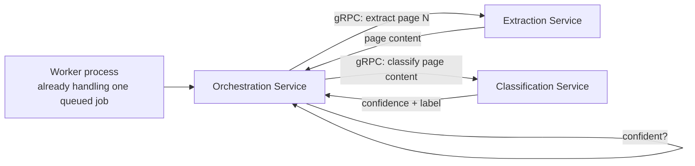

# 8.3 Inter-Service Communication and Data Ownership

## Problem

With six services defined (Lesson 8.2), a real decision remains: *how* do they talk to each
other? Two very different communication styles are available — synchronous request/response
(e.g., gRPC) and asynchronous messaging (via the queue infrastructure already built in Chapter
5) — and using the wrong one in the wrong place either adds unnecessary latency to a tight
processing loop or creates brittle, tightly-coupled synchronous chains where a decoupled,
eventual reaction would have been more robust.

## Solution / Concept: Two Communication Styles, Used for Different Kinds of Interaction

### Synchronous RPC — within the per-document processing loop

The Orchestration Service's hierarchical early-exit loop (Chapter 2.4) needs to call Extraction
Service for a page, then Classification Service for that page's result, check confidence, and
decide immediately whether to continue — this is a tight, sequential (or lane-appropriate
parallel, per Chapter 5.2/5.3) loop that needs an immediate answer to make its next decision.
This is exactly the situation synchronous RPC (e.g., gRPC) is suited for: low latency,
request/response, used *within* the processing of a single document that a worker has already
pulled off a queue (Chapter 5) — this is not introducing new asynchrony, it's internal
communication within what is already one async unit of work at the job level.

**Why not a queue between every pipeline stage:** inserting an async queue hop between
Orchestration and Extraction, or Orchestration and Classification, would add queueing latency to
a loop that needs an immediate answer to decide its next action — directly working against the
real-time lane's latency SLO (Chapter 1.1) and adding unnecessary overhead even for the batch
lane. The job-level asynchrony (Chapter 5) is already where the "waiting is fine" boundary
sits; adding more asynchrony *inside* that boundary provides no benefit.

### Asynchronous messaging — for decoupled, eventual reactions

Some inter-service interactions are not part of any single document's processing critical path
— they're side effects that other services need to react to eventually, not immediately:

- **"Class added/deprecated" event** (Chapter 4.3) — Taxonomy Service publishes this; Cache
  layer(s) (Chapter 6.2) and Classification Service's reference-set loading both need to react
  by invalidating/refreshing, but neither needs to block Taxonomy Service's write on their own
  reaction completing.
- **"Document completed" event** (Chapter 3.1) — triggers Notification Service to dispatch a
  webhook callback, entirely decoupled from the processing pipeline's own completion.
- **"Prediction corrected by reviewer" event** (Chapter 10.3, introduced fully later) — may
  feed into future retraining/monitoring pipelines (Chapter 10.2) without needing to block the
  review action itself.

These all go through the existing queue/messaging infrastructure from Chapter 5, not a new
synchronous call — they are genuinely eventual, decoupled reactions, and forcing them into
synchronous calls would create unnecessary coupling (e.g., Taxonomy Service's write blocking on
Cache's invalidation succeeding) for no correctness benefit.

## Trade-offs

| Communication style | Gain | Cost | Used for |
|---|---|---|---|
| Synchronous RPC (gRPC) | Low latency, simple request/response reasoning, fits a tight sequential/parallel decision loop | Couples the caller's completion to the callee's availability/latency in that moment — a slow or down Extraction Service directly stalls Orchestration Service | Orchestration ↔ Extraction, Orchestration ↔ Classification (within one document's processing) |
| Asynchronous messaging (existing queue infra) | Decouples publisher from subscriber timing entirely; a slow or temporarily-down subscriber doesn't block the publisher | Adds eventual-consistency lag — subscribers react some time after the event, not instantly | Class-change events, document-completion notifications, review-correction events |

## Data Ownership in Practice

Reiterating and extending Lesson 8.2's principle with a concrete example: when Orchestration
Service needs a document's current status for an external API response, it does **not** query
Extraction Service's `pages` table or Classification Service's `predictions` table directly —
it calls those services' APIs (or, for the read-heavy aggregate view the API layer needs,
Ingestion Service can maintain its own lightweight read model, updated via the same
asynchronous events described above, rather than performing live cross-service queries on every
API request). This event-driven read-model pattern is a standard technique for keeping
cross-service reads fast without violating ownership boundaries — worth knowing by name
(sometimes called CQRS-style read projections) even though building it out in full is an
implementation detail beyond this notes set's current scope.

## When to Use / When Not To

- **Synchronous RPC**: any interaction that is part of a single document's active processing
  path, where the caller needs the callee's result to decide its own next action immediately.
- **Asynchronous messaging**: any interaction that is a side effect or notification, where the
  publisher has no need to know whether or when the subscriber acts on it.
- **Never**: direct cross-service database queries, regardless of how convenient it might seem
  in the moment — this is the specific anti-pattern that turns a clean microservices split back
  into a distributed monolith.

## Summary

Communication style follows the shape of the interaction, not a blanket policy: synchronous
gRPC calls handle the tight, sequential early-exit loop between Orchestration, Extraction, and
Classification, since that loop needs an immediate answer to decide its next step; asynchronous
messaging through the existing queue infrastructure handles decoupled, eventual reactions like
class-taxonomy changes, document-completion notifications, and review corrections. Underneath
both, every service owns its own data and is reached only through its API — direct cross-service
database access is the one pattern explicitly ruled out, since it's what would quietly undo the
entire point of decomposing in the first place.