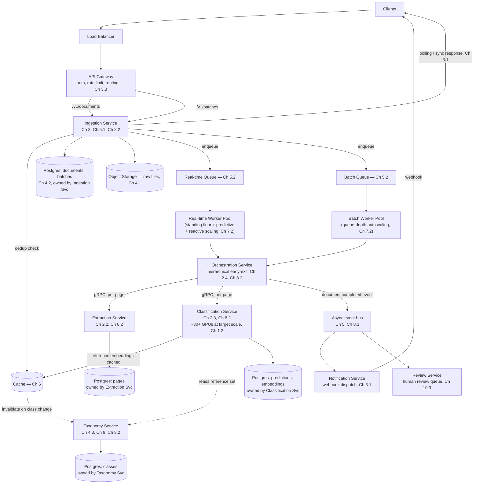

# 8.4 Full Microservice Architecture Diagram at 100M/50-Class Target Scale

## Problem

Chapters 1–8.3 have each added one piece — capacity planning, the MVP pipeline, the API
contract, the data schema, the queue/worker split, caching, scaling policy, and finally service
decomposition. This lesson assembles all of it into one coherent picture of the system at its
stated target scale (Chapter 1.1: ~100M documents/month, ~50 classes, 80/20 batch/real-time
split), so the full shape — and how each earlier chapter's decision shows up in it — is visible
in one place.

## The Full Architecture

## Reading the Diagram Against Earlier Chapters

- **Client → LB → Gateway → Ingestion**: the API contract and infrastructure roles from
  Chapter 3, unchanged in shape, now routing into a real service rather than the MVP monolith.
- **Two queues, two worker pools**: the lane separation decided in Chapter 5.2, still fully
  intact — decomposition into services (Chapter 8) happened *within* each lane's processing,
  not instead of the lane split.
- **Orchestration → Extraction/Classification via synchronous gRPC**: the tight early-exit loop
  from Chapter 2.4, now crossing real service boundaries but still communicating synchronously
  within one document's processing, per the reasoning in Lesson 8.3.
- **Classification Service's GPU footprint**: this is where the ~80+ GPU estimate from Chapter
  1.2 actually lives — isolated as its own service specifically so its scaling can be managed
  independently of every other component's much lighter resource profile.
- **Taxonomy Service, read via cache, written rarely**: directly reflects Chapter 4.3's
  data-as-rows design and Chapter 6.1's caching rationale — the class list and reference
  embeddings are hot-read, cold-write data, served from cache in the common case, invalidated
  on the rare class-change event.
- **Async event bus for completion and review events**: the decoupled-reaction pattern from
  Lesson 8.3, feeding Notification Service (webhook dispatch, Chapter 3.1) and Review Service
  (Chapter 10.3, expanded later) without those services blocking the main processing path.
- **Per-service Postgres ownership**: each service's data lives behind its own API, per Lesson
  8.2/8.3's data-ownership discipline — drawn here as logically separate stores, though they
  may or may not be physically separate database instances depending on operational scale
  (Chapter 4.4's partitioning/read-replica guidance still applies per-service).

## What's Deliberately Not Shown Here

Multi-region topology (Chapter 7.4) is omitted from this diagram for clarity — it would overlay
on top of this architecture (regional Ingestion Service instances, centralized processing) only
if and when the triggers discussed in Chapter 7.4 are actually observed. Security/PII handling
(Chapter 12) and detailed observability/monitoring wiring (Chapter 10) are also not depicted
here, as they're cross-cutting concerns layered across every service shown, not a distinct
architectural component of their own.

## Summary

The target-scale architecture is not a different system from the MVP built in Chapter 2 — it's
the same pipeline (route, extract, classify, aggregate) with every subsequent chapter's decision
applied: an API layer with a hybrid sync/async contract (Ch 3), a schema built for zero-downtime
taxonomy growth (Ch 4), lane-separated asynchronous processing (Ch 5), targeted caching (Ch 6),
lane-specific autoscaling (Ch 7), and finally, service decomposition along the boundaries that
scaling profile, deploy cadence, and data ownership actually justified (Ch 8) — with
Classification Service, carrying the ~80+ GPU footprint from Chapter 1.2, as the component the
entire decomposition effort was most motivated by isolating correctly.