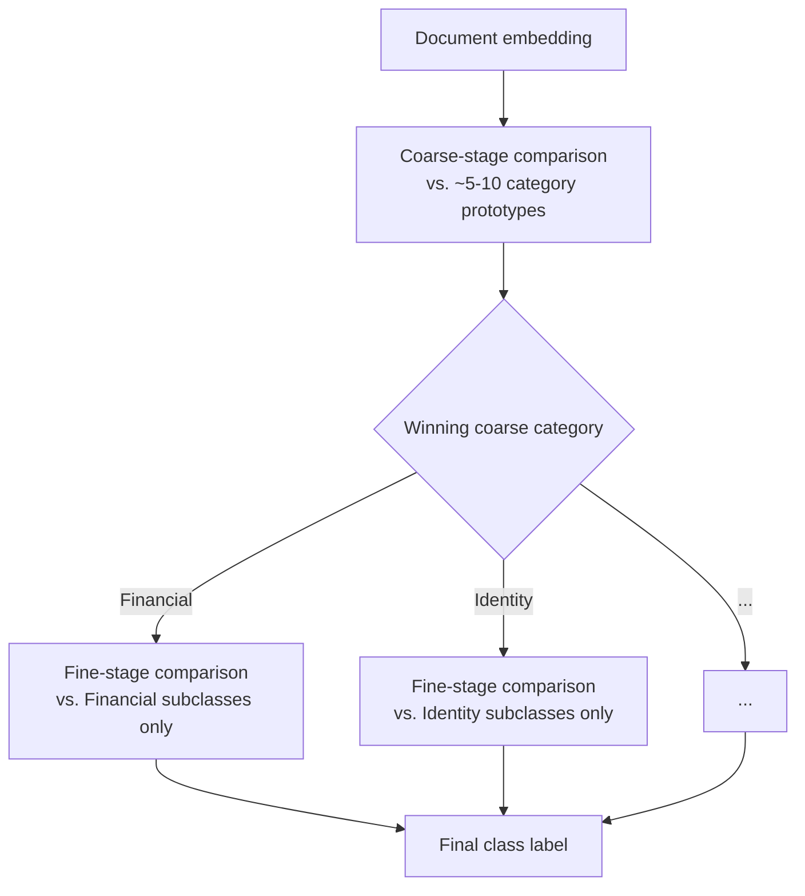

# 9.2 Hierarchical Taxonomies and Coarse-to-Fine Classification

## Problem

A flat 50-way comparison means every class's reference set competes directly against all 49
others in similarity space on every single inference. As Lesson 9.1 noted, some subset of those
50 classes are likely to be genuinely similar to each other (e.g., several distinct financial
document subtypes) — in a flat comparison, these confusable classes get no special treatment;
they're just 49 other candidates diluting the decision, exactly the same as classes that are
easy to distinguish. This raises a real design question: should "50 classes" be modeled as one
flat list, or as a tree?

## Solution / Concept: Two-Stage Coarse-to-Fine Classification

Organize the 50 classes into a small number of **coarse categories** (e.g., "Financial,"
"Identity," "Legal," "HR" — an illustrative grouping, the actual taxonomy is a product/domain
decision), each containing several **fine-grained classes**. Classification happens in two
stages:

1. **Coarse stage**: compare the document's embedding against coarse-category reference
   representations (e.g., a small number of category-level prototypes) — a much easier
   decision than a flat 50-way comparison, since coarse categories are chosen to be maximally
   distinct from each other (echoing the same Scenario-A reasoning from the original 5-class
   choice).
2. **Fine stage**: within the winning coarse category only, compare against that category's
   fine-grained class reference sets — a smaller, more tractable comparison (e.g., 5–10 classes
   instead of 50), where the remaining confusable classes are now competing only against each
   other, not diluted by 40+ unrelated classes.

## Trade-offs

| Aspect | Flat 50-way comparison | Hierarchical coarse-to-fine |
|---|---|---|
| Accuracy on confusable classes | Degrades as taxonomy densifies (Lesson 9.1) — no structural help for closely related classes | Improves — confusable classes are compared only against their true siblings, not diluted by unrelated classes |
| Latency per document | One comparison pass | Two comparison passes — a small added latency cost, though each pass compares against far fewer reference vectors, so the net cost is often modest, not doubled |
| New-class onboarding cost | Adding a class touches the entire flat 50-way reference set implicitly, since every inference already compares against all of it | Adding a class within an existing coarse category only affects that category's fine-stage reference set — smaller blast radius, easier to reason about and validate |
| Failure mode risk | A single wrong decision (misclassifying into the wrong flat-list neighbor) | **Cascading error risk**: a coarse-stage misrouting is unrecoverable — the correct fine-grained class, sitting in a different coarse category, is never even considered at the fine stage |
| Upfront design cost | None — the class list is just a list | Requires deliberate taxonomy design work (choosing coarse categories) — a real product/domain decision, not automatic, and one that may need revision as the taxonomy grows |

## Mitigating the Cascading-Error Risk

The coarse-stage misrouting risk is the most serious cost of this design and deserves an
explicit mitigation, not just an acknowledgment: rather than committing to only the single
top-1 coarse category, carry the **top-2 (or top-k) coarse categories** through to the fine
stage, running fine-grained comparison within each candidate category and combining results
(e.g., by overall similarity score across the union of candidates). This adds further latency
and comparison cost but substantially reduces the chance that a document is permanently
misrouted away from its correct fine-grained class due to a single coarse-stage error — a
direct, tunable trade between latency/cost and robustness to coarse-stage mistakes.

## When to Use / When Not To

- **Adopt hierarchical taxonomy** once flat 50-way comparison shows a **measured** accuracy
  problem specifically concentrated among confusable class groups (an observed signal, not a
  reflexive "50 classes must need hierarchy" assumption) — or once reference-set governance
  (Lesson 9.1, Lesson 9.4) becomes operationally easier to manage per-branch than as one
  undifferentiated 50-class set.
- **Stay flat** as long as the taxonomy's classes remain reasonably distinct from each other
  (echoing the original Scenario-A class-selection principle from the earlier ML-design phase
  of this system) — hierarchy adds real design and latency cost that isn't justified if
  confusability isn't actually a measured problem.
- **Use top-k coarse-category carry-through** as the default mitigation the moment hierarchy is
  adopted — accepting flat top-1 coarse routing without this safeguard reintroduces a serious,
  avoidable failure mode.

## Summary

Whether "50 classes" should be modeled as flat or hierarchical is a decision driven by measured
confusability, not by class count alone. Hierarchical coarse-to-fine classification improves
accuracy on genuinely confusable class groups and shrinks the blast radius of onboarding a new
class, at the cost of added latency and a real cascading-error risk if a document is misrouted
at the coarse stage — a risk that should be explicitly mitigated by carrying forward the top-k
coarse candidates rather than committing irreversibly to a single top-1 choice.